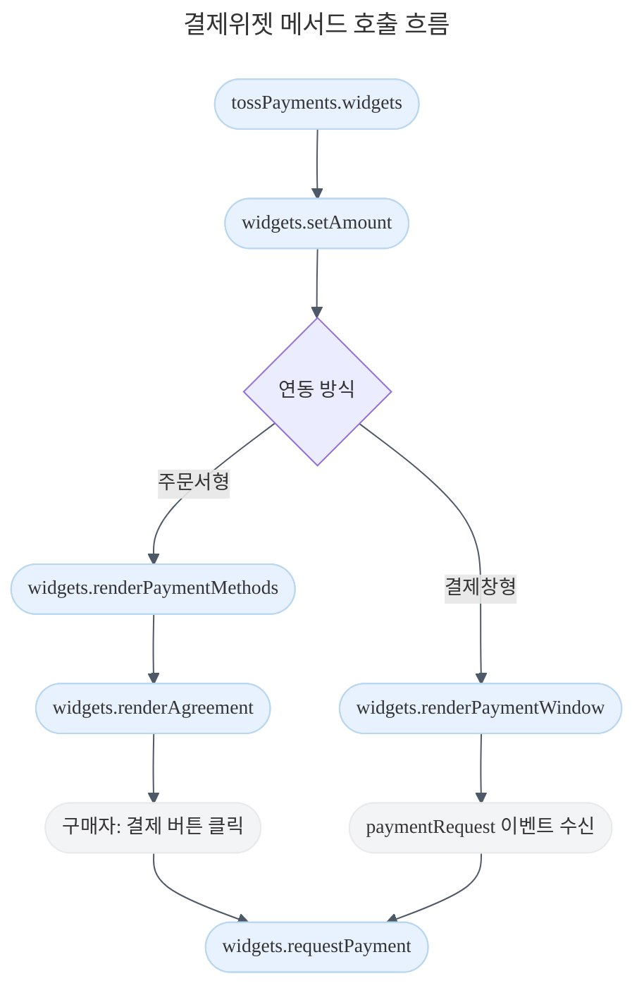

---

title: 토스페이먼츠 JavaScript SDK
description: 토스페이먼츠 JavaScript SDK를 추가하고 메서드를 사용하는 방법을 알아봅니다.
keyword: SDK, JavaScript, 렌더링, 위젯, 메서드

---

**Version 2**

새로 나온

# 토스페이먼츠 JavaScript SDK

{description}

샌드박스로 시작하기

샘플 프로젝트 보러가기

## SDK 설치

HTML
npm

HTML 페이지에 스크립트 태그로 결제창 SDK 파일을 추가합니다. 스크립트가 로드되면 전역 객체(window)에 생기는 [초기화 함수](#토스페이먼츠-초기화)를 호출하세요.

```html
<head>
  <!-- 스크립트 추가 -->
  <script src="https://js.tosspayments.com/v2/standard"></script>
</head>
```

아래 커맨드로 토스페이먼츠 SDK를 npm 패키지로 설치해보세요.

```bash
npm install @tosspayments/tosspayments-sdk --save
```

## 토스페이먼츠 초기화

`TossPayments()` 메서드로 SDK를 초기화해주세요. 반환되는 객체로 토스페이먼츠 SDK의 모든 결제 서비스를 이용할 수 있어요. 내 상점의 클라이언트 키를 파라미터로 넣으면 토스페이먼츠에서 상점의 정보를 확인할 수 있어요. 사용하고 싶은 제품에 따라 필요한 클라이언트 키 종류가 다른데요. 키 종류, 테스트 및 라이브 키 정보는 [API 키](/reference/using-api/api-keys) 가이드에서 자세히 확인하세요.

```javascript
// 스크립트 태그 연동방식
const tossPayments = TossPayments("<WidgetClientKey />"); // 결제위젯 연동 키
const tossPayments = TossPayments("<ClientKey />"); // API 개별 연동 키

// 모듈 임포트 연동방식
import { loadTossPayments } from "@tosspayments/tosspayments-sdk";
const tossPayments = await loadTossPayments("<WidgetClientKey />");
```

#### 파라미터

name: clientKey
type: string
required: true

토스페이먼츠 발급하는 클라이언트 키입니다. 개발자센터의 [API 키 메뉴](https://developers.tosspayments.com/my/api-keys)에서 확인할 수 있어요.

결제위젯을 연동한다면 [결제위젯 연동 키](/reference/using-api/api-keys#결제위젯-연동-키)를 사용하세요. 브랜드페이, 결제창, 자동결제(빌링)를 연동한다면 [API 개별 연동 키](/reference/using-api/api-keys#api-개별-연동-키)를 사용하세요.

#### 응답

아래 메서드를 호출할 수 있는 토스페이먼츠 객체를 반환합니다.

```plain theme="grey" copyable="false" feedbackable="false"
TossPaymentsSDK
```

name: widgets
type: function

결제위젯을 초기화합니다. [자세히 >](#결제위젯)

name: brandpay
type: function

브랜드페이를 초기화합니다. [자세히 >](#브랜드페이)

name: payment
type: function

결제창을 초기화합니다. [자세히 >](#결제창)

## 결제위젯

결제위젯은 **주문서형**과 **결제창형** 두 가지 방식으로 연동할 수 있어요. 공통 메서드로 SDK를 초기화하고 결제 금액을 설정한 다음, 선택한 방식의 렌더 메서드를 호출해요. 두 방식 모두 마지막엔 [widgets.requestPayment()](#widgetsrequestpayment)로 결제를 요청합니다.



### tossPayments.widgets()

[결제위젯](/guides/v2/payment-widget)을 초기화합니다. 결제위젯은 토스페이먼츠만의 기본 결제 서비스로, 수많은 상점을 분석해서 만든 최적의 주문서 결제 UI예요.

```javascript
// 결제위젯 방식 — renderPaymentMethods()로 UI를 렌더링한 다음 requestPayment()로 결제를 요청해요
// https://docs.tosspayments.com/guides/v2/payment-widget/integration

// 결제창형 방식 — renderPaymentWindow()로 결제창을 렌더링하고 paymentRequest 이벤트에서 결제를 요청해요
// https://docs.tosspayments.com/guides/v2/payment-widget/integration-window

const widgets = tossPayments.widgets({ customerKey });
```

비회원 결제는 `customerKey` 대신 `ANONYMOUS`를 넣어요.

```javascript
// 스크립트 태그 연동방식
const widgets = tossPayments.widgets({ customerKey: TossPayments.ANONYMOUS });

// 모듈 임포트 연동방식
import { ANONYMOUS } from "@tosspayments/tosspayments-sdk";
const widgets = tossPayments.widgets({ customerKey: ANONYMOUS });
```

#### 파라미터

name: params
type: object
required: true

결제위젯 초기화 정보입니다.

name: customerKey
type: string
required: true

구매자를 식별하는 고유 아이디입니다.

이메일・전화번호나 자동 증가하는 숫자와 같이 유추가 가능한 값은 안전하지 않아요. UUID와 같이 충분히 무작위적인 고유 값으로 생성해주세요.
영문 대소문자, 숫자, 특수문자 `-`, `_`, `=`, `.`, `@` 중 최소 1개를 포함하는 최소 2자 이상 최대 50자 이하의 문자열이어야 합니다.

name: brandpay
type: object
required: false

결제위젯으로 브랜드페이로 연동할 때 필요한 정보입니다.

name: redirectUrl
type: string
required: false

브랜드페이 결제 과정에서 [Access Token 발급](/guides/v2/brandpay/auth)을 위해 필요한 URL입니다. Access Token은 브랜드페이 고객을 식별하고 고객의 결제 권한을 증명합니다. 값을 넣지 않으면 개발자센터의 브랜드페이 메뉴에 최초로 등록한 리다이렉트 URL이 기본값으로 들어갑니다.

\* 브랜드페이 메뉴에 두 개 이상의 리다이렉트 URL을 등록한 상점은 각 도메인에 맞는 `redirectUrl` 값을 필수로 추가하세요.

#### 응답

아래 메서드를 호출할 수 있는 결제위젯 객체를 반환합니다.

```plain theme="grey" copyable="false" feedbackable="false"
TossPaymentsWidgets
```

name: setAmount
type: function

주문의 결제 금액을 설정합니다. [자세히 >](#widgetssetamount)

name: renderPaymentMethods
type: function

결제 UI를 렌더링합니다. [자세히 >](#widgetsrenderpaymentmethods)

name: requestPayment
type: function

결제를 요청합니다. 구매자가 결제 UI에서 선택한 결제수단의 결제창을 띄워요. [자세히 >](#widgetsrequestpayment)

name: renderPaymentWindow
type: function

결제창(팝업/오버레이) 형태의 결제위젯을 렌더링합니다. [자세히 >](#widgetsrenderpaymentwindow)

name: renderAgreement
type: function

약관 UI를 렌더링합니다. [자세히 >](#widgetsrenderagreement)

### widgets.setAmount()

결제 금액을 설정합니다. 주문서형의 [`renderPaymentMethods()`](#widgetsrenderpaymentmethods), 결제창형의 [`renderPaymentWindow()`](#widgetsrenderpaymentwindow)를 호출하기 전에 반드시 금액을 설정해주세요. 만약에 쿠폰, 할인 등으로 인해 주문서에서 결제 금액이 바뀌면 `setAmount()`로 결제 금액을 업데이트해주세요.

```javascript
widgets.setAmount({
  currency: "KRW",
  value: amount,
});
```

#### 파라미터

name: amount
type: object
required: true

결제 금액 정보입니다.

name: value
type: number
required: true

결제 금액입니다.

name: currency
type: string
required: true

결제 통화입니다. 일반결제는 `KRW`만 지원합니다. 해외 간편결제(PayPal)는 `USD`만 지원합니다.

#### 응답

```plain theme="grey" copyable="false" feedbackable="false"
Promise<void>
```

### widgets.requestPayment()

결제를 요청합니다. 구매자가 결제 UI에서 선택한 결제수단의 결제창을 띄워요. 결제 버튼은 직접 만들어주세요.

결제위젯의 결제 요청은 Redirect 방식과 Promise 방식을 지원하고 있어요. 결제 요청이 끝나고 결과를 확인하는 방법의 차이인데요. Redirect 방식을 선택하면 파라미터로 설정한 `successUrl` 또는 `failUrl`로 결제 요청의 결과를 확인할 수 있어요. Promise 방식을 선택하면 Promise로 돌아오는 객체로 결과를 확인할 수 있지만, **Promise 방식은 모바일 환경에서 사용할 수 없어요.**

Promise 방식
Redirect 방식

```js
widgets.requestPayment({
  orderId: generateRandomString(),
  orderName: "토스 티셔츠 외 2건",
  customerEmail: "customer123@gmail.com",
  customerName: "김토스",
});
```

```js
widgets.requestPayment({
  orderId: generateRandomString(),
  orderName: "토스 티셔츠 외 2건",
  successUrl: window.location.origin + "/success.html",
  failUrl: window.location.origin + "/fail.html",
  customerEmail: "customer123@gmail.com",
  customerName: "김토스",
});
```

#### 파라미터

name: paymentRequest
type: object
required: true

결제 요청 정보입니다.

name: orderId
type: string
required: true

주문번호입니다. 각 주문을 구분하는 무작위한 고유값을 생성하세요. 영문 대소문자, 숫자, 특수문자 `-`, `_`, `=`로 이루어진 6자 이상 64자 이하의 문자열이어야 합니다.

name: orderName
type: string
required: true

구매상품입니다. 예를 들면 `생수 외 1건` 같은 형식입니다. 최대 길이는 100자입니다.

name: customerEmail
type: string
required: false

구매자 이메일입니다. 결제 상태가 바뀌면 이메일 주소로 결제내역이 전송됩니다. 최대 길이는 100자입니다.

name: customerName
type: string
required: false

구매자명입니다. 최대 길이는 100자입니다.

name: customerMobilePhone
type: string
required: false

구매자의 휴대폰 번호입니다. 가상계좌 안내, 퀵계좌이체 휴대폰 번호 자동 완성에 사용되고 있어요. `-` 없이 숫자로만 구성된 최소 8자, 최대 15자의 문자열입니다.

name: taxFreeAmount
type: number
required: false

결제 금액 중 면세 금액입니다. 면세 상점 혹은 복합 과세 상점으로 계약된 상점만 사용하세요. 자세한 내용은 세금 처리 가이드에서 확인하세요.

name: windowTarget
type: enum
required: false

브라우저에서 결제창이 열리는 프레임입니다. `self`, `iframe` 중 하나입니다.

\- `self`는 현재 브라우저를 결제창으로 이동시켜요. 모바일 환경에서 기본 값입니다.

\- `iframe`은 iframe에서 결제창이 열려요. PC 환경에서 기본 값입니다. **모바일 환경에서는 `iframe`을 사용할 수 없습니다.**

name: metadata
type: object
required: false

결제 관련 정보를 추가할 수 있는 객체입니다. 최대 5개의 키-값(key-value) 쌍을 자유롭게 추가해주세요. 키는 `[` , `]` 를 사용하지 않는 최대 40자의 문자열, 값은 최대 2000자의 문자열입니다.

name: card
type: object
required: false

구매자가 카드를 선택하면 결제에 적용되는 옵션입니다.

name: taxExemptionAmount
type: number
required: false

과세를 제외한 결제 금액(컵 보증금 등)입니다. 값을 넣지 않으면 기본값인 0으로 설정됩니다.

과세 제외 금액이 있는 카드 결제는 부분 취소가 안 됩니다.

name: appScheme
type: string
required: false

페이북/ISP 앱에서 상점 앱으로 돌아올 때 사용됩니다. 상점의 앱 스킴을 지정하면 됩니다. 예를 들면 testapp://같은 형태입니다.

name: transfer
type: object
required: false

구매자가 계좌이체를 선택하면 결제에 적용되는 옵션입니다.

name: useEscrow
type: boolean
required: false

에스크로 적용 여부입니다. `true`로 설정하면 구매자가 반드시 에스크로 적용에 동의해야 결제가 완료돼요.

`false`로 설정하거나 파라미터를 설정하지 않으면 에스크로 적용을 구매자 선택에 맡겨요.

name: escrowProducts
type: array
required: false

각 상품의 상세 정보 객체를 담는 배열입니다. 에스크로를 사용하는 상점이라면 필수 파라미터입니다.

예를 들어 사용자가 세 가지 종류의 상품을 구매했다면 길이가 3인 배열이어야 합니다.

name: id
type: string
required: false

각 상품의 고유 ID입니다.

name: name
type: string
required: false

상품명입니다.

name: code
type: string
required: false

내 상점에서 사용하는 상품 관리 코드입니다.

name: unitPrice
type: number
required: false

상품의 1개의 개별 가격입니다.

name: quantity
type: number
required: false

상품 구매 수량입니다.

name: isCulturalExpenses
type: boolean
required: false

문화비(도서, 공연 티켓, 박물관·미술관 입장권 등) 지출 여부입니다.

name: virtualAccount
type: object
required: false

구매자가 가상계좌를 선택하면 결제에 적용되는 옵션입니다.

name: useEscrow
type: boolean
required: false

에스크로 사용 여부입니다. 값을 주지 않으면 결제창에서 고객이 직접 에스크로 결제 여부를 선택합니다.

name: escrowProducts
type: array
required: false

각 상품의 상세 정보 객체를 담는 배열입니다. 에스크로를 사용하는 상점이라면 필수 파라미터입니다.

예를 들어 사용자가 세 가지 종류의 상품을 구매했다면 길이가 3인 배열이어야 합니다.

name: id
type: string
required: false

각 상품의 고유 ID입니다.

name: name
type: string
required: false

상품명입니다.

name: code
type: string
required: false

내 상점에서 사용하는 상품 관리 코드입니다.

name: unitPrice
type: number
required: false

상품의 1개의 개별 가격입니다.

name: quantity
type: number
required: false

상품 구매 수량입니다.

name: cashReceipt
type: object
required: false

현금영수증 정보입니다.

name: type
type: enum
required: true

현금영수증 발급 용도입니다. '소득공제', '지출증빙', '미발행' 중 하나입니다.

name: isCulturalExpenses
type: boolean
required: false

문화비(도서, 공연 티켓, 박물관·미술관 입장권 등) 지출 여부입니다.

name: foreignEasyPay
type: object
required: false

구매자가 해외간편결제를 선택하면 결제에 적용되는 옵션입니다.

name: country
type: string
required: true

구매자가 위치한 국가입니다. ISO-3166의 두 자리 국가 코드를 입력하세요.

name: products
type: array
required: false

구매 상품 정보입니다. 여러 가지의 상품을 결제했다면 각 상품의 정보를 입력하세요. 예를 들어, 구매자가 세 가지 종류의 상품을 구매했다면 배열의 길이는 3이어야 합니다.

PayPal에서 제공하는 판매자 보호를 받고 싶다면 반드시 해당 파라미터를 사용하세요. 판매자 보호 및 위험거래 관리를 위해 PayPal에 제공돼요.

name: name
type: string
required: true

상품명입니다. 최대 길이는 100자입니다.

name: quantity
type: number
required: true

상품의 구매 수량입니다.

name: unitAmount
type: number
required: true

상품의 1개의 개별 가격입니다.

name: currency
type: string
required: true

결제 통화입니다.

name: description
type: string
required: true

상품 설명입니다.

name: shipping
type: object
required: false

배송 정보입니다.

name: fullName
type: string
required: false

수령인입니다.

name: address
type: object
required: false

배송 주소입니다.

name: country
type: string
required: true

구매자가 위치한 국가입니다. ISO-3166의 두 자리 국가 코드를 입력하세요.

name: line1
type: string
required: false

주소입니다. 도로명 및 건물(Street, Apt), 번지 정보입니다.

name: line2
type: string
required: false

상세 주소입니다. 번지 및 동호수 정보를 입력하세요.

name: area1
type: string
required: false

주(State, Province, Region) 정보입니다. 국가의 도시 체계에 따라 없는 경우가 있습니다.

name: area2
type: string
required: true

도시입니다.

name: postalCode
type: string
required: false

배송지 우편번호입니다. 중국, 일본, 프랑스, 독일 등 [일부 국가](https://developer.paypal.com/api/rest/reference/orders/v2/country-address-requirements/#link-countryandregionaddressrequirements)에서는 필수 파라미터입니다

name: paymentMethodOptions
type: object
required: false

특정 해외간편결제 수단에만 필요한 정보입니다.

name: paypal
type: object
required: false

PayPal 결제에 추가로 필요한 정보입니다.

name: setTransactionContext
type: unknown
required: false

PayPal에서 추가로 요청하는 STC(Set Transaction Context) 정보입니다. 이 정보는 토스페이먼츠에서 관리하지 않으며, PayPal에서 부정거래, 결제 취소, 환불 등 리스크 관리에 활용합니다.

결제 거래의 안전성과 신뢰성을 확보하려면 이 정보를 전달해야 합니다. [PayPal STC 문서](https://static.tosspayments.com/public/STC.pdf)를 참고해서 업종에 따라 필요한 파라미터를 추가해주세요.
문서의 표에 있는 ‘Data Field Name’ 컬럼 값을 객체의 ‘key’로, ‘Description’에 맞는 값을 객체의 ‘value’로 넣어주시면 됩니다.

#### 응답

`WidgetPaymentResult` 객체가 응답됩니다. 객체 필드를 확인하고 [결제 승인 API](/reference#결제-승인)를 호출해야 결제가 최종적으로 완료돼요.

```plain theme="grey" copyable="false" feedbackable="false"
Promise<WidgetPaymentResult>
```

name: paymentType
type: enum

결제 타입입니다. `NORMAL`(일반결제), `BRANDPAY`(브랜드페이) 중 하나입니다.

name: paymentKey
type: string

토스페이먼츠에서 발급하는 결제 식별 키입니다. 결제 승인, 조회, 취소 등에 사용되니 반드시 저장하세요.

name: orderId
type: string

주문번호입니다. 결제를 요청할 때 호출한 `requestPayment()` 메서드로 넘긴 `orderId` 값과 같은지 확인하세요.

name: amount
type: object

결제 금액 정보입니다. `requestPayment()` 메서드로 넘긴 `amount` 값과 같은지 확인하세요.

name: value
type: number

결제 금액입니다.

name: currency
type: string

결제 통화입니다. 일반결제는 `KRW`만 지원합니다. 해외 간편결제(PayPal)는 `USD`만 지원합니다.

#### 파라미터

name: paymentRequest
type: object
required: true

결제 요청 정보입니다.

name: orderId
type: string
required: true

주문번호입니다. 각 주문을 구분하는 무작위한 고유값을 생성하세요. 영문 대소문자, 숫자, 특수문자 `-`, `_`, `=`로 이루어진 6자 이상 64자 이하의 문자열이어야 합니다.

name: orderName
type: string
required: true

구매상품입니다. 예를 들면 `생수 외 1건` 같은 형식입니다. 최대 길이는 100자입니다.

name: customerEmail
type: string
required: false

구매자 이메일입니다. 결제 상태가 바뀌면 이메일 주소로 결제내역이 전송됩니다. 최대 길이는 100자입니다.

name: customerName
type: string
required: false

구매자명입니다. 최대 길이는 100자입니다.

name: customerMobilePhone
type: string
required: false

구매자의 휴대폰 번호입니다. 가상계좌 안내, 퀵계좌이체 휴대폰 번호 자동 완성에 사용되고 있어요. `-` 없이 숫자로만 구성된 최소 8자, 최대 15자의 문자열입니다.

name: taxFreeAmount
type: number
required: false

결제 금액 중 면세 금액입니다. 면세 상점 혹은 복합 과세 상점으로 계약된 상점만 사용하세요. 자세한 내용은 세금 처리 가이드에서 확인하세요.

name: windowTarget
type: enum
required: false

브라우저에서 결제창이 열리는 프레임입니다. `self`, `iframe` 중 하나입니다.

\- `self`는 현재 브라우저를 결제창으로 이동시켜요. 모바일 환경에서 기본 값입니다.

\- `iframe`은 iframe에서 결제창이 열려요. PC 환경에서 기본 값입니다. **모바일 환경에서는 `iframe`을 사용할 수 없습니다.**

name: metadata
type: object
required: false

결제 관련 정보를 추가할 수 있는 객체입니다. 최대 5개의 키-값(key-value) 쌍을 자유롭게 추가해주세요. 키는 `[` , `]` 를 사용하지 않는 최대 40자의 문자열, 값은 최대 2000자의 문자열입니다.

name: card
type: object
required: false

구매자가 카드를 선택하면 결제에 적용되는 옵션입니다.

name: taxExemptionAmount
type: number
required: false

과세를 제외한 결제 금액(컵 보증금 등)입니다. 값을 넣지 않으면 기본값인 0으로 설정됩니다.

과세 제외 금액이 있는 카드 결제는 부분 취소가 안 됩니다.

name: appScheme
type: string
required: false

페이북/ISP 앱에서 상점 앱으로 돌아올 때 사용됩니다. 상점의 앱 스킴을 지정하면 됩니다. 예를 들면 testapp://같은 형태입니다.

name: transfer
type: object
required: false

구매자가 계좌이체를 선택하면 결제에 적용되는 옵션입니다.

name: useEscrow
type: boolean
required: false

에스크로 적용 여부입니다. `true`로 설정하면 구매자가 반드시 에스크로 적용에 동의해야 결제가 완료돼요.

`false`로 설정하거나 파라미터를 설정하지 않으면 에스크로 적용을 구매자 선택에 맡겨요.

name: escrowProducts
type: array
required: false

각 상품의 상세 정보 객체를 담는 배열입니다. 에스크로를 사용하는 상점이라면 필수 파라미터입니다.

예를 들어 사용자가 세 가지 종류의 상품을 구매했다면 길이가 3인 배열이어야 합니다.

name: id
type: string
required: false

각 상품의 고유 ID입니다.

name: name
type: string
required: false

상품명입니다.

name: code
type: string
required: false

내 상점에서 사용하는 상품 관리 코드입니다.

name: unitPrice
type: number
required: false

상품의 1개의 개별 가격입니다.

name: quantity
type: number
required: false

상품 구매 수량입니다.

name: isCulturalExpenses
type: boolean
required: false

문화비(도서, 공연 티켓, 박물관·미술관 입장권 등) 지출 여부입니다.

name: virtualAccount
type: object
required: false

구매자가 가상계좌를 선택하면 결제에 적용되는 옵션입니다.

name: useEscrow
type: boolean
required: false

에스크로 사용 여부입니다. 값을 주지 않으면 결제창에서 고객이 직접 에스크로 결제 여부를 선택합니다.

name: escrowProducts
type: array
required: false

각 상품의 상세 정보 객체를 담는 배열입니다. 에스크로를 사용하는 상점이라면 필수 파라미터입니다.

예를 들어 사용자가 세 가지 종류의 상품을 구매했다면 길이가 3인 배열이어야 합니다.

name: id
type: string
required: false

각 상품의 고유 ID입니다.

name: name
type: string
required: false

상품명입니다.

name: code
type: string
required: false

내 상점에서 사용하는 상품 관리 코드입니다.

name: unitPrice
type: number
required: false

상품의 1개의 개별 가격입니다.

name: quantity
type: number
required: false

상품 구매 수량입니다.

name: cashReceipt
type: object
required: false

현금영수증 정보입니다.

name: type
type: enum
required: true

현금영수증 발급 용도입니다. '소득공제', '지출증빙', '미발행' 중 하나입니다.

name: isCulturalExpenses
type: boolean
required: false

문화비(도서, 공연 티켓, 박물관·미술관 입장권 등) 지출 여부입니다.

name: foreignEasyPay
type: object
required: false

구매자가 해외간편결제를 선택하면 결제에 적용되는 옵션입니다.

name: country
type: string
required: true

구매자가 위치한 국가입니다. ISO-3166의 두 자리 국가 코드를 입력하세요.

name: products
type: array
required: false

구매 상품 정보입니다. 여러 가지의 상품을 결제했다면 각 상품의 정보를 입력하세요. 예를 들어, 구매자가 세 가지 종류의 상품을 구매했다면 배열의 길이는 3이어야 합니다.

PayPal에서 제공하는 판매자 보호를 받고 싶다면 반드시 해당 파라미터를 사용하세요. 판매자 보호 및 위험거래 관리를 위해 PayPal에 제공돼요.

name: name
type: string
required: true

상품명입니다. 최대 길이는 100자입니다.

name: quantity
type: number
required: true

상품의 구매 수량입니다.

name: unitAmount
type: number
required: true

상품의 1개의 개별 가격입니다.

name: currency
type: string
required: true

결제 통화입니다.

name: description
type: string
required: true

상품 설명입니다.

name: shipping
type: object
required: false

배송 정보입니다.

name: fullName
type: string
required: false

수령인입니다.

name: address
type: object
required: false

배송 주소입니다.

name: country
type: string
required: true

구매자가 위치한 국가입니다. ISO-3166의 두 자리 국가 코드를 입력하세요.

name: line1
type: string
required: false

주소입니다. 도로명 및 건물(Street, Apt), 번지 정보입니다.

name: line2
type: string
required: false

상세 주소입니다. 번지 및 동호수 정보를 입력하세요.

name: area1
type: string
required: false

주(State, Province, Region) 정보입니다. 국가의 도시 체계에 따라 없는 경우가 있습니다.

name: area2
type: string
required: true

도시입니다.

name: postalCode
type: string
required: false

배송지 우편번호입니다. 중국, 일본, 프랑스, 독일 등 [일부 국가](https://developer.paypal.com/api/rest/reference/orders/v2/country-address-requirements/#link-countryandregionaddressrequirements)에서는 필수 파라미터입니다

name: paymentMethodOptions
type: object
required: false

특정 해외간편결제 수단에만 필요한 정보입니다.

name: paypal
type: object
required: false

PayPal 결제에 추가로 필요한 정보입니다.

name: setTransactionContext
type: unknown
required: false

PayPal에서 추가로 요청하는 STC(Set Transaction Context) 정보입니다. 이 정보는 토스페이먼츠에서 관리하지 않으며, PayPal에서 부정거래, 결제 취소, 환불 등 리스크 관리에 활용합니다.

결제 거래의 안전성과 신뢰성을 확보하려면 이 정보를 전달해야 합니다. [PayPal STC 문서](https://static.tosspayments.com/public/STC.pdf)를 참고해서 업종에 따라 필요한 파라미터를 추가해주세요.
문서의 표에 있는 ‘Data Field Name’ 컬럼 값을 객체의 ‘key’로, ‘Description’에 맞는 값을 객체의 ‘value’로 넣어주시면 됩니다.

name: successUrl
type: string
required: false

결제 요청이 성공하면 리다이렉트되는 URL입니다. `https://www.example.com/success`와 같이 오리진을 포함한 형태로 설정해주세요.

리다이렉트되면 URL의 쿼리 파라미터로 `amount`, `orderId`, `paymentKey`가 추가돼요.

name: failUrl
type: string
required: false

결제 요청이 실패하면 리다이렉트되는 URL입니다. `https://www.example.com/fail`와 같이 오리진을 포함한 형태로 설정해주세요.

리다이렉트되면 URL의 쿼리 파라미터로 에러 코드와 메시지를 확인할 수 있어요.

#### 응답

결제 요청이 성공하면 파라미터로 설정한 `successUrl`로 이동해요. 쿼리 파라미터의 `amount` 값이 메서드 파라미터로 설정한 `amount`와 같은지 반드시 확인하고 [결제 승인 API](/reference#결제-승인)를 호출해서 결제를 완료하세요.

```plain theme="grey" copyable="false"
{successUrl}?paymentType={PAYMENT_TYPE}&amount={AMOUNT}&orderId={ORDER_ID}&paymentKey={PAYMENT_KEY}
```

결제 요청이 실패하면 파라미터로 설정한 `failUrl`로 이동해요. 쿼리 파라미터로 에러 코드와 메시지를 확인하세요.

```plain theme="grey" copyable="false"
{failUrl}?code={ERROR_CODE}&message={ERROR_MESSAGE}&orderId={ORDER_ID}
```

Redirect 방식에서는 URL이 이동하기 때문에 `void`가 응답됩니다.

```plain theme="grey" copyable="false" feedbackable="false"
Promise<void>
```

## 결제위젯(주문서형)

### widgets.renderPaymentMethods()

결제 UI를 렌더링합니다. 주문서의 [DOM](/resources/glossary/dom)이 생성된 이후에 호출하세요. 토스페이먼츠와 전자결제 계약을 완료했다면 [결제위젯 어드민](https://dashboard.tosspayments.com/payment-widget-service/)에서 결제수단, 디자인 등 결제 UI를 커스터마이징할 수 있어요.

```javascript
const paymentMethodWidget = await widgets.renderPaymentMethods({
  selector: "#payment-method",
  variantKey: "CUSTOM-1",
});
```

#### 파라미터

name: params
type: object
required: true

결제 UI 렌더링 정보입니다.

name: selector
type: string
required: true

결제 UI를 렌더링할 위치를 지정합니다. `<div>`와 같은 HTML 요소를 선택할 수 있는 CSS 선택자를 사용합니다. 예를 들어 `<div id="payment-method">`에 결제 UI를 렌더링하려면, `#payment-method`를 전달해야 합니다.

name: variantKey
type: string
required: false

렌더링하고 싶은 결제 UI의 `variantKey`입니다. 2개 이상의 결제 UI를 사용하고 있다면 설정해주세요. `variantKey`는 [상점관리자의 결제위젯 어드민](/guides/v2/payment-widget#2-결제-ui의-variantkey-확인)에서 확인할 수 있어요. 기본 값은 `DEFAULT`입니다.

#### 응답

반환되는 결제 UI 객체로 아래 메서드를 호출할 수 있어요.

```plain theme="grey" copyable="false" feedbackable="false"
Promise<WidgetPaymentMethodWidget>
```

name: on
type: function

결제 UI의 이벤트를 구독합니다. [자세히 >](#paymentmethodwidgeton)

name: getSelectedPaymentMethod
type: function

구매자가 선택한 결제수단을 불러옵니다. [자세히 >](#paymentmethodwidgetgetselectedpaymentmethod)

name: destroy
type: function

결제 UI 객체를 제거합니다. [자세히 >](#paymentmethodwidgetdestroy)

### paymentMethodWidget.getSelectedPaymentMethod()

구매자가 결제 UI에서 현재 선택한 결제수단을 불러옵니다.

```javascript
const paymentMethod = await paymentMethodWidget.getSelectedPaymentMethod();
```

#### 응답

```plain theme="grey" copyable="false" feedbackable="false"
Promise<WidgetSelectedPaymentMethod>
```

### paymentMethodWidget.on()

결제 UI 이벤트를 구독합니다. 현재 지원하는 이벤트는 `paymentMethodSelect`입니다.

```javascript
paymentMethodWidget.on("paymentMethodSelect", (selectedPaymentMethod) => {
  if (selectedPaymentMethod.code === "카드") {
    // 카드 안내사항 노출
  }
  if (selectedPaymentMethod.code === "문화바우처") {
    // 커스텀 결제수단 (결제위젯 Pro 플랜 기능)
    // 문화바우처 안내사항 노출
  }
});
```

#### 파라미터

name: eventName
type: "paymentMethodSelect"
required: true

구독할 이벤트입니다. `paymentMethodSelect` 이벤트로 구매자가 선택한 결제수단 코드를 확인하세요. 일반결제는 [결제수단 ENUM 코드](/codes/enum-codes#결제수단-타입)가 응답돼요. 결제위젯 Pro 플랜으로 [커스텀 결제수단](/guides/v2/payment-widget/pro/integration-custom)을 연동했다면 결제위젯 어드민에서 설정한 `key` 값이 응답돼요.

name: callback
type: function
required: true

이벤트가 일어나면 호출되는 콜백 함수입니다.

#### 응답

```plain theme="grey" copyable="false" feedbackable="false"
void
```

### paymentMethodWidget.destroy()

`renderPaymentMethods()`로 생성한 결제 UI 객체를 제거합니다. 한 페이지에서 두 개의 결제 UI를 렌더링할 수 없어요. 새로운 결제 UI를 렌더링하고 싶다면 `destroy()` 메서드로 기존 결제 UI를 제거한 다음에 렌더링하세요.

```javascript
await paymentMethodWidget.destroy();
```

#### 응답

```plain theme="grey" copyable="false" feedbackable="false"
Promise<void>
```

### widgets.renderAgreement()

약관 UI를 렌더합니다. 약관에는 기본 토스페이먼츠 이용약관이 있는데요. 내 상점만의 약관을 추가하거나 다른 언어로 약관을 추가하고 싶다면 [결제위젯 어드민](https://dashboard.tosspayments.com/payment-widget-service/)에서 수정해주세요.

```javascript
const agreementWidget = await widgets.renderAgreement({
  selector: "#agreement",
  variantKey: "AGREEMENT",
});
```

#### 파라미터

name: params
type: object
required: true

약관 UI 렌더링 정보입니다.

name: selector
type: string
required: true

약관 UI를 렌더링할 위치를 지정합니다. `<div>`와 같은 HTML 요소를 선택할 수 있는 CSS 선택자를 사용합니다. 예를 들어 `<div id="agreement">`에 결제 UI를 렌더링하려면, `#agreement`를 전달해야 합니다.

name: variantKey
type: string
required: false

렌더링하고 싶은 약관 UI의 `variantKey`입니다. 상점관리자의 결제위젯 어드민에서 확인할 수 있어요.

#### 응답

반환되는 약관 UI 객체로 아래 메서드를 호출할 수 있어요.

```plain theme="grey" copyable="false" feedbackable="false"
Promise<WidgetAgreementWidget>
```

name: on
type: function

약관 UI의 이벤트를 구독합니다. [자세히 >](#widgetagreementwidgeton)

name: destroy
type: function

약관 UI 객체를 제거합니다. [자세히 >](#agreementwidgetdestroy)

### agreementWidget.on()

약관 UI 이벤트를 구독합니다. 현재 지원하는 이벤트는 `agreementStatusChange`입니다.

```javascript
agreementWidget.on("agreementStatusChange", (agreementStatus) => {
  if (agreementStatus.agreedRequiredTerms) {
    // 결제 버튼 활성화
  } else {
    // 결제 버튼 비활성화
  }
});
```

#### 파라미터

name: eventName
type: "agreementStatusChange"
required: true

구독할 이벤트입니다. `agreementStatusChange` 이벤트로 구매자가 약관에 동의했는지 확인하세요.

name: callback
type: function
required: true

이벤트가 일어나면 호출되는 콜백 함수입니다.

#### 응답

```plain theme="grey" copyable="false" feedbackable="false"
void
```

### agreementWidget.destroy()

`renderAgreement()` 메서드로 생성한 약관 UI 객체를 제거합니다. 한 페이지에서 두 개의 약관 UI를 렌더링할 수 없어요. 새로운 약관 UI를 렌더링하고 싶다면 `destroy()` 메서드로 기존 약관 UI를 제거한 다음에 렌더링하세요.

```javascript
await agreementWidget.destroy();
```

#### 응답

```plain theme="grey" copyable="false" feedbackable="false"
Promise<void>
```

## 결제위젯(결제창형)

### widgets.renderPaymentWindow()

결제위젯을 결제창(팝업/오버레이) 형태로 렌더링합니다. 자세한 내용은 [결제창형 연동 가이드](/guides/v2/payment-widget/integration-window)를 참고하세요.

결제창은 가맹점 페이지 DOM에 직접 마운트되지 않아요. 메서드를 호출하면 결제창 인스턴스를 반환하고, 구매자가 결제창에서 결제수단을 선택해 결제 요청 액션을 일으키면 `paymentRequest` 이벤트가 발생합니다. 이벤트 콜백 안에서 [widgets.requestPayment()](#widgetsrequestpayment)를 호출해 결제를 요청하세요.

```javascript
widgets.setAmount({
  value: 50000,
  currency: "KRW",
});

const paymentWindow = await widgets.renderPaymentWindow({
  variantKey: {
    paymentMethod: "DEFAULT",
    agreement: "AGREEMENT",
  },
});

paymentWindow.on("paymentRequest", async ({ paymentMethod }) => {
  try {
    await widgets.requestPayment({
      orderId: "<UniqueId name='orderId.window' />",
      orderName: "토스 티셔츠 외 2건",
      successUrl: window.location.origin + "/success",
      failUrl: window.location.origin + "/fail",
    });
  } catch (error) {
    console.error(error);
  }

  // 결제 완료 후 등 원하는 시점에 결제창을 제거하세요
  await paymentWindow.destroy();
});
```

> **참고**: `renderPaymentWindow()`를 호출하기 전에 [widgets.setAmount()](#widgetssetamount)로 결제 금액을 먼저 설정하세요. 결제창은 한 번에 하나만 렌더링할 수 있어요. 이미 렌더링된 상태에서 다시 호출하면 `PaymentWindowAlreadyRenderedError`가 발생해요.

#### 파라미터

name: params
type: object
required: false

결제창 렌더링 정보입니다. 생략할 수 있어요.

name: variantKey
type: object
required: false

결제위젯 UI의 variantKey 정보입니다. [결제위젯 어드민](https://dashboard.tosspayments.com/payment-widget-service/)에서 확인할 수 있어요.

name: paymentMethod
type: string
required: false

결제수단 UI의 variantKey입니다.

name: agreement
type: string
required: false

약관 UI의 variantKey입니다.

#### 응답

아래 메서드를 호출할 수 있는 결제창 객체를 Promise로 반환해요.

```plain theme="grey" copyable="false" feedbackable="false"
Promise<WidgetPaymentWindow>
```

name: on
type: function

결제창 이벤트를 구독합니다. [자세히 >](#paymentwindowon)

name: destroy
type: function

결제창을 제거합니다. [자세히 >](#paymentwindowdestroy)

### paymentWindow.on()

결제창 이벤트를 구독합니다. 현재 지원하는 이벤트는 `paymentRequest`입니다. 구매자가 결제창에서 결제수단을 선택하고 결제 요청 액션을 일으키면 콜백이 호출돼요. 콜백 파라미터로 구매자가 선택한 결제수단 정보(`paymentMethod`)가 전달됩니다. 콜백 안에서 [widgets.requestPayment()](#widgetsrequestpayment)를 호출해 결제를 요청하세요.

```javascript
paymentWindow.on("paymentRequest", async ({ paymentMethod }) => {
  // paymentMethod.code: "CARD" | "TRANSFER" | "KAKAOPAY" | ...
  // BRANDPAY는 { code: "BRANDPAY", methodId: "..." } 형태
  console.log(paymentMethod);

  await widgets.requestPayment({
    orderId: "<UniqueId name='orderId.window' />",
    orderName: "토스 티셔츠 외 2건",
    successUrl: window.location.origin + "/success",
    failUrl: window.location.origin + "/fail",
  });
});
```

`paymentMethod.code`의 전체 값은 [ENUM 코드](/codes/enum-codes)를 참고하세요. 브랜드페이의 경우 `methodId`로 구매자가 선택한 결제수단을 식별할 수 있어요.

#### 파라미터

name: eventName
type: "paymentRequest"
required: true

구독할 이벤트입니다. `paymentRequest` 이벤트로 구매자의 결제 요청을 받아서 [widgets.requestPayment()](#widgetsrequestpayment)를 호출하세요.

name: callback
type: function
required: true

이벤트가 일어나면 호출되는 콜백 함수입니다. 콜백 파라미터로 `paymentMethod` 객체가 전달돼요. 일반 결제수단은 `{ code }`, 브랜드페이는 `{ code: 'BRANDPAY', methodId }` 형태예요.

#### 응답

```plain theme="grey" copyable="false" feedbackable="false"
void
```

### paymentWindow.destroy()

`renderPaymentWindow()`로 생성한 결제창(팝업/오버레이)을 제거합니다. 결제 완료 후, 결제 실패 등 원하는 시점에 호출하세요.

```javascript
await paymentWindow.destroy();
```

#### 응답

```plain theme="grey" copyable="false" feedbackable="false"
Promise<void>
```

## 브랜드페이

### tossPayments.brandpay()

[브랜드페이](/guides/v2/brandpay)를 초기화합니다. 브랜드페이는 내 상점의 자체 간편결제를 쉽게 만들 수 있는 결제 서비스예요.

```javascript
const brandpay = tossPayments.brandpay({
  customerKey,
  redirectUrl: window.location.origin + "/callback-auth",
});
```

#### 파라미터

name: params
type: object
required: true

브랜드페이 초기화 정보입니다.

name: customerKey
type: string
required: true

구매자를 식별하는 고유 아이디입니다.

이메일・전화번호나 자동 증가하는 숫자와 같이 유추가 가능한 값은 안전하지 않아요. UUID와 같이 충분히 무작위적인 고유 값으로 생성해주세요.
영문 대소문자, 숫자, 특수문자 `-`, `_`, `=`, `.`, `@` 중 최소 1개를 포함하는 최소 2자 이상 최대 50자 이하의 문자열이어야 합니다.

name: redirectUrl
type: string
required: false

브랜드페이 결제 과정에서 [Access Token 발급](/guides/v2/brandpay/auth)을 위해 필요한 URL입니다. Access Token은 브랜드페이 고객을 식별하고 고객의 결제 권한을 증명합니다. 값을 넣지 않으면 개발자센터의 브랜드페이 메뉴에 최초로 등록한 리다이렉트 URL이 기본값으로 들어갑니다.

\* 브랜드페이 메뉴에 두 개 이상의 리다이렉트 URL을 등록한 상점은 각 도메인에 맞는 `redirectUrl` 값을 필수로 추가하세요.

#### 응답

아래 메서드를 호출할 수 있는 브랜드페이 객체를 반환합니다.

```plain theme="grey" copyable="false" feedbackable="false"
TossPaymentsBrandpay
```

name: requestPayment
type: function

브랜드페이 결제창을 띄웁니다. [자세히 >](#brandpayrequestpayment)

name: changePassword
type: function

브랜드페이 결제 비밀번호를 변경하는 창을 띄웁니다. [자세히 >](#brandpaychangepassword)

name: addPaymentMethod
type: function

브랜드페이에 새로운 결제수단을 추가합니다. [자세히 >](#brandpayaddpaymentmethod)

name: openSettings
type: function

브랜드페이 결제 관리 설정창을 띄웁니다. [자세히 >](#brandpayopensettings)

name: changeOneTouchPay
type: function

원터치결제 설정을 변경합니다. [자세히 >](#brandpaychangeonetouchpay)

name: isOneTouchPayEnabled
type: function

원터치결제 활성화 여부를 확인합니다. [자세히 >](#brandpayisonetouchpayenabled)

### brandpay.requestPayment()

브랜드페이 결제창을 띄웁니다. 구매자의 최초 결제라면 결제수단을 등록하고, 결제가 요청돼요. 이미 결제수단을 등록한 구매자라면 결제수단을 선택하고 결제 비밀번호를 입력하면 바로 결제가 돼요.

결제위젯의 결제 요청은 Redirect 방식과 Promise 방식을 지원하고 있어요. 결제 요청이 끝나고 결과를 확인하는 방법의 차이인데요. Redirect 방식을 선택하면 파라미터로 설정한 `successUrl` 또는 `failUrl`로 결제 요청의 결과를 확인할 수 있어요. Promise 방식을 선택하면 Promise로 돌아오는 객체로 결과를 확인할 수 있어요. 브랜드페이 결제에서는 모바일, PC 환경에서 Redirect 방식, Promise 방식 둘 다 지원해요.

Promise 방식
Redirect 방식

```javascript
brandpay.requestPayment({
  amount: {
    currency: "KRW",
    value: 50000,
  },
  orderId: "<UniqueId name='orderId.brandpay' />",
  orderName: "토스 티셔츠 외 2건",
  customerEmail: "customer123@gmail.com",
  customerName: "김토스",
});
```

```javascript
brandpay.requestPayment({
  amount: {
    currency: "KRW",
    value: 50000,
  },
  orderId: "<UniqueId name='orderId.brandpay' />",
  orderName: "토스 티셔츠 외 2건",
  successUrl: window.location.origin + "/success.html",
  failUrl: window.location.origin + "/fail.html",
  customerEmail: "customer123@gmail.com",
  customerName: "김토스",
});
```

#### 파라미터

name: paymentRequest
type: object
required: true

결제 요청 정보입니다.

name: amount
type: object
required: true

결제 금액 정보입니다.

name: currency
type: "KRW"
required: true

결제 통화입니다. 브랜드페이는 `KRW` 결제만 지원합니다.

name: value
type: number
required: true

결제 금액입니다.

name: orderId
type: string
required: true

주문번호입니다. 각 주문을 구분하는 무작위한 고유값을 생성하세요. 영문 대소문자, 숫자, 특수문자 `-`, `_`, `=`로 이루어진 6자 이상 64자 이하의 문자열이어야 합니다.

name: orderName
type: string
required: true

구매상품입니다. 예를 들면 `생수 외 1건` 같은 형식입니다. 최대 길이는 100자입니다.

name: customerEmail
type: string
required: false

구매자 이메일입니다. 결제 상태가 바뀌면 이메일 주소로 결제내역이 전송됩니다. 최대 길이는 100자입니다.

name: customerName
type: string
required: false

구매자명입니다. 최대 길이는 100자입니다.

name: taxFreeAmount
type: number
required: false

결제 금액 중 면세 금액입니다. 면세 상점 혹은 복합 과세 상점으로 계약된 상점만 사용하세요. 자세한 내용은 세금 처리 가이드에서 확인하세요.

name: methodId
type: string
required: false

결제수단의 ID입니다. 결제수단 ID 입니다. 등록되어 있는 결제수단 중 하나를 지정해서 바로 결제하고 싶을 때 사용합니다.

name: metadata
type: object
required: false

결제 관련 정보를 추가할 수 있는 객체입니다. 최대 5개의 키-값(key-value) 쌍을 자유롭게 추가해주세요. 키는 `[` , `]` 를 사용하지 않는 최대 40자의 문자열, 값은 최대 2000자의 문자열입니다.

name: card
type: object
required: false

구매자가 카드를 선택하면 결제에 적용되는 옵션입니다.

name: cardInstallmentPlan
type: number
required: false

신용 카드의 할부 개월 수입니다. 값을 넣으면 해당 할부 개월 수로 결제가 진행됩니다.

2부터 12사이의 값을 사용할 수 있고, 0이 들어가면 할부가 아닌 일시불로 결제됩니다.
결제 금액(amount)이 5만원 이상일 때만 할부가 적용됩니다.

name: useCardPoint
type: boolean
required: false

카드사 포인트 사용 여부입니다.

값을 주지 않거나 값이 false라면 사용자가 카드사 포인트 사용 여부를 결정할 수 있습니다. 이 값을 true로 주면 카드사 포인트 사용이 체크된 상태로 결제창이 열립니다.

\* 추가 계약이 필요한 파라미터입니다. 토스페이먼츠 고객센터(1544-7772, support@tosspayments.com)로 문의해주세요.

name: discountCode
type: string
required: false

카드 즉시 할인 코드입니다. methodId 파라미터가 있을 경우 적용됩니다.

[카드 프로모션 조회 API](https://docs.tosspayments.com/reference/brandpay#%EC%B9%B4%EB%93%9C-%ED%94%84%EB%A1%9C%EB%AA%A8%EC%85%98-%EC%A1%B0%ED%9A%8C)로 적용할 수 있는 할인 코드의 목록을 조회할 수 있습니다.

name: transfer
type: object
required: false

구매자가 계좌를 선택하면 결제에 적용되는 옵션입니다.

name: cashReceipt
type: enum
required: false

현금영수증 발급 정보를 담는 객체입니다.

name: isCulturalExpenses
type: boolean
required: false

문화비(도서, 공연 티켓, 박물관·미술관 입장권 등) 지출 여부입니다.

name: discountCode
type: string
required: false

계좌 즉시 할인 코드입니다. methodId 파라미터가 있을 경우 적용됩니다.

[계좌 프로모션 조회 API](https://docs.tosspayments.com/reference/brandpay#%EA%B3%84%EC%A2%8C-%ED%94%84%EB%A1%9C%EB%AA%A8%EC%85%98-%EC%A1%B0%ED%9A%8C)로 적용할 수 있는 할인 코드의 목록을 조회할 수 있습니다.

#### 응답

`BrandpayRequestPaymentResult` 객체가 응답됩니다. 객체 필드를 확인하고 [브랜드페이 결제 승인 API](/reference/brandpay#결제-승인)를 호출해야 결제가 최종적으로 완료돼요.

```plain theme="grey" copyable="false" feedbackable="false"
Promise<BrandpayRequestPaymentResult>
```

name: paymentKey
type: string

토스페이먼츠에서 발급하는 결제 식별 키입니다. 결제 승인, 조회, 취소 등에 사용되니 반드시 저장하세요.

name: orderId
type: string

주문번호입니다. 결제를 요청할 때 호출한 `requestPayment()` 메서드로 넘긴 `orderId` 값과 같은지 확인하세요.

name: amount
type: object

결제 금액 정보입니다. `requestPayment()` 메서드로 넘긴 `amount` 값과 같은지 확인하세요.

name: currency
type: "KRW"

결제 통화입니다. 브랜드페이는 `KRW` 결제만 지원합니다.

name: value
type: number

결제 금액입니다.

#### 파라미터

name: paymentRequest
type: object
required: true

결제 요청 정보입니다.

name: amount
type: object
required: true

결제 금액 정보입니다.

name: currency
type: "KRW"
required: true

결제 통화입니다. 브랜드페이는 `KRW` 결제만 지원합니다.

name: value
type: number
required: true

결제 금액입니다.

name: orderId
type: string
required: true

주문번호입니다. 각 주문을 구분하는 무작위한 고유값을 생성하세요. 영문 대소문자, 숫자, 특수문자 `-`, `_`, `=`로 이루어진 6자 이상 64자 이하의 문자열이어야 합니다.

name: orderName
type: string
required: true

구매상품입니다. 예를 들면 `생수 외 1건` 같은 형식입니다. 최대 길이는 100자입니다.

name: customerEmail
type: string
required: false

구매자 이메일입니다. 결제 상태가 바뀌면 이메일 주소로 결제내역이 전송됩니다. 최대 길이는 100자입니다.

name: customerName
type: string
required: false

구매자명입니다. 최대 길이는 100자입니다.

name: taxFreeAmount
type: number
required: false

결제 금액 중 면세 금액입니다. 면세 상점 혹은 복합 과세 상점으로 계약된 상점만 사용하세요. 자세한 내용은 세금 처리 가이드에서 확인하세요.

name: methodId
type: string
required: false

결제수단의 ID입니다. 결제수단 ID 입니다. 등록되어 있는 결제수단 중 하나를 지정해서 바로 결제하고 싶을 때 사용합니다.

name: metadata
type: object
required: false

결제 관련 정보를 추가할 수 있는 객체입니다. 최대 5개의 키-값(key-value) 쌍을 자유롭게 추가해주세요. 키는 `[` , `]` 를 사용하지 않는 최대 40자의 문자열, 값은 최대 2000자의 문자열입니다.

name: card
type: object
required: false

구매자가 카드를 선택하면 결제에 적용되는 옵션입니다.

name: cardInstallmentPlan
type: number
required: false

신용 카드의 할부 개월 수입니다. 값을 넣으면 해당 할부 개월 수로 결제가 진행됩니다.

2부터 12사이의 값을 사용할 수 있고, 0이 들어가면 할부가 아닌 일시불로 결제됩니다.
결제 금액(amount)이 5만원 이상일 때만 할부가 적용됩니다.

name: useCardPoint
type: boolean
required: false

카드사 포인트 사용 여부입니다.

값을 주지 않거나 값이 false라면 사용자가 카드사 포인트 사용 여부를 결정할 수 있습니다. 이 값을 true로 주면 카드사 포인트 사용이 체크된 상태로 결제창이 열립니다.

\* 추가 계약이 필요한 파라미터입니다. 토스페이먼츠 고객센터(1544-7772, support@tosspayments.com)로 문의해주세요.

name: discountCode
type: string
required: false

카드 즉시 할인 코드입니다. methodId 파라미터가 있을 경우 적용됩니다.

[카드 프로모션 조회 API](https://docs.tosspayments.com/reference/brandpay#%EC%B9%B4%EB%93%9C-%ED%94%84%EB%A1%9C%EB%AA%A8%EC%85%98-%EC%A1%B0%ED%9A%8C)로 적용할 수 있는 할인 코드의 목록을 조회할 수 있습니다.

name: transfer
type: object
required: false

구매자가 계좌를 선택하면 결제에 적용되는 옵션입니다.

name: cashReceipt
type: enum
required: false

현금영수증 발급 정보를 담는 객체입니다.

name: isCulturalExpenses
type: boolean
required: false

문화비(도서, 공연 티켓, 박물관·미술관 입장권 등) 지출 여부입니다.

name: discountCode
type: string
required: false

계좌 즉시 할인 코드입니다. methodId 파라미터가 있을 경우 적용됩니다.

[계좌 프로모션 조회 API](https://docs.tosspayments.com/reference/brandpay#%EA%B3%84%EC%A2%8C-%ED%94%84%EB%A1%9C%EB%AA%A8%EC%85%98-%EC%A1%B0%ED%9A%8C)로 적용할 수 있는 할인 코드의 목록을 조회할 수 있습니다.

name: successUrl
type: string
required: false

결제 요청이 성공하면 리다이렉트되는 URL입니다. `https://www.example.com/success`와 같이 오리진을 포함한 형태로 설정해주세요.

리다이렉트되면 URL의 쿼리 파라미터로 `amount`, `orderId`, `paymentKey`가 추가돼요.

name: failUrl
type: string
required: false

결제 요청이 실패하면 리다이렉트되는 URL입니다. `https://www.example.com/fail`와 같이 오리진을 포함한 형태로 설정해주세요.

리다이렉트되면 URL의 쿼리 파라미터로 에러 코드와 메시지를 확인할 수 있어요.

#### 응답

결제 요청이 성공하면 파라미터로 설정한 `successUrl`로 이동해요. 쿼리 파라미터의 `amount` 값이 메서드 파라미터로 설정한 `amount`와 같은지 반드시 확인하고 [브랜드페이 결제 승인 API](/reference/brandpay#결제-승인)를 호출해서 결제를 완료하세요.

```plain theme="grey" copyable="false"
{successUrl}?amount={AMOUNT}&orderId={ORDER_ID}&paymentKey={PAYMENT_KEY}
```

결제 요청이 실패하면 파라미터로 설정한 `failUrl`로 이동해요. 쿼리 파라미터로 에러 코드와 메시지를 확인하세요.

```plain theme="grey" copyable="false"
{failUrl}?code={ERROR_CODE}&message={ERROR_MESSAGE}&orderId={ORDER_ID}
```

Redirect 방식에서는 URL이 이동하기 때문에 `void`가 응답됩니다.

```plain theme="grey" copyable="false" feedbackable="false"
Promise<void>
```

### brandpay.addPaymentMethod()

브랜드페이에 새로운 결제수단을 추가합니다. 카드 또는 계좌를 추가할 수 있어요.

```javascript
brandpay.addPaymentMethod();
```

#### 응답

```plain theme="grey" copyable="false" feedbackable="false"
Promise<void>
```

### brandpay.openSettings()

브랜드페이 [결제 관리](/guides/v2/brandpay#결제-관리) 설정창을 띄웁니다. 결제수단 관리, 비밀번호 설정, 원터치결제 설정, 탈퇴 등 다양한 설정을 구매자가 직접 변경할 수 있어요.

```javascript
brandpay.openSettings();
```

#### 응답

```plain theme="grey" copyable="false" feedbackable="false"
Promise<void>
```

### brandpay.changePassword()

브랜드페이 결제 비밀번호를 변경하는 창을 띄웁니다. 기존 비밀번호를 입력하고 새로운 비밀번호를 등록할 수 있어요.

```javascript
brandpay.changePassword();
```

#### 응답

```plain theme="grey" copyable="false" feedbackable="false"
Promise<void>
```

### brandpay.changeOneTouchPay()

원터치결제 설정을 변경합니다. 원터치결제는 브랜드페이의 자체 FDS로 안전하다고 판단되는 결제는 비밀번호 입력 없이 편리하게 결제를 완료할 수 있는 기능입니다.

```javascript
brandpay.changeOneTouchPay();
```

#### 응답

```plain theme="grey" copyable="false" feedbackable="false"
Promise<void>
```

### brandpay.isOneTouchPayEnabled()

원터치결제 활성화 여부를 확인합니다.

```javascript
const result = await brandpay.isOneTouchPayEnabled();
alert(result);
```

#### 응답

```plain theme="grey" copyable="false" feedbackable="false"
Promise<{ isEnabled: boolean; }>
```

name: isEnabled
type: boolean

원터치결제 활성화 여부입니다. 원터치결제가 설정되어 있다면 `true`, 설정되어 있지 않으면 `false`입니다.

## 결제창

### tossPayments.payment()

[결제창](/guides/v2/payment-window)을 초기화합니다. 토스페이먼츠에서 제공하는 신용/체크카드 통합결제창을 연동하거나 사용하고 싶은 결제수단의 결제창을 각각 연동할 수 있어요.

```javascript
const payment = tossPayments.payment({ customerKey });
```

#### 파라미터

name: params
type: object
required: true

결제창 초기화 정보입니다.

name: customerKey
type: string
required: true

구매자를 식별하는 고유 아이디입니다.

이메일・전화번호나 자동 증가하는 숫자와 같이 유추가 가능한 값은 안전하지 않아요. UUID와 같이 충분히 무작위적인 고유 값으로 생성해주세요.
영문 대소문자, 숫자, 특수문자 `-`, `_`, `=`, `.`, `@` 중 최소 1개를 포함하는 최소 2자 이상 최대 50자 이하의 문자열이어야 합니다.

#### 응답

아래 메서드를 호출할 수 있는 결제창 객체를 반환합니다.

```plain theme="grey" copyable="false" feedbackable="false"
TossPaymentsPayment
```

name: requestPayment
type: function

결제창을 띄웁니다. [자세히 >](#paymentrequestpayment)

name: requestBillingAuth
type: function

자동결제(빌링) 카드 등록창을 띄웁니다. [자세히 >](#paymentrequestbillingauth)

name: destroy
type: function

떠 있는 결제창 iframe을 닫고 진행 중인 결제 요청을 중단합니다. [자세히 >](#paymentdestroy)

### payment.requestPayment()

결제창을 띄웁니다.

결제창 결제 요청은 Redirect 방식과 Promise 방식을 지원하고 있어요. 결제 요청이 끝나고 결과를 확인하는 방법의 차이인데요. Redirect 방식을 선택하면 파라미터로 설정한 `successUrl` 또는 `failUrl`로 결제 요청의 결과를 확인할 수 있어요. Promise 방식을 선택하면 Promise로 돌아오는 객체로 결과를 확인할 수 있지만, **Promise 방식은 모바일 환경에서 사용할 수 없어요.**

카드(Redirect 방식)
카드(Promise 방식)
가상계좌(Redirect 방식)
가상계좌(Promise 방식)
계좌이체(Redirect 방식)
계좌이체(Promise 방식)
휴대폰 결제(Redirect 방식)
휴대폰 결제(Promise 방식)
상품권(Redirect 방식)
상품권(Promise 방식)
해외 간편결제(Redirect 방식)

```javascript
payment.requestPayment({
  method: "CARD",
  amount: {
    currency: "KRW",
    value: 50000,
  },
  orderId: "<UniqueId name='orderId.card' />",
  orderName: "토스 티셔츠 외 2건",
  successUrl: window.location.origin + "/success.html",
  failUrl: window.location.origin + "/fail.html",
  customerEmail: "customer123@gmail.com",
  customerName: "김토스",
  card: {
    useEscrow: false,
    flowMode: "DEFAULT",
    useCardPoint: false,
    useAppCardOnly: false,
  },
});
```

```javascript
payment.requestPayment({
  method: "CARD",
  amount: {
    currency: "KRW",
    value: 50000,
  },
  orderId: "<UniqueId name='orderId.card' />",
  orderName: "토스 티셔츠 외 2건",
  customerEmail: "customer123@gmail.com",
  customerName: "김토스",
  windowTarget: "iframe",
  card: {
    useEscrow: false,
    flowMode: "DEFAULT",
    useCardPoint: false,
    useAppCardOnly: false,
  },
});
```

```javascript
payment.requestPayment({
  method: "VIRTUAL_ACCOUNT",
  amount: {
    currency: "KRW",
    value: 50000,
  },
  orderId: "<UniqueId name='orderId.virtualaccount' />",
  orderName: "토스 티셔츠 외 2건",
  successUrl: window.location.origin + "/success.html",
  failUrl: window.location.origin + "/fail.html",
  customerEmail: "customer123@gmail.com",
  customerName: "김토스",
  virtualAccount: {
    cashReceipt: {
      type: "소득공제",
    },
    useEscrow: false,
    validHours: 24,
  },
});
```

```javascript
payment.requestPayment({
  method: "VIRTUAL_ACCOUNT",
  amount: {
    currency: "KRW",
    value: 50000,
  },
  orderId: "<UniqueId name='orderId.virtualaccount' />",
  orderName: "토스 티셔츠 외 2건",
  customerEmail: "customer123@gmail.com",
  customerName: "김토스",
  windowTarget: "iframe",
  virtualAccount: {
    cashReceipt: {
      type: "소득공제",
    },
    useEscrow: false,
    validHours: 24,
  },
});
```

```javascript
payment.requestPayment({
  method: "TRANSFER",
  amount: {
    currency: "KRW",
    value: 50000,
  },
  orderId: "<UniqueId name='orderId.transfer' />",
  orderName: "토스 티셔츠 외 2건",
  successUrl: window.location.origin + "/success.html",
  failUrl: window.location.origin + "/fail.html",
  customerEmail: "customer123@gmail.com",
  customerName: "김토스",
  transfer: {
    cashReceipt: {
      type: "소득공제",
    },
    useEscrow: false,
  },
});
```

```javascript
payment.requestPayment({
  method: "TRANSFER",
  amount: {
    currency: "KRW",
    value: 50000,
  },
  orderId: "<UniqueId name='orderId.transfer' />",
  orderName: "토스 티셔츠 외 2건",
  customerEmail: "customer123@gmail.com",
  customerName: "김토스",
  transfer: {
    cashReceipt: {
      type: "소득공제",
    },
    useEscrow: false,
  },
});
```

```javascript
payment.requestPayment({
  method: "MOBILE_PHONE",
  amount: {
    currency: "KRW",
    value: 50000,
  },
  orderId: "<UniqueId name='orderId.mobile' />",
  orderName: "토스 티셔츠 외 2건",
  successUrl: window.location.origin + "/success.html",
  failUrl: window.location.origin + "/fail.html",
  customerEmail: "customer123@gmail.com",
  customerName: "김토스",
});
```

```javascript
payment.requestPayment({
  method: "MOBILE_PHONE",
  amount: {
    currency: "KRW",
    value: 50000,
  },
  orderId: "<UniqueId name='orderId.mobile' />",
  orderName: "토스 티셔츠 외 2건",
  customerEmail: "customer123@gmail.com",
  customerName: "김토스",
});
```

```javascript
payment.requestPayment({
  method: "CULTURE_GIFT_CERTIFICATE",
  amount: {
    currency: "KRW",
    value: 50000,
  },
  orderId: "<UniqueId name='orderId.giftcertificate' />",
  orderName: "토스 티셔츠 외 2건",
  successUrl: window.location.origin + "/success.html",
  failUrl: window.location.origin + "/fail.html",
  customerEmail: "customer123@gmail.com",
  customerName: "김토스",
});
```

```javascript
payment.requestPayment({
  method: "CULTURE_GIFT_CERTIFICATE",
  amount: {
    currency: "KRW",
    value: 50000,
  },
  orderId: "<UniqueId name='orderId.giftcertificate' />",
  orderName: "토스 티셔츠 외 2건",
  customerEmail: "customer123@gmail.com",
  customerName: "김토스",
});
```

```javascript
payment.requestPayment({
  method: "FOREIGN_EASY_PAY",
  amount: {
    currency: "USD",
    value: 5000,
  },
  orderId: "<UniqueId name='orderId.paypal' />",
  orderName: "토스 티셔츠 외 2건",
  successUrl: window.location.origin + "/success.html",
  failUrl: window.location.origin + "/fail.html",
  customerEmail: "customer123@gmail.com",
  customerName: "김토스",
  foreignEasyPay: {
    provider: "PAYPAL",
    country: "KR",
  },
});
```

#### 파라미터

name: paymentRequest
type: object
required: true

결제 요청 정보입니다.

name: method
type: "CARD"
required: true

결제수단입니다. `CARD`로 설정하면 카드/간편결제 통합결제창, 카드・간편결제 자체창을 사용할 수 있어요.

name: card
type: object
required: false

카드 결제 정보입니다.

name: useEscrow
type: boolean
required: false

에스크로 적용 여부입니다. `true`로 설정하면 구매자가 반드시 에스크로 적용에 동의해야 결제가 완료돼요. `false`로 설정하거나 파라미터를 설정하지 않으면 에스크로 적용을 구매자 선택에 맡겨요.

name: taxExemptionAmount
type: number
required: false

과세를 제외한 결제 금액(컵 보증금 등)입니다.

과세 제외 금액이 있는 카드 결제는 부분 취소가 안 됩니다.

name: flowMode
type: enum
required: false

결제창을 여는 방법입니다. `DEFAULT`는 카드/간편결제 통합결제창을 열고, `DIRECT`는 카드 또는 간편결제의 자체창을 열어요.

기본 값은 `DEFAULT`입니다.

name: cardCompany
type: string
required: false

[카드사 코드](/codes/org-codes#카드사-코드)입니다. `flowMode` 값에 따라 아래와 같이 다르게 동작해요.

`flowMode`가 `DIRECT`일 때는 입력한 코드의 카드사 앱이 열려요.
`flowMode`가 `DEFAULT`일 때는 통합결제창에 입력한 코드의 카드사만 표시돼요. 파이프(`|`)로 구분해서 여러 카드사를 지정할 수 있어요. 예를 들어, `BC|삼성`을 입력하면 BC카드와 삼성카드가 결제창에 표시돼요.

name: easyPay
type: string
required: false

[간편결제 코드](/codes/org-codes#간편결제사-코드)입니다. `flowMode` 값에 따라 아래와 같이 다르게 동작해요.

`flowMode`가 `DIRECT`일 때는 입력한 코드의 간편결제 앱이 열려요.
`flowMode`가 `DEFAULT`일 때는 해당 파라미터와 상관 없이 기본 통합결제창이 열려요.

name: cardInstallmentPlan
type: number
required: false

신용카드 결제에 적용되는 할부 개월 수입니다.

예를 들어, `6`으로 설정하면 할부 개월 수가 6개월로 고정돼요. 자체창에서는 구매자가 할부 개월 수를 볼 수 없으니 사전에 충분히 안내를 해주세요.
0(일시불), 2~12 값으로 설정할 수 있고 `maxCardInstallmentPlan` 파라미터와 함께 사용할 수 없어요. 카드사 별로 할부결제가 가능한 [최소 금액](https://consumer.tosspayments.com/notice/free-installment)을 확인하세요.

name: maxCardInstallmentPlan
type: number
required: false

신용카드 결제에 적용할 수 있는 최대 할부 개월 수입니다.

예를 들어, `6`으로 설정하면 구매자는 일시불부터 6개월 할부를 선택할 수 있어요. 0(일시불), 2~12 값으로 설정할 수 있고 `cardInstallmentPlan` 파라미터와 함께 사용할 수 없어요. 카드사 별로 할부결제가 가능한 [최소 금액](https://consumer.tosspayments.com/notice/free-installment)을 확인하세요.

name: freeInstallmentPlans
type: array
required: false

신용카드 결제에 적용할 수 있는 **상점 부담 무이자** 할부 정보입니다.

구매자가 선택한 카드, 할부 개월 수가 배열에 등록한 정보와 같다면 무이자가 할부가 자동으로 적용돼요. 카드사 별로 할부결제가 가능한 [최소 금액](https://consumer.tosspayments.com/notice/free-installment)을 확인하세요.

name: company
type: string
required: true

상점 부담 무이자를 적용할 [카드사 코드](/codes/org-codes#카드사-코드)입니다.

name: months
type: array
required: true

상점 부담 무이자를 적용할 할부 개월입니다.

name: useCardPoint
type: boolean
required: false

카드사 포인트 사용 여부입니다. `true`로 설정하면 카드사 포인트 사용이 체크된 상태로 결제창이 열려요. `false`로 설정하거나 값을 넣지 않으면 구매자가 직접 카드사 포인트 사용 여부를 선택할 수 있어요.

\* 추가 계약이 필요한 파라미터입니다. 토스페이먼츠 고객센터(1544-7772, support@tosspayments.com)로 문의해주세요.

name: useAppCardOnly
type: boolean
required: false

앱카드 단독 사용 여부입니다. `true`로 설정하면 카드사의 앱카드만 열려요. 국민, 농협, 롯데, 삼성, 신한, 우리, 현대 카드 결제에 적용할 수 있어요.

name: discountCode
type: string
required: false

카드사의 프로모션 코드입니다. 프로모션은 `flowMode`가 `DIRECT`로 설정된 자체창 결제에만 사용할 수 있어요. 프로모션 조회 API로 적용할 수 있는 프로모션 코드를 확인하세요.

name: validHours
type: number
required: false

시간으로 설정하는 결제 기한입니다. 설정할 수 있는 최대 값은 2160시간(90일)입니다.

기한이 지나고 시도하는 결제는 실패해요. 예를 들어 `24`로 설정하면, 결제 요청 시점으로부터 24시간 동안 결제할 수 있어요.

name: dueDate
type: string
required: false

특정 날짜로 설정하는 결제 기한입니다. `yyyy-MM-dd'T'HH:mm:ss` ISO 8601 형식입니다.

기한이 지나고 시도하는 결제는 실패해요. 예를 들어 `2025-01-01T00:00:00`으로 설정하면, 2024년 12월 31일 23:59까지 결제할 수 있어요.

name: escrowProducts
type: array
required: false

name: id
type: string
required: false

각 상품의 고유 ID입니다.

name: name
type: string
required: false

상품명입니다.

name: code
type: string
required: false

내 상점에서 사용하는 상품 관리 코드입니다.

name: unitPrice
type: number
required: false

상품의 1개의 개별 가격입니다.

name: quantity
type: number
required: false

상품 구매 수량입니다.

name: useInternationalCardOnly
type: boolean
required: false

해외카드(Visa, MasterCard, JCB, UnionPay 등) 결제 여부입니다. `true`로 설정하면 해외카드 결제가 가능한 [다국어 결제창](/resources/glossary/payment-window#다국어-결제창)이 열립니다.

name: language
type: string
required: false

결제창 초기 언어입니다. `KO`(한국어), `EN`(영어), `JA`(일본어), `ZH`(중국어) 중 하나로 설정할 수 있어요. 값을 설정하지 않으면 결제 통화에 따라 자동으로 결정됩니다.

name: appScheme
type: string
required: false

페이북/ISP 앱에서 상점 앱으로 돌아올 때 사용됩니다. 상점의 앱 스킴을 지정하면 됩니다. 예를 들면 testapp://같은 형태입니다.

name: keyin
type: object
required: false

키인 결제정보입니다.

name: selectableCardTypes
type: array
required: false

결제화면에 노출할 카드 타입입니다. `PERSONAL`(개인카드), `CORPORATE`(법인카드), `FOREIGN`(해외카드) 값을 배열 형태로 전달할 수 있습니다. 입력한 순서대로 화면에 노출되며, 첫 번째로 입력한 카드 타입이 기본 선택됩니다.

name: amount
type: object
required: true

결제 금액 정보입니다.

name: value
type: number
required: true

결제 금액입니다.

name: currency
type: string
required: true

결제 통화입니다. 일반결제는 `KRW`만 지원합니다. 해외 간편결제(PayPal)는 `USD`만 지원합니다.

name: orderName
type: string
required: true

구매상품입니다. 예를 들면 `생수 외 1건` 같은 형식입니다. 최대 길이는 100자입니다.

name: orderId
type: string
required: true

주문번호입니다. 각 주문을 구분하는 무작위한 고유값을 생성하세요. 영문 대소문자, 숫자, 특수문자 `-`, `_`, `=`로 이루어진 6자 이상 64자 이하의 문자열이어야 합니다.

name: customerName
type: string
required: false

구매자명입니다. 최대 길이는 100자입니다.

name: customerEmail
type: string
required: false

구매자 이메일입니다. 결제 상태가 바뀌면 이메일 주소로 결제내역이 전송됩니다. 최대 길이는 100자입니다.

name: customerMobilePhone
type: string
required: false

구매자의 휴대폰 번호입니다. 가상계좌 안내, 퀵계좌이체 휴대폰 번호 자동 완성에 사용되고 있어요. `-` 없이 숫자로만 구성된 최소 8자, 최대 15자의 문자열입니다.

name: taxFreeAmount
type: number
required: false

결제 금액 중 면세 금액입니다. 면세 상점 혹은 복합 과세 상점으로 계약된 상점만 사용하세요. 자세한 내용은 세금 처리 가이드에서 확인하세요.

name: windowTarget
type: enum
required: false

브라우저에서 결제창이 열리는 프레임입니다. `self`, `iframe` 중 하나입니다.

\- `self`는 현재 브라우저를 결제창으로 이동시켜요. 모바일 환경에서 기본 값입니다.

\- `iframe`은 iframe에서 결제창이 열려요. PC 환경에서 기본 값입니다. **모바일 환경에서는 `iframe`을 사용할 수 없습니다.**

name: metadata
type: object
required: false

결제 관련 정보를 추가할 수 있는 객체입니다. 최대 5개의 키-값(key-value) 쌍을 자유롭게 추가해주세요. 키는 `[` , `]` 를 사용하지 않는 최대 40자의 문자열, 값은 최대 2000자의 문자열입니다.

name: successUrl
type: string
required: false

결제 요청이 성공하면 리다이렉트되는 URL입니다. `https://www.example.com/success`와 같이 오리진을 포함한 형태로 설정해주세요.

리다이렉트되면 URL의 쿼리 파라미터로 `amount`, `orderId`, `paymentKey`가 추가돼요.

name: failUrl
type: string
required: false

결제 요청이 실패하면 리다이렉트되는 URL입니다. `https://www.example.com/fail`와 같이 오리진을 포함한 형태로 설정해주세요.

리다이렉트되면 URL의 쿼리 파라미터로 에러 코드와 메시지를 확인할 수 있어요.

#### 응답

결제 요청이 성공하면 파라미터로 설정한 `successUrl`로 이동해요. 쿼리 파라미터의 `amount` 값이 메서드 파라미터로 설정한 `amount`와 같은지 반드시 확인하고 [결제 승인 API](/reference#결제-승인)를 호출해서 결제를 완료하세요.

```plain theme="grey" copyable="false"
{successUrl}?amount={AMOUNT}&orderId={ORDER_ID}&paymentKey={PAYMENT_KEY}
```

결제 요청이 실패하면 파라미터로 설정한 `failUrl`로 이동해요. 쿼리 파라미터로 에러 코드와 메시지를 확인하세요.

```plain theme="grey" copyable="false"
{failUrl}?code={ERROR_CODE}&message={ERROR_MESSAGE}&orderId={ORDER_ID}
```

Redirect 방식에서는 URL이 이동하기 때문에 `void`가 응답됩니다.

```plain theme="grey" copyable="false" feedbackable="false"
Promise<void>
```

#### 파라미터

name: paymentRequest
type: object
required: true

결제 요청 정보입니다.

name: method
type: "CARD"
required: true

결제수단입니다. `CARD`로 설정하면 카드/간편결제 통합결제창, 카드・간편결제 자체창을 사용할 수 있어요.

name: card
type: object
required: false

카드 결제 정보입니다.

name: useEscrow
type: boolean
required: false

에스크로 적용 여부입니다. `true`로 설정하면 구매자가 반드시 에스크로 적용에 동의해야 결제가 완료돼요. `false`로 설정하거나 파라미터를 설정하지 않으면 에스크로 적용을 구매자 선택에 맡겨요.

name: taxExemptionAmount
type: number
required: false

과세를 제외한 결제 금액(컵 보증금 등)입니다.

과세 제외 금액이 있는 카드 결제는 부분 취소가 안 됩니다.

name: flowMode
type: enum
required: false

결제창을 여는 방법입니다. `DEFAULT`는 카드/간편결제 통합결제창을 열고, `DIRECT`는 카드 또는 간편결제의 자체창을 열어요.

기본 값은 `DEFAULT`입니다.

name: cardCompany
type: string
required: false

[카드사 코드](/codes/org-codes#카드사-코드)입니다. `flowMode` 값에 따라 아래와 같이 다르게 동작해요.

`flowMode`가 `DIRECT`일 때는 입력한 코드의 카드사 앱이 열려요.
`flowMode`가 `DEFAULT`일 때는 통합결제창에 입력한 코드의 카드사만 표시돼요. 파이프(`|`)로 구분해서 여러 카드사를 지정할 수 있어요. 예를 들어, `BC|삼성`을 입력하면 BC카드와 삼성카드가 결제창에 표시돼요.

name: easyPay
type: string
required: false

[간편결제 코드](/codes/org-codes#간편결제사-코드)입니다. `flowMode` 값에 따라 아래와 같이 다르게 동작해요.

`flowMode`가 `DIRECT`일 때는 입력한 코드의 간편결제 앱이 열려요.
`flowMode`가 `DEFAULT`일 때는 해당 파라미터와 상관 없이 기본 통합결제창이 열려요.

name: cardInstallmentPlan
type: number
required: false

신용카드 결제에 적용되는 할부 개월 수입니다.

예를 들어, `6`으로 설정하면 할부 개월 수가 6개월로 고정돼요. 자체창에서는 구매자가 할부 개월 수를 볼 수 없으니 사전에 충분히 안내를 해주세요.
0(일시불), 2~12 값으로 설정할 수 있고 `maxCardInstallmentPlan` 파라미터와 함께 사용할 수 없어요. 카드사 별로 할부결제가 가능한 [최소 금액](https://consumer.tosspayments.com/notice/free-installment)을 확인하세요.

name: maxCardInstallmentPlan
type: number
required: false

신용카드 결제에 적용할 수 있는 최대 할부 개월 수입니다.

예를 들어, `6`으로 설정하면 구매자는 일시불부터 6개월 할부를 선택할 수 있어요. 0(일시불), 2~12 값으로 설정할 수 있고 `cardInstallmentPlan` 파라미터와 함께 사용할 수 없어요. 카드사 별로 할부결제가 가능한 [최소 금액](https://consumer.tosspayments.com/notice/free-installment)을 확인하세요.

name: freeInstallmentPlans
type: array
required: false

신용카드 결제에 적용할 수 있는 **상점 부담 무이자** 할부 정보입니다.

구매자가 선택한 카드, 할부 개월 수가 배열에 등록한 정보와 같다면 무이자가 할부가 자동으로 적용돼요. 카드사 별로 할부결제가 가능한 [최소 금액](https://consumer.tosspayments.com/notice/free-installment)을 확인하세요.

name: company
type: string
required: true

상점 부담 무이자를 적용할 [카드사 코드](/codes/org-codes#카드사-코드)입니다.

name: months
type: array
required: true

상점 부담 무이자를 적용할 할부 개월입니다.

name: useCardPoint
type: boolean
required: false

카드사 포인트 사용 여부입니다. `true`로 설정하면 카드사 포인트 사용이 체크된 상태로 결제창이 열려요. `false`로 설정하거나 값을 넣지 않으면 구매자가 직접 카드사 포인트 사용 여부를 선택할 수 있어요.

\* 추가 계약이 필요한 파라미터입니다. 토스페이먼츠 고객센터(1544-7772, support@tosspayments.com)로 문의해주세요.

name: useAppCardOnly
type: boolean
required: false

앱카드 단독 사용 여부입니다. `true`로 설정하면 카드사의 앱카드만 열려요. 국민, 농협, 롯데, 삼성, 신한, 우리, 현대 카드 결제에 적용할 수 있어요.

name: discountCode
type: string
required: false

카드사의 프로모션 코드입니다. 프로모션은 `flowMode`가 `DIRECT`로 설정된 자체창 결제에만 사용할 수 있어요. 프로모션 조회 API로 적용할 수 있는 프로모션 코드를 확인하세요.

name: validHours
type: number
required: false

시간으로 설정하는 결제 기한입니다. 설정할 수 있는 최대 값은 2160시간(90일)입니다.

기한이 지나고 시도하는 결제는 실패해요. 예를 들어 `24`로 설정하면, 결제 요청 시점으로부터 24시간 동안 결제할 수 있어요.

name: dueDate
type: string
required: false

특정 날짜로 설정하는 결제 기한입니다. `yyyy-MM-dd'T'HH:mm:ss` ISO 8601 형식입니다.

기한이 지나고 시도하는 결제는 실패해요. 예를 들어 `2025-01-01T00:00:00`으로 설정하면, 2024년 12월 31일 23:59까지 결제할 수 있어요.

name: escrowProducts
type: array
required: false

name: id
type: string
required: false

각 상품의 고유 ID입니다.

name: name
type: string
required: false

상품명입니다.

name: code
type: string
required: false

내 상점에서 사용하는 상품 관리 코드입니다.

name: unitPrice
type: number
required: false

상품의 1개의 개별 가격입니다.

name: quantity
type: number
required: false

상품 구매 수량입니다.

name: useInternationalCardOnly
type: boolean
required: false

해외카드(Visa, MasterCard, JCB, UnionPay 등) 결제 여부입니다. `true`로 설정하면 해외카드 결제가 가능한 [다국어 결제창](/resources/glossary/payment-window#다국어-결제창)이 열립니다.

name: language
type: string
required: false

결제창 초기 언어입니다. `KO`(한국어), `EN`(영어), `JA`(일본어), `ZH`(중국어) 중 하나로 설정할 수 있어요. 값을 설정하지 않으면 결제 통화에 따라 자동으로 결정됩니다.

name: appScheme
type: string
required: false

페이북/ISP 앱에서 상점 앱으로 돌아올 때 사용됩니다. 상점의 앱 스킴을 지정하면 됩니다. 예를 들면 testapp://같은 형태입니다.

name: keyin
type: object
required: false

키인 결제정보입니다.

name: selectableCardTypes
type: array
required: false

결제화면에 노출할 카드 타입입니다. `PERSONAL`(개인카드), `CORPORATE`(법인카드), `FOREIGN`(해외카드) 값을 배열 형태로 전달할 수 있습니다. 입력한 순서대로 화면에 노출되며, 첫 번째로 입력한 카드 타입이 기본 선택됩니다.

name: amount
type: object
required: true

결제 금액 정보입니다.

name: value
type: number
required: true

결제 금액입니다.

name: currency
type: string
required: true

결제 통화입니다. 일반결제는 `KRW`만 지원합니다. 해외 간편결제(PayPal)는 `USD`만 지원합니다.

name: orderName
type: string
required: true

구매상품입니다. 예를 들면 `생수 외 1건` 같은 형식입니다. 최대 길이는 100자입니다.

name: orderId
type: string
required: true

주문번호입니다. 각 주문을 구분하는 무작위한 고유값을 생성하세요. 영문 대소문자, 숫자, 특수문자 `-`, `_`, `=`로 이루어진 6자 이상 64자 이하의 문자열이어야 합니다.

name: customerName
type: string
required: false

구매자명입니다. 최대 길이는 100자입니다.

name: customerEmail
type: string
required: false

구매자 이메일입니다. 결제 상태가 바뀌면 이메일 주소로 결제내역이 전송됩니다. 최대 길이는 100자입니다.

name: customerMobilePhone
type: string
required: false

구매자의 휴대폰 번호입니다. 가상계좌 안내, 퀵계좌이체 휴대폰 번호 자동 완성에 사용되고 있어요. `-` 없이 숫자로만 구성된 최소 8자, 최대 15자의 문자열입니다.

name: taxFreeAmount
type: number
required: false

결제 금액 중 면세 금액입니다. 면세 상점 혹은 복합 과세 상점으로 계약된 상점만 사용하세요. 자세한 내용은 세금 처리 가이드에서 확인하세요.

name: windowTarget
type: enum
required: false

브라우저에서 결제창이 열리는 프레임입니다. `self`, `iframe` 중 하나입니다.

\- `self`는 현재 브라우저를 결제창으로 이동시켜요. 모바일 환경에서 기본 값입니다.

\- `iframe`은 iframe에서 결제창이 열려요. PC 환경에서 기본 값입니다. **모바일 환경에서는 `iframe`을 사용할 수 없습니다.**

name: metadata
type: object
required: false

결제 관련 정보를 추가할 수 있는 객체입니다. 최대 5개의 키-값(key-value) 쌍을 자유롭게 추가해주세요. 키는 `[` , `]` 를 사용하지 않는 최대 40자의 문자열, 값은 최대 2000자의 문자열입니다.

#### 응답

`RequestPaymentResult` 객체가 응답됩니다. 객체 필드를 확인하고 [결제 승인 API](/reference#결제-승인)를 호출해야 결제가 최종적으로 완료돼요.

```plain theme="grey" copyable="false" feedbackable="false"
Promise<RequestPaymentResult>
```

name: paymentKey
type: string

토스페이먼츠에서 발급하는 결제 식별 키입니다. 결제 승인, 조회, 취소 등에 사용되니 반드시 저장하세요.

name: orderId
type: string

주문번호입니다. 결제를 요청할 때 호출한 `requestPayment()` 메서드로 넘긴 `orderId` 값과 같은지 확인하세요.

name: amount
type: object

결제 금액 정보입니다. `requestPayment()` 메서드로 넘긴 `amount` 값과 같은지 확인하세요.

name: value
type: number

결제 금액입니다.

name: currency
type: string

결제 통화입니다. 일반결제는 `KRW`만 지원합니다. 해외 간편결제(PayPal)는 `USD`만 지원합니다.

#### 파라미터

name: paymentRequest
type: object
required: true

결제 요청 정보입니다.

name: method
type: "VIRTUAL_ACCOUNT"
required: true

결제수단입니다. 가상계좌 결제창을 열려면 `VIRTUAL_ACCOUNT`로 설정하세요.

name: virtualAccount
type: object
required: false

가상계좌 결제 정보입니다.

name: taxExemptionAmount
type: number
required: false

과세를 제외한 결제 금액(컵 보증금 등)입니다.

name: cashReceipt
type: object
required: false

현금영수증 정보입니다.

name: type
type: enum
required: true

현금영수증 발급 용도입니다. '소득공제', '지출증빙', '미발행' 중 하나입니다.

name: useEscrow
type: boolean
required: false

에스크로 적용 여부입니다.

name: escrowProducts
type: array
required: false

에스크로 상품 정보입니다.

여러 가지의 상품을 결제했다면 각 상품의 정보를 입력하세요. 예를 들어, 구매자가 세 가지 종류의 상품을 구매했다면 배열의 길이는 3이어야 합니다.

name: id
type: string
required: false

각 상품의 고유 ID입니다.

name: name
type: string
required: false

상품명입니다.

name: code
type: string
required: false

내 상점에서 사용하는 상품 관리 코드입니다.

name: unitPrice
type: number
required: false

상품의 1개의 개별 가격입니다.

name: quantity
type: number
required: false

상품 구매 수량입니다.

name: validHours
type: number
required: false

시간으로 설정하는 결제 기한입니다. 설정할 수 있는 최대 값은 2160시간(90일)입니다.

기한이 지나고 시도하는 결제는 실패해요. 예를 들어 `24`로 설정하면, 결제 요청 시점으로부터 24시간 동안 결제할 수 있어요.

name: dueDate
type: string
required: false

특정 날짜로 설정하는 결제 기한입니다. `yyyy-MM-dd'T'HH:mm:ss` ISO 8601 형식입니다.

기한이 지나고 시도하는 결제는 실패해요. 예를 들어 `2025-01-01T00:00:00`으로 설정하면, 2024년 12월 31일 23:59까지 결제할 수 있어요.

name: isCulturalExpenses
type: boolean
required: false

문화비(도서, 공연 티켓, 박물관·미술관 입장권 등) 지출 여부입니다.

name: amount
type: object
required: true

결제 금액 정보입니다.

name: value
type: number
required: true

결제 금액입니다.

name: currency
type: string
required: true

결제 통화입니다. 일반결제는 `KRW`만 지원합니다. 해외 간편결제(PayPal)는 `USD`만 지원합니다.

name: orderName
type: string
required: true

구매상품입니다. 예를 들면 `생수 외 1건` 같은 형식입니다. 최대 길이는 100자입니다.

name: orderId
type: string
required: true

주문번호입니다. 각 주문을 구분하는 무작위한 고유값을 생성하세요. 영문 대소문자, 숫자, 특수문자 `-`, `_`, `=`로 이루어진 6자 이상 64자 이하의 문자열이어야 합니다.

name: customerName
type: string
required: false

구매자명입니다. 최대 길이는 100자입니다.

name: customerEmail
type: string
required: false

구매자 이메일입니다. 결제 상태가 바뀌면 이메일 주소로 결제내역이 전송됩니다. 최대 길이는 100자입니다.

name: customerMobilePhone
type: string
required: false

구매자의 휴대폰 번호입니다. 가상계좌 안내, 퀵계좌이체 휴대폰 번호 자동 완성에 사용되고 있어요. `-` 없이 숫자로만 구성된 최소 8자, 최대 15자의 문자열입니다.

name: taxFreeAmount
type: number
required: false

결제 금액 중 면세 금액입니다. 면세 상점 혹은 복합 과세 상점으로 계약된 상점만 사용하세요. 자세한 내용은 세금 처리 가이드에서 확인하세요.

name: windowTarget
type: enum
required: false

브라우저에서 결제창이 열리는 프레임입니다. `self`, `iframe` 중 하나입니다.

\- `self`는 현재 브라우저를 결제창으로 이동시켜요. 모바일 환경에서 기본 값입니다.

\- `iframe`은 iframe에서 결제창이 열려요. PC 환경에서 기본 값입니다. **모바일 환경에서는 `iframe`을 사용할 수 없습니다.**

name: metadata
type: object
required: false

결제 관련 정보를 추가할 수 있는 객체입니다. 최대 5개의 키-값(key-value) 쌍을 자유롭게 추가해주세요. 키는 `[` , `]` 를 사용하지 않는 최대 40자의 문자열, 값은 최대 2000자의 문자열입니다.

name: successUrl
type: string
required: false

결제 요청이 성공하면 리다이렉트되는 URL입니다. `https://www.example.com/success`와 같이 오리진을 포함한 형태로 설정해주세요.

리다이렉트되면 URL의 쿼리 파라미터로 `amount`, `orderId`, `paymentKey`가 추가돼요.

name: failUrl
type: string
required: false

결제 요청이 실패하면 리다이렉트되는 URL입니다. `https://www.example.com/fail`와 같이 오리진을 포함한 형태로 설정해주세요.

리다이렉트되면 URL의 쿼리 파라미터로 에러 코드와 메시지를 확인할 수 있어요.

#### 응답

결제 요청이 성공하면 파라미터로 설정한 `successUrl`로 이동해요. 쿼리 파라미터의 `amount` 값이 메서드 파라미터로 설정한 `amount`와 같은지 반드시 확인하고 [결제 승인 API](/reference#결제-승인)를 호출해서 결제를 완료하세요.

```plain theme="grey" copyable="false"
{successUrl}?amount={AMOUNT}&orderId={ORDER_ID}&paymentKey={PAYMENT_KEY}
```

결제 요청이 실패하면 파라미터로 설정한 `failUrl`로 이동해요. 쿼리 파라미터로 에러 코드와 메시지를 확인하세요.

```plain theme="grey" copyable="false"
{failUrl}?code={ERROR_CODE}&message={ERROR_MESSAGE}&orderId={ORDER_ID}
```

Redirect 방식에서는 URL이 이동하기 때문에 `void`가 응답됩니다.

```plain theme="grey" copyable="false" feedbackable="false"
Promise<void>
```

#### 파라미터

name: paymentRequest
type: object
required: true

결제 요청 정보입니다.

name: method
type: "VIRTUAL_ACCOUNT"
required: true

결제수단입니다. 가상계좌 결제창을 열려면 `VIRTUAL_ACCOUNT`로 설정하세요.

name: virtualAccount
type: object
required: false

가상계좌 결제 정보입니다.

name: taxExemptionAmount
type: number
required: false

과세를 제외한 결제 금액(컵 보증금 등)입니다.

name: cashReceipt
type: object
required: false

현금영수증 정보입니다.

name: type
type: enum
required: true

현금영수증 발급 용도입니다. '소득공제', '지출증빙', '미발행' 중 하나입니다.

name: useEscrow
type: boolean
required: false

에스크로 적용 여부입니다.

name: escrowProducts
type: array
required: false

에스크로 상품 정보입니다.

여러 가지의 상품을 결제했다면 각 상품의 정보를 입력하세요. 예를 들어, 구매자가 세 가지 종류의 상품을 구매했다면 배열의 길이는 3이어야 합니다.

name: id
type: string
required: false

각 상품의 고유 ID입니다.

name: name
type: string
required: false

상품명입니다.

name: code
type: string
required: false

내 상점에서 사용하는 상품 관리 코드입니다.

name: unitPrice
type: number
required: false

상품의 1개의 개별 가격입니다.

name: quantity
type: number
required: false

상품 구매 수량입니다.

name: validHours
type: number
required: false

시간으로 설정하는 결제 기한입니다. 설정할 수 있는 최대 값은 2160시간(90일)입니다.

기한이 지나고 시도하는 결제는 실패해요. 예를 들어 `24`로 설정하면, 결제 요청 시점으로부터 24시간 동안 결제할 수 있어요.

name: dueDate
type: string
required: false

특정 날짜로 설정하는 결제 기한입니다. `yyyy-MM-dd'T'HH:mm:ss` ISO 8601 형식입니다.

기한이 지나고 시도하는 결제는 실패해요. 예를 들어 `2025-01-01T00:00:00`으로 설정하면, 2024년 12월 31일 23:59까지 결제할 수 있어요.

name: isCulturalExpenses
type: boolean
required: false

문화비(도서, 공연 티켓, 박물관·미술관 입장권 등) 지출 여부입니다.

name: amount
type: object
required: true

결제 금액 정보입니다.

name: value
type: number
required: true

결제 금액입니다.

name: currency
type: string
required: true

결제 통화입니다. 일반결제는 `KRW`만 지원합니다. 해외 간편결제(PayPal)는 `USD`만 지원합니다.

name: orderName
type: string
required: true

구매상품입니다. 예를 들면 `생수 외 1건` 같은 형식입니다. 최대 길이는 100자입니다.

name: orderId
type: string
required: true

주문번호입니다. 각 주문을 구분하는 무작위한 고유값을 생성하세요. 영문 대소문자, 숫자, 특수문자 `-`, `_`, `=`로 이루어진 6자 이상 64자 이하의 문자열이어야 합니다.

name: customerName
type: string
required: false

구매자명입니다. 최대 길이는 100자입니다.

name: customerEmail
type: string
required: false

구매자 이메일입니다. 결제 상태가 바뀌면 이메일 주소로 결제내역이 전송됩니다. 최대 길이는 100자입니다.

name: customerMobilePhone
type: string
required: false

구매자의 휴대폰 번호입니다. 가상계좌 안내, 퀵계좌이체 휴대폰 번호 자동 완성에 사용되고 있어요. `-` 없이 숫자로만 구성된 최소 8자, 최대 15자의 문자열입니다.

name: taxFreeAmount
type: number
required: false

결제 금액 중 면세 금액입니다. 면세 상점 혹은 복합 과세 상점으로 계약된 상점만 사용하세요. 자세한 내용은 세금 처리 가이드에서 확인하세요.

name: windowTarget
type: enum
required: false

브라우저에서 결제창이 열리는 프레임입니다. `self`, `iframe` 중 하나입니다.

\- `self`는 현재 브라우저를 결제창으로 이동시켜요. 모바일 환경에서 기본 값입니다.

\- `iframe`은 iframe에서 결제창이 열려요. PC 환경에서 기본 값입니다. **모바일 환경에서는 `iframe`을 사용할 수 없습니다.**

name: metadata
type: object
required: false

결제 관련 정보를 추가할 수 있는 객체입니다. 최대 5개의 키-값(key-value) 쌍을 자유롭게 추가해주세요. 키는 `[` , `]` 를 사용하지 않는 최대 40자의 문자열, 값은 최대 2000자의 문자열입니다.

#### 응답

`RequestPaymentResult` 객체가 응답됩니다. 객체 필드를 확인하고 [결제 승인 API](/reference#결제-승인)를 호출해야 결제가 최종적으로 완료돼요.

```plain theme="grey" copyable="false" feedbackable="false"
Promise<RequestPaymentResult>
```

name: paymentKey
type: string

토스페이먼츠에서 발급하는 결제 식별 키입니다. 결제 승인, 조회, 취소 등에 사용되니 반드시 저장하세요.

name: orderId
type: string

주문번호입니다. 결제를 요청할 때 호출한 `requestPayment()` 메서드로 넘긴 `orderId` 값과 같은지 확인하세요.

name: amount
type: object

결제 금액 정보입니다. `requestPayment()` 메서드로 넘긴 `amount` 값과 같은지 확인하세요.

name: value
type: number

결제 금액입니다.

name: currency
type: string

결제 통화입니다. 일반결제는 `KRW`만 지원합니다. 해외 간편결제(PayPal)는 `USD`만 지원합니다.

#### 파라미터

name: paymentRequest
type: object
required: true

결제 요청 정보입니다.

name: method
type: "TRANSFER"
required: true

결제수단입니다. `TRANSFER`로 설정하면 퀵계좌이체 결제창이 열려요.

name: transfer
type: object
required: false

계좌이체 정보입니다.

name: taxExemptionAmount
type: number
required: false

과세를 제외한 결제 금액(컵 보증금 등)입니다.

name: cashReceipt
type: object
required: false

현금영수증 정보입니다.

name: type
type: enum
required: true

type을 '미발행' 으로 보내면 현금영수증을 발행하지 않습니다.

name: useEscrow
type: boolean
required: false

에스크로 적용 여부입니다. `true`로 설정하면 구매자가 반드시 에스크로 적용에 동의해야 결제가 완료돼요.

`false`로 설정하거나 파라미터를 설정하지 않으면 에스크로 적용을 구매자 선택에 맡겨요.

name: escrowProducts
type: array
required: false

에스크로 상품 정보입니다.

여러 가지의 상품을 결제했다면 각 상품의 정보를 입력하세요. 예를 들어, 구매자가 세 가지 종류의 상품을 구매했다면 배열의 길이는 3이어야 합니다.

name: id
type: string
required: false

각 상품의 고유 ID입니다.

name: name
type: string
required: false

상품명입니다.

name: code
type: string
required: false

내 상점에서 사용하는 상품 관리 코드입니다.

name: unitPrice
type: number
required: false

상품의 1개의 개별 가격입니다.

name: quantity
type: number
required: false

상품 구매 수량입니다.

name: validHours
type: number
required: false

시간으로 설정하는 결제 기한입니다. 설정할 수 있는 최대 값은 2160시간(90일)입니다.

기한이 지나고 시도하는 결제는 실패해요. 예를 들어 `24`로 설정하면, 결제 요청 시점으로부터 24시간 동안 결제할 수 있어요.

name: dueDate
type: string
required: false

특정 날짜로 설정하는 결제 기한입니다. `yyyy-MM-dd'T'HH:mm:ss` ISO 8601 형식입니다.

기한이 지나고 시도하는 결제는 실패해요. 예를 들어 `2025-01-01T00:00:00`으로 설정하면, 2024년 12월 31일 23:59까지 결제할 수 있어요.

name: isCulturalExpenses
type: boolean
required: false

문화비(도서, 공연 티켓, 박물관·미술관 입장권 등) 지출 여부입니다.

name: amount
type: object
required: true

결제 금액 정보입니다.

name: value
type: number
required: true

결제 금액입니다.

name: currency
type: string
required: true

결제 통화입니다. 일반결제는 `KRW`만 지원합니다. 해외 간편결제(PayPal)는 `USD`만 지원합니다.

name: orderName
type: string
required: true

구매상품입니다. 예를 들면 `생수 외 1건` 같은 형식입니다. 최대 길이는 100자입니다.

name: orderId
type: string
required: true

주문번호입니다. 각 주문을 구분하는 무작위한 고유값을 생성하세요. 영문 대소문자, 숫자, 특수문자 `-`, `_`, `=`로 이루어진 6자 이상 64자 이하의 문자열이어야 합니다.

name: customerName
type: string
required: false

구매자명입니다. 최대 길이는 100자입니다.

name: customerEmail
type: string
required: false

구매자 이메일입니다. 결제 상태가 바뀌면 이메일 주소로 결제내역이 전송됩니다. 최대 길이는 100자입니다.

name: customerMobilePhone
type: string
required: false

구매자의 휴대폰 번호입니다. 가상계좌 안내, 퀵계좌이체 휴대폰 번호 자동 완성에 사용되고 있어요. `-` 없이 숫자로만 구성된 최소 8자, 최대 15자의 문자열입니다.

name: taxFreeAmount
type: number
required: false

결제 금액 중 면세 금액입니다. 면세 상점 혹은 복합 과세 상점으로 계약된 상점만 사용하세요. 자세한 내용은 세금 처리 가이드에서 확인하세요.

name: windowTarget
type: enum
required: false

브라우저에서 결제창이 열리는 프레임입니다. `self`, `iframe` 중 하나입니다.

\- `self`는 현재 브라우저를 결제창으로 이동시켜요. 모바일 환경에서 기본 값입니다.

\- `iframe`은 iframe에서 결제창이 열려요. PC 환경에서 기본 값입니다. **모바일 환경에서는 `iframe`을 사용할 수 없습니다.**

name: metadata
type: object
required: false

결제 관련 정보를 추가할 수 있는 객체입니다. 최대 5개의 키-값(key-value) 쌍을 자유롭게 추가해주세요. 키는 `[` , `]` 를 사용하지 않는 최대 40자의 문자열, 값은 최대 2000자의 문자열입니다.

name: successUrl
type: string
required: false

결제 요청이 성공하면 리다이렉트되는 URL입니다. `https://www.example.com/success`와 같이 오리진을 포함한 형태로 설정해주세요.

리다이렉트되면 URL의 쿼리 파라미터로 `amount`, `orderId`, `paymentKey`가 추가돼요.

name: failUrl
type: string
required: false

결제 요청이 실패하면 리다이렉트되는 URL입니다. `https://www.example.com/fail`와 같이 오리진을 포함한 형태로 설정해주세요.

리다이렉트되면 URL의 쿼리 파라미터로 에러 코드와 메시지를 확인할 수 있어요.

#### 응답

결제 요청이 성공하면 파라미터로 설정한 `successUrl`로 이동해요. 쿼리 파라미터의 `amount` 값이 메서드 파라미터로 설정한 `amount`와 같은지 반드시 확인하고 [결제 승인 API](/reference#결제-승인)를 호출해서 결제를 완료하세요.

```plain theme="grey" copyable="false"
{successUrl}?amount={AMOUNT}&orderId={ORDER_ID}&paymentKey={PAYMENT_KEY}
```

결제 요청이 실패하면 파라미터로 설정한 `failUrl`로 이동해요. 쿼리 파라미터로 에러 코드와 메시지를 확인하세요.

```plain theme="grey" copyable="false"
{failUrl}?code={ERROR_CODE}&message={ERROR_MESSAGE}&orderId={ORDER_ID}
```

Redirect 방식에서는 URL이 이동하기 때문에 `void`가 응답됩니다.

```plain theme="grey" copyable="false" feedbackable="false"
Promise<void>
```

#### 파라미터

name: paymentRequest
type: object
required: true

결제 요청 정보입니다.

name: method
type: "TRANSFER"
required: true

결제수단입니다. `TRANSFER`로 설정하면 퀵계좌이체 결제창이 열려요.

name: transfer
type: object
required: false

계좌이체 정보입니다.

name: taxExemptionAmount
type: number
required: false

과세를 제외한 결제 금액(컵 보증금 등)입니다.

name: cashReceipt
type: object
required: false

현금영수증 정보입니다.

name: type
type: enum
required: true

type을 '미발행' 으로 보내면 현금영수증을 발행하지 않습니다.

name: useEscrow
type: boolean
required: false

에스크로 적용 여부입니다. `true`로 설정하면 구매자가 반드시 에스크로 적용에 동의해야 결제가 완료돼요.

`false`로 설정하거나 파라미터를 설정하지 않으면 에스크로 적용을 구매자 선택에 맡겨요.

name: escrowProducts
type: array
required: false

에스크로 상품 정보입니다.

여러 가지의 상품을 결제했다면 각 상품의 정보를 입력하세요. 예를 들어, 구매자가 세 가지 종류의 상품을 구매했다면 배열의 길이는 3이어야 합니다.

name: id
type: string
required: false

각 상품의 고유 ID입니다.

name: name
type: string
required: false

상품명입니다.

name: code
type: string
required: false

내 상점에서 사용하는 상품 관리 코드입니다.

name: unitPrice
type: number
required: false

상품의 1개의 개별 가격입니다.

name: quantity
type: number
required: false

상품 구매 수량입니다.

name: validHours
type: number
required: false

시간으로 설정하는 결제 기한입니다. 설정할 수 있는 최대 값은 2160시간(90일)입니다.

기한이 지나고 시도하는 결제는 실패해요. 예를 들어 `24`로 설정하면, 결제 요청 시점으로부터 24시간 동안 결제할 수 있어요.

name: dueDate
type: string
required: false

특정 날짜로 설정하는 결제 기한입니다. `yyyy-MM-dd'T'HH:mm:ss` ISO 8601 형식입니다.

기한이 지나고 시도하는 결제는 실패해요. 예를 들어 `2025-01-01T00:00:00`으로 설정하면, 2024년 12월 31일 23:59까지 결제할 수 있어요.

name: isCulturalExpenses
type: boolean
required: false

문화비(도서, 공연 티켓, 박물관·미술관 입장권 등) 지출 여부입니다.

name: amount
type: object
required: true

결제 금액 정보입니다.

name: value
type: number
required: true

결제 금액입니다.

name: currency
type: string
required: true

결제 통화입니다. 일반결제는 `KRW`만 지원합니다. 해외 간편결제(PayPal)는 `USD`만 지원합니다.

name: orderName
type: string
required: true

구매상품입니다. 예를 들면 `생수 외 1건` 같은 형식입니다. 최대 길이는 100자입니다.

name: orderId
type: string
required: true

주문번호입니다. 각 주문을 구분하는 무작위한 고유값을 생성하세요. 영문 대소문자, 숫자, 특수문자 `-`, `_`, `=`로 이루어진 6자 이상 64자 이하의 문자열이어야 합니다.

name: customerName
type: string
required: false

구매자명입니다. 최대 길이는 100자입니다.

name: customerEmail
type: string
required: false

구매자 이메일입니다. 결제 상태가 바뀌면 이메일 주소로 결제내역이 전송됩니다. 최대 길이는 100자입니다.

name: customerMobilePhone
type: string
required: false

구매자의 휴대폰 번호입니다. 가상계좌 안내, 퀵계좌이체 휴대폰 번호 자동 완성에 사용되고 있어요. `-` 없이 숫자로만 구성된 최소 8자, 최대 15자의 문자열입니다.

name: taxFreeAmount
type: number
required: false

결제 금액 중 면세 금액입니다. 면세 상점 혹은 복합 과세 상점으로 계약된 상점만 사용하세요. 자세한 내용은 세금 처리 가이드에서 확인하세요.

name: windowTarget
type: enum
required: false

브라우저에서 결제창이 열리는 프레임입니다. `self`, `iframe` 중 하나입니다.

\- `self`는 현재 브라우저를 결제창으로 이동시켜요. 모바일 환경에서 기본 값입니다.

\- `iframe`은 iframe에서 결제창이 열려요. PC 환경에서 기본 값입니다. **모바일 환경에서는 `iframe`을 사용할 수 없습니다.**

name: metadata
type: object
required: false

결제 관련 정보를 추가할 수 있는 객체입니다. 최대 5개의 키-값(key-value) 쌍을 자유롭게 추가해주세요. 키는 `[` , `]` 를 사용하지 않는 최대 40자의 문자열, 값은 최대 2000자의 문자열입니다.

#### 응답

`RequestPaymentResult` 객체가 응답됩니다. 객체 필드를 확인하고 [결제 승인 API](/reference#결제-승인)를 호출해야 결제가 최종적으로 완료돼요.

```plain theme="grey" copyable="false" feedbackable="false"
Promise<RequestPaymentResult>
```

name: paymentKey
type: string

토스페이먼츠에서 발급하는 결제 식별 키입니다. 결제 승인, 조회, 취소 등에 사용되니 반드시 저장하세요.

name: orderId
type: string

주문번호입니다. 결제를 요청할 때 호출한 `requestPayment()` 메서드로 넘긴 `orderId` 값과 같은지 확인하세요.

name: amount
type: object

결제 금액 정보입니다. `requestPayment()` 메서드로 넘긴 `amount` 값과 같은지 확인하세요.

name: value
type: number

결제 금액입니다.

name: currency
type: string

결제 통화입니다. 일반결제는 `KRW`만 지원합니다. 해외 간편결제(PayPal)는 `USD`만 지원합니다.

#### 파라미터

name: paymentRequest
type: object
required: true

결제 요청 정보입니다.

name: method
type: "MOBILE_PHONE"
required: true

결제수단입니다. `MOBILE_PHONE`으로 설정하면 휴대폰 결제창이 열려요.

name: amount
type: object
required: true

결제 금액 정보입니다.

name: value
type: number
required: true

결제 금액입니다.

name: currency
type: string
required: true

결제 통화입니다. 일반결제는 `KRW`만 지원합니다. 해외 간편결제(PayPal)는 `USD`만 지원합니다.

name: orderName
type: string
required: true

구매상품입니다. 예를 들면 `생수 외 1건` 같은 형식입니다. 최대 길이는 100자입니다.

name: orderId
type: string
required: true

주문번호입니다. 각 주문을 구분하는 무작위한 고유값을 생성하세요. 영문 대소문자, 숫자, 특수문자 `-`, `_`, `=`로 이루어진 6자 이상 64자 이하의 문자열이어야 합니다.

name: customerName
type: string
required: false

구매자명입니다. 최대 길이는 100자입니다.

name: customerEmail
type: string
required: false

구매자 이메일입니다. 결제 상태가 바뀌면 이메일 주소로 결제내역이 전송됩니다. 최대 길이는 100자입니다.

name: customerMobilePhone
type: string
required: false

구매자의 휴대폰 번호입니다. 가상계좌 안내, 퀵계좌이체 휴대폰 번호 자동 완성에 사용되고 있어요. `-` 없이 숫자로만 구성된 최소 8자, 최대 15자의 문자열입니다.

name: taxFreeAmount
type: number
required: false

결제 금액 중 면세 금액입니다. 면세 상점 혹은 복합 과세 상점으로 계약된 상점만 사용하세요. 자세한 내용은 세금 처리 가이드에서 확인하세요.

name: windowTarget
type: enum
required: false

브라우저에서 결제창이 열리는 프레임입니다. `self`, `iframe` 중 하나입니다.

\- `self`는 현재 브라우저를 결제창으로 이동시켜요. 모바일 환경에서 기본 값입니다.

\- `iframe`은 iframe에서 결제창이 열려요. PC 환경에서 기본 값입니다. **모바일 환경에서는 `iframe`을 사용할 수 없습니다.**

name: metadata
type: object
required: false

결제 관련 정보를 추가할 수 있는 객체입니다. 최대 5개의 키-값(key-value) 쌍을 자유롭게 추가해주세요. 키는 `[` , `]` 를 사용하지 않는 최대 40자의 문자열, 값은 최대 2000자의 문자열입니다.

name: successUrl
type: string
required: false

결제 요청이 성공하면 리다이렉트되는 URL입니다. `https://www.example.com/success`와 같이 오리진을 포함한 형태로 설정해주세요.

리다이렉트되면 URL의 쿼리 파라미터로 `amount`, `orderId`, `paymentKey`가 추가돼요.

name: failUrl
type: string
required: false

결제 요청이 실패하면 리다이렉트되는 URL입니다. `https://www.example.com/fail`와 같이 오리진을 포함한 형태로 설정해주세요.

리다이렉트되면 URL의 쿼리 파라미터로 에러 코드와 메시지를 확인할 수 있어요.

#### 응답

결제 요청이 성공하면 파라미터로 설정한 `successUrl`로 이동해요. 쿼리 파라미터의 `amount` 값이 메서드 파라미터로 설정한 `amount`와 같은지 반드시 확인하고 [결제 승인 API](/reference#결제-승인)를 호출해서 결제를 완료하세요.

```plain theme="grey" copyable="false"
{successUrl}?amount={AMOUNT}&orderId={ORDER_ID}&paymentKey={PAYMENT_KEY}
```

결제 요청이 실패하면 파라미터로 설정한 `failUrl`로 이동해요. 쿼리 파라미터로 에러 코드와 메시지를 확인하세요.

```plain theme="grey" copyable="false"
{failUrl}?code={ERROR_CODE}&message={ERROR_MESSAGE}&orderId={ORDER_ID}
```

Redirect 방식에서는 URL이 이동하기 때문에 `void`가 응답됩니다.

```plain theme="grey" copyable="false" feedbackable="false"
Promise<void>
```

#### 파라미터

name: paymentRequest
type: object
required: true

결제 요청 정보입니다.

name: method
type: "MOBILE_PHONE"
required: true

결제수단입니다. `MOBILE_PHONE`으로 설정하면 휴대폰 결제창이 열려요.

name: amount
type: object
required: true

결제 금액 정보입니다.

name: value
type: number
required: true

결제 금액입니다.

name: currency
type: string
required: true

결제 통화입니다. 일반결제는 `KRW`만 지원합니다. 해외 간편결제(PayPal)는 `USD`만 지원합니다.

name: orderName
type: string
required: true

구매상품입니다. 예를 들면 `생수 외 1건` 같은 형식입니다. 최대 길이는 100자입니다.

name: orderId
type: string
required: true

주문번호입니다. 각 주문을 구분하는 무작위한 고유값을 생성하세요. 영문 대소문자, 숫자, 특수문자 `-`, `_`, `=`로 이루어진 6자 이상 64자 이하의 문자열이어야 합니다.

name: customerName
type: string
required: false

구매자명입니다. 최대 길이는 100자입니다.

name: customerEmail
type: string
required: false

구매자 이메일입니다. 결제 상태가 바뀌면 이메일 주소로 결제내역이 전송됩니다. 최대 길이는 100자입니다.

name: customerMobilePhone
type: string
required: false

구매자의 휴대폰 번호입니다. 가상계좌 안내, 퀵계좌이체 휴대폰 번호 자동 완성에 사용되고 있어요. `-` 없이 숫자로만 구성된 최소 8자, 최대 15자의 문자열입니다.

name: taxFreeAmount
type: number
required: false

결제 금액 중 면세 금액입니다. 면세 상점 혹은 복합 과세 상점으로 계약된 상점만 사용하세요. 자세한 내용은 세금 처리 가이드에서 확인하세요.

name: windowTarget
type: enum
required: false

브라우저에서 결제창이 열리는 프레임입니다. `self`, `iframe` 중 하나입니다.

\- `self`는 현재 브라우저를 결제창으로 이동시켜요. 모바일 환경에서 기본 값입니다.

\- `iframe`은 iframe에서 결제창이 열려요. PC 환경에서 기본 값입니다. **모바일 환경에서는 `iframe`을 사용할 수 없습니다.**

name: metadata
type: object
required: false

결제 관련 정보를 추가할 수 있는 객체입니다. 최대 5개의 키-값(key-value) 쌍을 자유롭게 추가해주세요. 키는 `[` , `]` 를 사용하지 않는 최대 40자의 문자열, 값은 최대 2000자의 문자열입니다.

#### 응답

`RequestPaymentResult` 객체가 응답됩니다. 객체 필드를 확인하고 [결제 승인 API](/reference#결제-승인)를 호출해야 결제가 최종적으로 완료돼요.

```plain theme="grey" copyable="false" feedbackable="false"
Promise<RequestPaymentResult>
```

name: paymentKey
type: string

토스페이먼츠에서 발급하는 결제 식별 키입니다. 결제 승인, 조회, 취소 등에 사용되니 반드시 저장하세요.

name: orderId
type: string

주문번호입니다. 결제를 요청할 때 호출한 `requestPayment()` 메서드로 넘긴 `orderId` 값과 같은지 확인하세요.

name: amount
type: object

결제 금액 정보입니다. `requestPayment()` 메서드로 넘긴 `amount` 값과 같은지 확인하세요.

name: value
type: number

결제 금액입니다.

name: currency
type: string

결제 통화입니다. 일반결제는 `KRW`만 지원합니다. 해외 간편결제(PayPal)는 `USD`만 지원합니다.

#### 파라미터

name: paymentRequest
type: object
required: true

결제 요청 정보입니다.

name: method
type: enum
required: true

결제수단입니다. 토스페이먼츠는 세 종류의 상품권을 지원해요: 문화상품권(`CULTURE_GIFT_CERTIFICATE`), 도서문화상품권(`BOOK_GIFT_CERTIFICATE`), 게임문화상품권(`GAME_GIFT_CERTIFICATE`).

name: amount
type: object
required: true

결제 금액 정보입니다.

name: value
type: number
required: true

결제 금액입니다.

name: currency
type: string
required: true

결제 통화입니다. 일반결제는 `KRW`만 지원합니다. 해외 간편결제(PayPal)는 `USD`만 지원합니다.

name: orderName
type: string
required: true

구매상품입니다. 예를 들면 `생수 외 1건` 같은 형식입니다. 최대 길이는 100자입니다.

name: orderId
type: string
required: true

주문번호입니다. 각 주문을 구분하는 무작위한 고유값을 생성하세요. 영문 대소문자, 숫자, 특수문자 `-`, `_`, `=`로 이루어진 6자 이상 64자 이하의 문자열이어야 합니다.

name: customerName
type: string
required: false

구매자명입니다. 최대 길이는 100자입니다.

name: customerEmail
type: string
required: false

구매자 이메일입니다. 결제 상태가 바뀌면 이메일 주소로 결제내역이 전송됩니다. 최대 길이는 100자입니다.

name: customerMobilePhone
type: string
required: false

구매자의 휴대폰 번호입니다. 가상계좌 안내, 퀵계좌이체 휴대폰 번호 자동 완성에 사용되고 있어요. `-` 없이 숫자로만 구성된 최소 8자, 최대 15자의 문자열입니다.

name: taxFreeAmount
type: number
required: false

결제 금액 중 면세 금액입니다. 면세 상점 혹은 복합 과세 상점으로 계약된 상점만 사용하세요. 자세한 내용은 세금 처리 가이드에서 확인하세요.

name: windowTarget
type: enum
required: false

브라우저에서 결제창이 열리는 프레임입니다. `self`, `iframe` 중 하나입니다.

\- `self`는 현재 브라우저를 결제창으로 이동시켜요. 모바일 환경에서 기본 값입니다.

\- `iframe`은 iframe에서 결제창이 열려요. PC 환경에서 기본 값입니다. **모바일 환경에서는 `iframe`을 사용할 수 없습니다.**

name: metadata
type: object
required: false

결제 관련 정보를 추가할 수 있는 객체입니다. 최대 5개의 키-값(key-value) 쌍을 자유롭게 추가해주세요. 키는 `[` , `]` 를 사용하지 않는 최대 40자의 문자열, 값은 최대 2000자의 문자열입니다.

name: successUrl
type: string
required: false

결제 요청이 성공하면 리다이렉트되는 URL입니다. `https://www.example.com/success`와 같이 오리진을 포함한 형태로 설정해주세요.

리다이렉트되면 URL의 쿼리 파라미터로 `amount`, `orderId`, `paymentKey`가 추가돼요.

name: failUrl
type: string
required: false

결제 요청이 실패하면 리다이렉트되는 URL입니다. `https://www.example.com/fail`와 같이 오리진을 포함한 형태로 설정해주세요.

리다이렉트되면 URL의 쿼리 파라미터로 에러 코드와 메시지를 확인할 수 있어요.

#### 응답

결제 요청이 성공하면 파라미터로 설정한 `successUrl`로 이동해요. 쿼리 파라미터의 `amount` 값이 메서드 파라미터로 설정한 `amount`와 같은지 반드시 확인하고 [결제 승인 API](/reference#결제-승인)를 호출해서 결제를 완료하세요.

```plain theme="grey" copyable="false"
{successUrl}?amount={AMOUNT}&orderId={ORDER_ID}&paymentKey={PAYMENT_KEY}
```

결제 요청이 실패하면 파라미터로 설정한 `failUrl`로 이동해요. 쿼리 파라미터로 에러 코드와 메시지를 확인하세요.

```plain theme="grey" copyable="false"
{failUrl}?code={ERROR_CODE}&message={ERROR_MESSAGE}&orderId={ORDER_ID}
```

Redirect 방식에서는 URL이 이동하기 때문에 `void`가 응답됩니다.

```plain theme="grey" copyable="false" feedbackable="false"
Promise<void>
```

#### 파라미터

name: paymentRequest
type: object
required: true

결제 요청 정보입니다.

name: method
type: enum
required: true

결제수단입니다. 토스페이먼츠는 세 종류의 상품권을 지원해요: 문화상품권(`CULTURE_GIFT_CERTIFICATE`), 도서문화상품권(`BOOK_GIFT_CERTIFICATE`), 게임문화상품권(`GAME_GIFT_CERTIFICATE`).

name: amount
type: object
required: true

결제 금액 정보입니다.

name: value
type: number
required: true

결제 금액입니다.

name: currency
type: string
required: true

결제 통화입니다. 일반결제는 `KRW`만 지원합니다. 해외 간편결제(PayPal)는 `USD`만 지원합니다.

name: orderName
type: string
required: true

구매상품입니다. 예를 들면 `생수 외 1건` 같은 형식입니다. 최대 길이는 100자입니다.

name: orderId
type: string
required: true

주문번호입니다. 각 주문을 구분하는 무작위한 고유값을 생성하세요. 영문 대소문자, 숫자, 특수문자 `-`, `_`, `=`로 이루어진 6자 이상 64자 이하의 문자열이어야 합니다.

name: customerName
type: string
required: false

구매자명입니다. 최대 길이는 100자입니다.

name: customerEmail
type: string
required: false

구매자 이메일입니다. 결제 상태가 바뀌면 이메일 주소로 결제내역이 전송됩니다. 최대 길이는 100자입니다.

name: customerMobilePhone
type: string
required: false

구매자의 휴대폰 번호입니다. 가상계좌 안내, 퀵계좌이체 휴대폰 번호 자동 완성에 사용되고 있어요. `-` 없이 숫자로만 구성된 최소 8자, 최대 15자의 문자열입니다.

name: taxFreeAmount
type: number
required: false

결제 금액 중 면세 금액입니다. 면세 상점 혹은 복합 과세 상점으로 계약된 상점만 사용하세요. 자세한 내용은 세금 처리 가이드에서 확인하세요.

name: windowTarget
type: enum
required: false

브라우저에서 결제창이 열리는 프레임입니다. `self`, `iframe` 중 하나입니다.

\- `self`는 현재 브라우저를 결제창으로 이동시켜요. 모바일 환경에서 기본 값입니다.

\- `iframe`은 iframe에서 결제창이 열려요. PC 환경에서 기본 값입니다. **모바일 환경에서는 `iframe`을 사용할 수 없습니다.**

name: metadata
type: object
required: false

결제 관련 정보를 추가할 수 있는 객체입니다. 최대 5개의 키-값(key-value) 쌍을 자유롭게 추가해주세요. 키는 `[` , `]` 를 사용하지 않는 최대 40자의 문자열, 값은 최대 2000자의 문자열입니다.

#### 응답

`RequestPaymentResult` 객체가 응답됩니다. 객체 필드를 확인하고 [결제 승인 API](/reference#결제-승인)를 호출해야 결제가 최종적으로 완료돼요.

```plain theme="grey" copyable="false" feedbackable="false"
Promise<RequestPaymentResult>
```

name: paymentKey
type: string

토스페이먼츠에서 발급하는 결제 식별 키입니다. 결제 승인, 조회, 취소 등에 사용되니 반드시 저장하세요.

name: orderId
type: string

주문번호입니다. 결제를 요청할 때 호출한 `requestPayment()` 메서드로 넘긴 `orderId` 값과 같은지 확인하세요.

name: amount
type: object

결제 금액 정보입니다. `requestPayment()` 메서드로 넘긴 `amount` 값과 같은지 확인하세요.

name: value
type: number

결제 금액입니다.

name: currency
type: string

결제 통화입니다. 일반결제는 `KRW`만 지원합니다. 해외 간편결제(PayPal)는 `USD`만 지원합니다.

#### 파라미터

name: paymentRequest
type: object
required: true

결제 요청 정보입니다.

name: method
type: "FOREIGN_EASY_PAY"
required: true

결제수단입니다. `FOREIGN_EASY_PAY`로 설정하면 PayPal 해외 간편결제를 사용할 수 있어요.

name: foreignEasyPay
type: object
required: true

해외 간편결제 정보입니다.

name: provider
type: enum
required: true

해외간편결제 코드입니다. 현재는 `PAYPAL`만 지원하고 있어요.

name: country
type: string
required: true

구매자가 위치한 국가입니다. ISO-3166의 두 자리 국가 코드를 입력하세요.

name: products
type: array
required: false

구매 상품 정보입니다. 여러 가지의 상품을 결제했다면 각 상품의 정보를 입력하세요. 예를 들어, 구매자가 세 가지 종류의 상품을 구매했다면 배열의 길이는 3이어야 합니다.

PayPal에서 제공하는 판매자 보호를 받고 싶다면 반드시 해당 파라미터를 사용하세요. 판매자 보호 및 위험거래 관리를 위해 PayPal에 제공돼요.

name: name
type: string
required: true

상품명입니다. 최대 길이는 100자입니다.

name: quantity
type: number
required: true

상품의 구매 수량입니다.

name: unitAmount
type: number
required: true

상품의 1개의 개별 가격입니다.

name: currency
type: string
required: true

결제 통화입니다.

name: description
type: string
required: true

상품 설명입니다.

name: shipping
type: object
required: false

배송 정보입니다.

name: fullName
type: string
required: false

수령인입니다.

name: address
type: object
required: false

배송 주소입니다.

name: country
type: string
required: true

구매자가 위치한 국가입니다. ISO-3166의 두 자리 국가 코드를 입력하세요.

name: line1
type: string
required: false

주소입니다. 도로명 및 건물(Street, Apt), 번지 정보입니다.

name: line2
type: string
required: false

상세 주소입니다. 번지 및 동호수 정보를 입력하세요.

name: area1
type: string
required: false

주(State, Province, Region) 정보입니다. 국가의 도시 체계에 따라 없는 경우가 있습니다.

name: area2
type: string
required: true

도시입니다.

name: postalCode
type: string
required: false

배송지 우편번호입니다. 중국, 일본, 프랑스, 독일 등 [일부 국가](https://developer.paypal.com/api/rest/reference/orders/v2/country-address-requirements/#link-countryandregionaddressrequirements)에서는 필수 파라미터입니다

name: paymentMethodOptions
type: object
required: false

특정 해외간편결제 수단에만 필요한 정보입니다.

name: paypal
type: object
required: false

PayPal 결제에 추가로 필요한 정보입니다.

name: setTransactionContext
type: unknown
required: false

PayPal에서 추가로 요청하는 STC(Set Transaction Context) 정보입니다. 이 정보는 토스페이먼츠에서 관리하지 않으며, PayPal에서 부정거래, 결제 취소, 환불 등 리스크 관리에 활용합니다.

결제 거래의 안전성과 신뢰성을 확보하려면 이 정보를 전달해야 합니다. [PayPal STC 문서](https://static.tosspayments.com/public/STC.pdf)를 참고해서 업종에 따라 필요한 파라미터를 추가해주세요.
문서의 표에 있는 ‘Data Field Name’ 컬럼 값을 객체의 ‘key’로, ‘Description’에 맞는 값을 객체의 ‘value’로 넣어주시면 됩니다.

name: amount
type: object
required: true

결제 금액 정보입니다.

name: value
type: number
required: true

결제 금액입니다.

name: currency
type: string
required: true

결제 통화입니다. 일반결제는 `KRW`만 지원합니다. 해외 간편결제(PayPal)는 `USD`만 지원합니다.

name: orderName
type: string
required: true

구매상품입니다. 예를 들면 `생수 외 1건` 같은 형식입니다. 최대 길이는 100자입니다.

name: orderId
type: string
required: true

주문번호입니다. 각 주문을 구분하는 무작위한 고유값을 생성하세요. 영문 대소문자, 숫자, 특수문자 `-`, `_`, `=`로 이루어진 6자 이상 64자 이하의 문자열이어야 합니다.

name: customerName
type: string
required: false

구매자명입니다. 최대 길이는 100자입니다.

name: customerEmail
type: string
required: false

구매자 이메일입니다. 결제 상태가 바뀌면 이메일 주소로 결제내역이 전송됩니다. 최대 길이는 100자입니다.

name: customerMobilePhone
type: string
required: false

구매자의 휴대폰 번호입니다. 가상계좌 안내, 퀵계좌이체 휴대폰 번호 자동 완성에 사용되고 있어요. `-` 없이 숫자로만 구성된 최소 8자, 최대 15자의 문자열입니다.

name: taxFreeAmount
type: number
required: false

결제 금액 중 면세 금액입니다. 면세 상점 혹은 복합 과세 상점으로 계약된 상점만 사용하세요. 자세한 내용은 세금 처리 가이드에서 확인하세요.

name: windowTarget
type: enum
required: false

브라우저에서 결제창이 열리는 프레임입니다. `self`, `iframe` 중 하나입니다.

\- `self`는 현재 브라우저를 결제창으로 이동시켜요. 모바일 환경에서 기본 값입니다.

\- `iframe`은 iframe에서 결제창이 열려요. PC 환경에서 기본 값입니다. **모바일 환경에서는 `iframe`을 사용할 수 없습니다.**

name: metadata
type: object
required: false

결제 관련 정보를 추가할 수 있는 객체입니다. 최대 5개의 키-값(key-value) 쌍을 자유롭게 추가해주세요. 키는 `[` , `]` 를 사용하지 않는 최대 40자의 문자열, 값은 최대 2000자의 문자열입니다.

name: successUrl
type: string
required: false

결제 요청이 성공하면 리다이렉트되는 URL입니다. `https://www.example.com/success`와 같이 오리진을 포함한 형태로 설정해주세요.

리다이렉트되면 URL의 쿼리 파라미터로 `amount`, `orderId`, `paymentKey`가 추가돼요.

name: failUrl
type: string
required: false

결제 요청이 실패하면 리다이렉트되는 URL입니다. `https://www.example.com/fail`와 같이 오리진을 포함한 형태로 설정해주세요.

리다이렉트되면 URL의 쿼리 파라미터로 에러 코드와 메시지를 확인할 수 있어요.

#### 응답

결제 요청이 성공하면 파라미터로 설정한 `successUrl`로 이동해요. 쿼리 파라미터의 `amount` 값이 메서드 파라미터로 설정한 `amount`와 같은지 반드시 확인하고 [결제 승인 API](/reference#결제-승인)를 호출해서 결제를 완료하세요.

```plain theme="grey" copyable="false"
{successUrl}?amount={AMOUNT}&orderId={ORDER_ID}&paymentKey={PAYMENT_KEY}
```

결제 요청이 실패하면 파라미터로 설정한 `failUrl`로 이동해요. 쿼리 파라미터로 에러 코드와 메시지를 확인하세요.

```plain theme="grey" copyable="false"
{failUrl}?code={ERROR_CODE}&message={ERROR_MESSAGE}&orderId={ORDER_ID}
```

Redirect 방식에서는 URL이 이동하기 때문에 `void`가 응답됩니다.

```plain theme="grey" copyable="false" feedbackable="false"
Promise<void>
```

### payment.requestBillingAuth()

[자동결제(빌링)](/guides/v2/billing) 등록창을 띄웁니다. 자동결제는 카드, 계좌를 지원해요.

```javascript
payment.requestBillingAuth({
  method: "CARD",
  successUrl: window.location.origin + "/payment/billing",
  failUrl: window.location.origin + "/fail",
  customerEmail: "customer123@gmail.com",
  customerName: "김토스",
});
```

#### 파라미터

name: billingAuthRequest
type: object
required: true

자동결제(빌링) 등록에 필요한 정보입니다.

name: method
type: enum
required: true

자동결제(빌링)에 등록할 결제수단입니다. 토스페이먼츠 자동결제는 신용·체크카드, 계좌이체를 지원해요.

name: successUrl
type: string
required: true

등록이 성공하면 리다이렉트되는 URL입니다. 리다이렉트되면 URL의 쿼리 파라미터로 `authKey`, `customerKey`가 추가돼요. 값을 검증하고 [빌링키 발급 API](/reference#authkey로-카드-빌링키-발급)를 호출하세요.

반드시 오리진을 포함해야 합니다.

name: failUrl
type: string
required: true

등록이 실패하면 리다이렉트되는 URL입니다. 리다이렉트되면 URL의 쿼리 파라미터로 에러 코드와 메시지를 확인할 수 있어요.

반드시 오리진을 포함해야 합니다.

name: customerName
type: string
required: false

구매자명입니다. 상점관리자 및 결제내역 이메일에 사용됩니다. 최대 길이는 100자입니다.

name: customerEmail
type: string
required: false

구매자의 이메일 주소입니다. 결제 상태가 바뀌면 이메일 주소로 결제내역이 전송됩니다. 최대 길이는 100자입니다.

name: windowTarget
type: enum
required: false

브라우저에서 결제창이 열리는 프레임입니다. `self`, `iframe` 중 하나입니다.

\- `self`는 현재 브라우저를 결제창으로 이동시켜요. 모바일 환경에서 기본 값입니다.

\- `iframe`은 iframe에서 결제창이 열려요. PC 환경에서 기본 값입니다. **모바일 환경에서는 `iframe`을 사용할 수 없습니다.**

name: selectableCardTypes
type: array
required: false

결제화면에 노출할 카드 타입입니다. `PERSONAL`(개인카드), `CORPORATE`(법인카드) 값을 배열 형태로 전달할 수 있습니다. 입력한 순서대로 화면에 노출되며, 첫 번째로 입력한 카드 타입이 기본 선택됩니다.

#### 응답

URL이 이동하기 때문에 `void`가 응답됩니다. 파라미터로 설정한 `successUrl` 또는 `failUrl`에서 카드 등록 결과를 확인하고 [빌링키 발급 API](/reference#authkey로-카드-빌링키-발급)를 호출해야 자동결제를 할 수 있어요.

```plain theme="grey" copyable="false" feedbackable="false"
Promise<void>
```

### payment.destroy()

`payment.destroy()`를 실행하면 화면에 떠 있는 결제창 iframe이 닫히고 진행 중인 결제 요청이 중단됩니다.

React 또는 Vue.js로 SPA(Single Page Application) 사이트를 구현했을 때 사용합니다. 데스크톱 브라우저에서 페이지를 전환해도 결제창 iframe이 남아 있다면 `payment.destroy()`를 실행하세요.

```js
// React를 사용하는 경우
useEffect(() => {
  return () => {
    payment.destroy();
  };
}, [payment]);
```

- 진행 중인 [`payment.requestPayment()`](#paymentrequestpayment) 또는 [`payment.requestBillingAuth()`](#paymentrequestbillingauth)가 있으면 해당 메서드 호출이 [`PAYMENT_REQUEST_ABORTED`](/sdk/v2/error-codes#결제창-에러) 에러로 종료됩니다.
- 진행 중인 결제 요청이 없으면 `payment.destroy()`가 [`NO_ACTIVE_PAYMENT_REQUEST`](/sdk/v2/error-codes#결제창-에러) 에러를 던집니다.

#### 응답

```plain theme="grey" copyable="false" feedbackable="false"
Promise<void>
```
