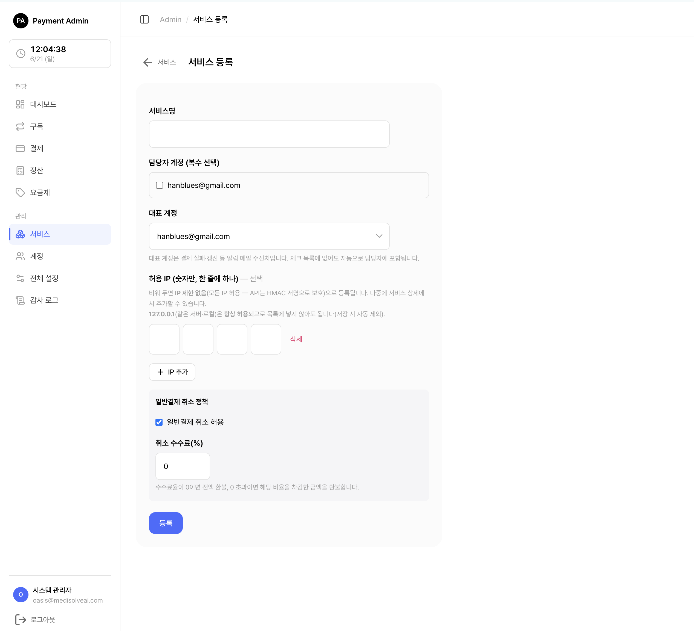
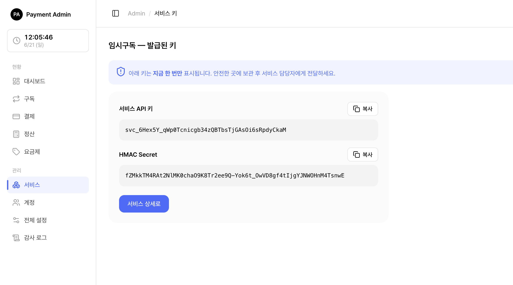

# 0. 구독·결제 서버 전체 개요

> 쉽게 말하면 이 서버는 사내 여러 앱이 '구독·결제'를 각자 따로 만들지 않고 한곳에 맡기는 **공용 결제 창구**입니다. 건물 안 모든 가게가 1층 공용 카운터에서 계산하는 것과 같습니다. 우리 앱은 "이 사용자 구독시켜줘"라고 **요청만** 하고, 실제 카드 결제·자동 연장·정산은 이 서버가 대신 처리합니다.

이 문서는 이 서버를 **처음 접하는 분**이 "이게 무엇이고, 어떤 흐름으로 동작하는지"를 그림과 함께 한눈에 이해하도록 돕습니다. 세부 화면·연동 방법은 각 섹션의 링크를 따라가세요.

> 길잡이(독자별 시작점): **관리자·서비스 담당자**라면 → 아래 0-5 빠른 시작과 [관리자 콘솔 시작](01-admin-console.md)부터 보세요. **연동 개발자**라면 → 0-2의 연동 시퀀스와 [서비스 API 연동](11-service-api.md)·[설치·배포](10-install-deploy.md)부터 보세요. 0-1~0-4는 두 독자 공통 개요입니다.

---

## 0-1. 이 서버는 무엇이고, 누가 쓰나

사내 여러 서비스(진료 앱, 쇼핑몰 등)가 공통으로 쓰는 **구독·결제 API 서버**입니다. 결제는 **토스페이먼츠**로 처리합니다. 사용 방법은 크게 두 가지입니다.

- **관리자 콘솔(화면)** — 브라우저에서 로그인해 서비스·요금제·구독·결제·정산을 눈으로 보고 관리합니다.
- **API(자동 연동)** — 외부 서비스가 코드로 "구독해줘 / 결제해줘"를 요청합니다.

### 등장하는 4가지 역할

| 역할 | 누구인가 | 주로 하는 일 |
|------|----------|--------------|
| 시스템 관리자 | 결제 서버 운영자(SYSTEM_ADMIN) | 서비스 등록·키 발급, 담당자 계정 생성, 전체 설정(킬스위치 등), 전 서비스 모니터링 |
| 서비스 담당자 | 각 사내 서비스의 담당자(SERVICE_MANAGER) | 로그인해 **자기 서비스**의 요금제 생성·구독/결제 확인·정산 조회 |
| 외부 서비스 | 사내 앱(진료 앱·쇼핑몰 등)의 서버 | API로 카드 등록·구독·결제를 요청하고, 알림을 수신 |
| 최종 사용자 | 외부 서비스를 쓰는 실제 고객 | 외부 서비스 화면에서 카드를 등록하고 구독·결제 |

> 참고: 관리자/담당자는 콘솔에 **로그인 세션**으로 접근하고, 외부 서비스는 **API 키 + HMAC 서명**으로 인증합니다. 두 입구는 완전히 분리되어 있습니다.

---

## 0-2. 전체 프로세스 그림 — 서비스 입장에서

신규 서비스를 붙이고 실제 구독·결제가 도는 전체 흐름입니다. 앞쪽(1~4)은 **관리자/담당자가 콘솔에서** 준비하는 단계이고, 뒤쪽(5~8)은 **외부 서비스가 API로** 실제 사용자를 처리하는 단계입니다.

  
1<b>서비스 등록</b>시스템 관리자가 사내 서비스를 콘솔에 등록(서비스명·허용 IP·담당자·취소정책).

  
2<b>API 키 발급·전달</b>등록 직후 API 키·HMAC 시크릿이 1회만 표시 → 안전하게 복사해 담당 개발자에게 전달.

  
3<b>담당자 로그인</b>서비스 담당자(SERVICE_MANAGER)가 콘솔에 로그인해 자기 서비스를 관리.

  
4<b>요금제 생성</b>가격·결제주기(년/월/주/일)·첫구독 혜택·체험·자동결제 여부를 정해 활성(ACTIVE) 요금제 생성.

  
5<b>카드 등록</b>외부 서비스에서 사용자 카드(빌링키)를 먼저 등록. 구독·결제 전 필수.

  
6<b>구독 요청·처리</b>외부 서비스가 구독을 요청 → 서버가 등록 카드로 첫 결제(또는 체험) 처리, 구독 생성.

  
7<b>자동 연장</b>만료일이 되면 스케줄러가 등록 카드로 자동결제해 구독을 연장. 실패 시 재시도·미수 처리.

  
8<b>정산·대시보드·알림</b>결제 결과를 정산·대시보드로 집계하고, 상태 변화는 서비스 알림으로 통지.

> 쉽게 말하면 **1~4는 "가게를 여는 준비"**(서비스·요금제 세팅), **5~8은 "손님이 와서 결제하고 매달 자동결제되는 일상"**입니다.

> 함께 보기: 1~4단계를 순서대로 따라 하려면 [관리자 콘솔 시작](01-admin-console.md)과 [요금제 관리](04-admin-plan.md)를, 5~8단계의 API 연동은 [서비스 API 연동](11-service-api.md)을 보세요.

### (개발자용) 서비스가 실제로 호출하는 순서 — 연동 시퀀스

> 참고(개발자용): 아래 시퀀스 다이어그램과 엔드포인트(`POST /api/v1/...`)·HMAC·웹훅은 **연동 개발자**를 위한 내용입니다. 콘솔에서 운영·관리만 한다면 건너뛰고 아래 **0-3 핵심 개념**으로 가도 됩니다. 실제 연동은 [서비스 API 연동](11-service-api.md)에서 자세히 다룹니다.

준비(1~4)가 끝났다면, **외부 서비스(앱)가 API로** 어떤 순서로 호출하는지를 그림으로 나타내면 다음과 같습니다. 화살표는 "누가 누구를 호출하는지"이며, **파란색**은 서비스가 결제 서버를 호출하는 부분입니다.

<svg viewBox="0 0 760 532" xmlns="http://www.w3.org/2000/svg">
  <defs>
    <marker id="apr" markerWidth="9" markerHeight="9" refX="7" refY="4" orient="auto"><path d="M0,0 L8,4 L0,8 z" fill="#476CFF"/></marker>
    <marker id="agr" markerWidth="9" markerHeight="9" refX="7" refY="4" orient="auto"><path d="M0,0 L8,4 L0,8 z" fill="#9AA1AD"/></marker>
  </defs>
  <!-- 레인 헤더 -->
  <rect class="lane" x="30" y="14" width="160" height="34" rx="9"/>
  <text class="lane-t" x="110" y="36" text-anchor="middle">외부 서비스(앱)</text>
  <rect class="lane" x="310" y="14" width="160" height="34" rx="9"/>
  <text class="lane-t" x="390" y="36" text-anchor="middle">결제 서버</text>
  <rect class="lane" x="580" y="14" width="160" height="34" rx="9"/>
  <text class="lane-t" x="660" y="36" text-anchor="middle">토스페이먼츠</text>
  <!-- 라이프라인 -->
  <line class="life" x1="110" y1="48" x2="110" y2="520"/>
  <line class="life" x1="390" y1="48" x2="390" y2="520"/>
  <line class="life" x1="660" y1="48" x2="660" y2="520"/>
  <!-- 1) 카드 등록 -->
  <line class="msg" x1="110" y1="86" x2="390" y2="86" marker-end="url(#apr)"/>
  <text class="lbl" x="250" y="78" text-anchor="middle"><tspan>① </tspan><tspan style="font-weight:800;fill:#2A45C0">POST /api/v1/cards</tspan> 카드 등록</text>
  <line class="msg2" x1="390" y1="122" x2="660" y2="122" marker-end="url(#agr)"/>
  <text class="lbl" x="525" y="114" text-anchor="middle">빌링키 발급 요청</text>
  <line class="msg2" x1="660" y1="158" x2="390" y2="158" marker-end="url(#agr)"/>
  <text class="lbl" x="525" y="150" text-anchor="middle">billingKey (암호화 보관)</text>
  <line class="msg" x1="390" y1="194" x2="110" y2="194" marker-end="url(#apr)"/>
  <text class="lbl" x="250" y="186" text-anchor="middle">201 카드 등록 완료</text>
  <!-- 구독 시작 -->
  <rect class="band" x="20" y="206" width="720" height="22" rx="6"/>
  <text class="band-t" x="380" y="221" text-anchor="middle">구독 시작 — 구독 전 카드 등록은 필수</text>
  <line class="msg" x1="110" y1="252" x2="390" y2="252" marker-end="url(#apr)"/>
  <text class="lbl" x="250" y="244" text-anchor="middle"><tspan>② </tspan><tspan style="font-weight:800;fill:#2A45C0">POST /api/v1/subscriptions</tspan> 구독 요청</text>
  <line class="msg2" x1="390" y1="288" x2="660" y2="288" marker-end="url(#agr)"/>
  <text class="lbl" x="525" y="280" text-anchor="middle">첫 결제(빌링키) · 체험이면 생략</text>
  <line class="msg2" x1="660" y1="324" x2="390" y2="324" marker-end="url(#agr)"/>
  <text class="lbl" x="525" y="316" text-anchor="middle">결제 승인</text>
  <line class="msg" x1="390" y1="360" x2="110" y2="360" marker-end="url(#apr)"/>
  <text class="lbl" x="250" y="352" text-anchor="middle">201 구독 생성 (ACTIVE / TRIAL)</text>
  <!-- 이후 자동 -->
  <rect class="band" x="20" y="372" width="720" height="22" rx="6"/>
  <text class="band-t" x="380" y="387" text-anchor="middle">이후 자동 — 서비스가 호출하지 않아도 서버가 처리</text>
  <line class="msg2" x1="390" y1="418" x2="660" y2="418" marker-end="url(#agr)"/>
  <text class="lbl" x="525" y="410" text-anchor="middle">③ 만료일 자동결제(연장) · 스케줄러</text>
  <line class="msg" x1="390" y1="454" x2="110" y2="454" marker-end="url(#apr)"/>
  <text class="lbl" x="250" y="446" text-anchor="middle">④ 알림URL <tspan style="font-weight:800;fill:#2A45C0">/notify</tspan> 상태변화 통지(웹훅)</text>
  <!-- 필요할 때 -->
  <rect class="band" x="20" y="466" width="720" height="22" rx="6"/>
  <text class="band-t" x="380" y="481" text-anchor="middle">필요할 때 — 서비스가 추가로 호출</text>
  <line class="msg" x1="110" y1="512" x2="390" y2="512" marker-end="url(#apr)"/>
  <text class="lbl" x="250" y="504" text-anchor="middle">⑤ 단건결제 · 취소/환불 · 카드변경 · 내역조회</text>
</svg>

위 그림을 글로 풀면, 서비스가 따라야 하는 연동 프로세스는 다음과 같습니다.

<ol class="steps">
  <li><b>연동 준비</b> — 발급받은 <b>API 키·HMAC 시크릿</b>을 서버 환경에 저장하고, 모든 요청에 HMAC 서명 헤더를 붙입니다. → [서비스 API 연동](11-service-api.md)</li>
  <li><b>① 카드 등록</b> — 사용자가 토스로 카드 인증을 마치면, 서비스가 <code>POST /api/v1/cards</code>로 등록합니다. 서버가 토스에서 빌링키를 발급받아 암호화 보관합니다. <b>구독·결제 전 필수</b>입니다.</li>
  <li><b>② 구독 요청</b> — <code>POST /api/v1/subscriptions</code>로 요금제를 지정해 구독을 만듭니다. 서버가 등록된 카드로 <b>첫 결제</b>(체험이면 생략)를 하고 구독을 ACTIVE/TRIAL로 생성합니다.</li>
  <li><b>③ 자동 연장(서비스 개입 없음)</b> — 만료일이 되면 서버 스케줄러가 등록 카드로 <b>자동결제해 구독을 연장</b>합니다. 실패하면 재시도 → 미수(PAST_DUE) → 정지(SUSPENDED) 순으로 처리됩니다. 서비스는 호출하지 않아도 됩니다.</li>
  <li><b>④ 알림 수신(웹훅)</b> — 상태가 바뀌면 서버가 서비스의 <b>알림 URL</b>로 JSON을 <code>POST</code>합니다. 서비스는 이 알림으로 자기 DB를 갱신합니다. → [서비스 알림](15-feature-notifications.md)</li>
  <li><b>⑤ 필요할 때 추가 호출</b> — 단건(1회성) 결제, 결제 취소/환불, 카드 변경(재등록), 구독 취소·재개·수동결제, 결제·구독 내역 조회 등을 그때그때 호출합니다.</li>
</ol>

> 쉽게 말하면 서비스가 직접 챙기는 건 **①카드 등록 → ②구독 요청** 두 번뿐이고, **③자동결제·연장은 서버가 알아서** 하며, 서비스는 **④알림만 받으면** 됩니다.

---

## 0-3. 핵심 개념 한눈에

이 서버를 이해하는 데 꼭 필요한 용어만 모았습니다.

| 개념 | 한 줄 설명 |
|------|-----------|
| **서비스** | 구독·결제를 사용하는 사내 앱 단위. 서비스마다 API 키·허용 IP·취소정책을 가짐 |
| **요금제** | 가격·결제주기(년/월/주/일)·첫구독 혜택·체험·자동결제 여부를 정한 상품. 활성(ACTIVE)이어야 구독 가능 |
| **카드 보관함** | 사용자의 결제수단(빌링키)을 암호화해 보관. `(서비스+사용자)`당 1건. 구독·결제 전 반드시 등록 |
| **빌링키(billingKey)** | 토스가 카드 인증 후 발급하는 **재사용 결제 키**. 서버가 암호화해 카드 보관함에 저장하고 자동·수동결제에 사용. 카드번호 원문은 보관하지 않음 |
| **customerKey** | 토스 빌링에서 고객(카드)을 식별하는 값. 카드 등록 시 서비스가 보내며 빌링키 발급·결제에 함께 쓰임 |
| **구독 상태** | 체험(TRIAL)·이용중(ACTIVE)·미수(PAST_DUE)·정지(SUSPENDED)·취소예약(CANCELED)·만료(EXPIRED) 등 |
| **미수(PAST_DUE)** | 자동결제가 실패해 결제일이 지난 구독 상태. 유예 기간엔 이용이 유지되며 재시도되고, 실패가 쌓이면 정지(SUSPENDED)로 진행 |
| **일반(단건) 결제** | 구독과 무관한 1회성 결제. 취소(환불)는 서비스 취소정책·수수료에 따름 |
| **정산** | 서비스·기간별로 실제 결제·환불 금액을 집계해 매출을 확인 |
| **알림** | 구독·결제·카드·요금제 상태가 바뀌면 서비스가 등록한 URL로 JSON 알림을 보내는 기능 |
| **HMAC 서명** | 외부 서비스가 API를 호출할 때 **요청이 위·변조되지 않았음을 증명**하는 서명. API 키와 짝인 HMAC 시크릿으로 요청 본문·시각·논스를 해시해 만든다 → [서비스 API](11-service-api.md) |
| **킬스위치** | 점검·사고 시 **결제 처리를 일시 전면 중지**하는 전체 설정 스위치. 어드민 콘솔 접속 자체는 영향 없음 → [전체 설정](07-admin-settings.md) |

> 참고: **구독은 서비스+사용자당 1개만** 가능합니다. 또 **요금제·서비스는 구독이 남아 있으면 삭제할 수 없습니다**(정상 동작). 정리 후 삭제하거나 비활성화로 대체하세요.

> 주의: **카드 등록이 구독·결제보다 먼저**입니다. 카드(빌링키)를 등록하지 않은 사용자는 구독·결제가 거부됩니다. 자세한 내용은 [카드 관리](02-admin-card.md)를 보세요.

---

## 0-4. 두 가지 사용 경로

이 서버를 쓰는 방법은 목적에 따라 둘로 나뉩니다. 보통 둘을 함께 씁니다(콘솔로 세팅 → API로 연동).

### (a) 관리자 콘솔(화면)로 관리

브라우저에서 로그인해 **눈으로 보고 손으로** 관리하는 방식입니다. 서비스·요금제 준비와 운영 중 모니터링·환불 처리에 씁니다.

| 하고 싶은 일 | 보는 문서 |
|--------------|-----------|
| 로그인·기본 화면 익히기 | [관리자 콘솔 시작](01-admin-console.md) |
| 사용자 카드 확인·활성/비활성 | [카드 관리](02-admin-card.md) |
| 구독 조회·강제취소·수동결제 | [구독 관리](03-admin-subscription.md) |
| 요금제 만들기·수정 | [요금제 관리](04-admin-plan.md) |
| 결제 확인·환불(전액/부분) | [결제·환불 관리](05-admin-payment-refund.md) |
| 담당자 계정 만들기 | [계정 관리](06-admin-accounts.md) |
| 전체 설정·킬스위치 | [전체 설정](07-admin-settings.md) |
| 감사 로그(누가 무엇을 했나) | [감사 로그](08-admin-audit.md) |
| 매출·구독 추이 보기 | [대시보드](09-dashboard.md) |

### (b) 외부 서비스가 API로 연동

사내 앱이 코드로 자동 연동하는 방식입니다. API 키 + HMAC 서명으로 인증하며, 카드 등록 → 구독/결제 → 조회 → 알림 수신을 자동화합니다.

| 하고 싶은 일 | 보는 문서 |
|--------------|-----------|
| 설치·배포(docker)·환경 준비 | [개발자 설치·배포](10-install-deploy.md) |
| API 엔드포인트·HMAC 서명·샘플 연동 | [서비스 API 연동](11-service-api.md) |
| 카드 등록 흐름(코드) | [카드 기능 흐름](12-feature-card.md) |
| 구독 생성·갱신 흐름(코드) | [구독 기능 흐름](13-feature-subscription.md) |
| 결제·취소 흐름(코드) | [결제 기능 흐름](14-feature-payment.md) |
| 상태 변화 알림(웹훅) | [서비스 알림](15-feature-notifications.md) |

> 팁: 외부 연동을 처음 시도한다면 동작하는 예제인 **샘플 서비스**(`sample_service/`)로 흐름을 먼저 따라가 보는 것이 가장 빠릅니다. [서비스 API 연동](11-service-api.md)에 셋업 방법이 있습니다.

---

## 0-5. 빠른 시작 — 관리자 관점 따라하기

<figure class="shot">
  
  <figcaption style="color:#6b7280;font-size:13px;margin-top:6px">서비스 등록 폼</figcaption>
</figure>

<figure class="shot">
  
  <figcaption style="color:#6b7280;font-size:13px;margin-top:6px">서비스 키·HMAC 시크릿 1회 표시 화면</figcaption>
</figure>

신규 서비스를 처음 붙일 때, 콘솔에서 순서대로 진행합니다. **계정을 먼저 만들고 서비스를 등록**하는 순서가 중요합니다(서비스 등록 화면에서 담당자를 *선택*하기 때문).

<ol class="steps">
  <li>시스템 관리자 <b>담당자 계정 생성</b> — 계정 메뉴에서 담당자 이메일로 계정을 만들고 역할을 <b>SERVICE_MANAGER</b>로 지정합니다. 담당자에게 비밀번호 설정 링크(48시간·1회용)가 메일로 발송됩니다. → [계정 관리](06-admin-accounts.md)</li>
  <li>시스템 관리자 <b>서비스 등록</b> — 서비스명·허용 IP(1개 이상 필수)·담당자(대표 지정)·취소정책을 입력해 등록합니다. → [관리자 콘솔 시작](01-admin-console.md)</li>
  <li>시스템 관리자 <b>API 키 발급·전달</b> — 등록 직후 표시되는 <b>API 키·HMAC 시크릿</b>을 그 자리에서 복사해 담당 개발자에게 안전한 채널로 전달합니다(화면을 벗어나면 다시 볼 수 없음).</li>
  <li>서비스 담당자 <b>로그인 후 요금제 생성</b> — 받은 비밀번호 링크로 로그인해, 가격·결제주기·첫구독 혜택·체험·자동결제 여부를 정해 <b>활성(ACTIVE) 요금제</b>를 만듭니다. → [요금제 관리](04-admin-plan.md)</li>
  <li>외부 서비스 <b>연동·카드 등록</b> — 담당 개발자가 API 키·HMAC 시크릿으로 서버에 연동하고, 사용자 카드를 먼저 등록합니다. → [서비스 API 연동](11-service-api.md)</li>
  <li><b>테스트 구독 1건 검증</b> — 외부 서비스(또는 샘플)에서 테스트 구독을 만들고, 콘솔 구독 화면에 ACTIVE(또는 TRIAL)로 보이는지, 정산·대시보드에 집계되는지 확인합니다. → [구독 관리](03-admin-subscription.md) · [대시보드](09-dashboard.md)</li>
  <li><b>운영 시작 후 모니터링</b> — 결제 실패가 쌓이지 않는지, 자동 연장이 정상인지 주기적으로 확인합니다. 점검·사고 시 전체 설정의 <b>킬스위치</b>로 결제 서버를 일시 중지할 수 있습니다. → [전체 설정](07-admin-settings.md)</li>
</ol>

> 함께 보기: 단계별 체크리스트와 자주 하는 실수는 개발자 매뉴얼의 온보딩 체크리스트에도 정리되어 있습니다. 화면별 상세는 각 단계의 링크를 따라가세요.
