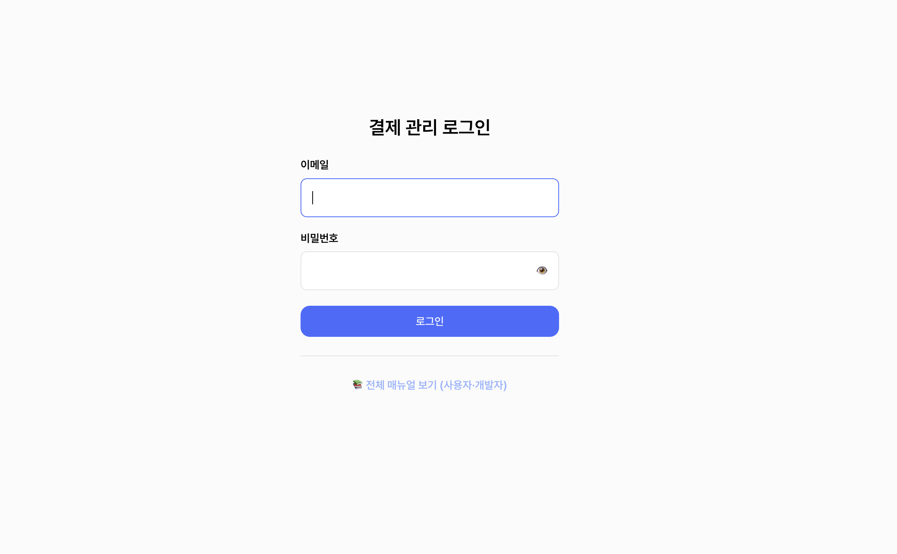

# 1. 관리자 콘솔 사용하기

구독·결제 시스템의 **관리자 콘솔**은 구독 현황을 보고, 결제를 관리하고, 서비스와 요금제를 설정하는 웹 화면입니다. 이 문서는 콘솔에 처음 들어가는 방법(로그인)과 화면 전체 구조, 그리고 두 가지 역할에 따라 보이는 메뉴 차이를 안내합니다.

> 쉽게 말하면, 이 콘솔은 "구독·결제를 눈으로 보고 손으로 관리하는 관제실"입니다.

> 함께 보기: [서비스 관리](19-admin-services.md) · [카드 관리](02-admin-card.md) · [구독 관리](03-admin-subscription.md)

---

## 1.1 로그인하기

<figure class="shot">
  
  <figcaption style="color:#6b7280;font-size:13px;margin-top:6px">관리자 콘솔 로그인 화면</figcaption>
</figure>

관리자 콘솔의 모든 화면은 로그인을 해야 볼 수 있습니다. 로그인하지 않은 상태로 콘솔 주소에 접속하면 자동으로 로그인 화면으로 이동합니다.

### 로그인 절차

<ol class="steps">
<li>브라우저에서 콘솔 로그인 주소(<code>/admin/login</code>)에 접속합니다.</li>
<li><b>이메일</b>과 <b>비밀번호</b>를 입력합니다. 비밀번호 칸 오른쪽의 눈 아이콘을 누르면 입력한 비밀번호를 잠깐 확인할 수 있습니다.</li>
<li><b>로그인</b> 버튼을 누릅니다.</li>
<li>로그인에 성공하면 <b>대시보드</b> 화면으로 들어갑니다.</li>
</ol>

로그인에 실패하면 화면 위쪽에 빨간 안내 문구가 나타납니다. 자주 보게 되는 메시지는 다음과 같습니다.

| 상황 | 화면에 나오는 안내 |
|------|------------------|
| 이메일이나 비밀번호가 틀림 | 이메일 또는 비밀번호가 올바르지 않습니다 |
| 비밀번호를 5번 연속 틀림 | 계정이 잠겼습니다. 잠시 후 다시 시도해주세요 |
| 사용 중지된 계정 | 비활성화된 계정입니다. 관리자에게 문의하세요 |
| 비밀번호를 아직 설정하지 않은 계정 | 비밀번호 설정이 필요합니다. 안내 메일을 확인해주세요 |

> 주의: 비밀번호를 **5번 연속** 틀리면 계정이 **15분간 잠깁니다**. 잠겨 있는 동안에는 올바른 비밀번호를 넣어도 들어갈 수 없으며, 15분이 지나면 자동으로 풀립니다.

### 처음 로그인 — 비밀번호 설정

새로 계정을 만들었거나 비밀번호 재설정을 요청한 경우, 이메일로 **비밀번호 설정 링크**가 전달됩니다.

<ol class="steps">
<li>이메일에서 받은 링크를 브라우저로 엽니다.</li>
<li><b>새 비밀번호</b>(10자 이상)와 <b>비밀번호 확인</b>을 같게 입력합니다.</li>
<li><b>설정</b> 버튼을 누릅니다. 완료되면 로그인 화면으로 이동하며, 이제 새 비밀번호로 로그인할 수 있습니다.</li>
</ol>

> 주의: 이 설정 링크는 **한 번만** 사용할 수 있고 **48시간** 동안만 유효합니다. 이미 사용했거나 시간이 지난 링크를 다시 열면 오류가 납니다. 그럴 때는 시스템 관리자에게 재발급을 요청하세요.

> 참고: 비밀번호 재설정을 완료하면, 다른 기기·다른 브라우저에 남아 있던 로그인도 모두 자동으로 로그아웃됩니다.

### 로그아웃

화면 왼쪽 아래(또는 상단)의 **로그아웃** 버튼을 누르면 즉시 로그아웃되고 로그인 화면으로 돌아갑니다.

> 참고: 세션은 **30분간 활동이 없으면** 자동 로그아웃되고, 활동이 있더라도 **로그인 후 12시간이 지나면** 절대 만료되어 다시 로그인해야 합니다(보안상 세션 수명 제한).

---

## 1.2 두 가지 역할 — 무엇을 볼 수 있나

관리자 계정에는 두 가지 역할이 있습니다. 역할에 따라 **볼 수 있는 메뉴와 데이터 범위**가 다릅니다.

- SYSTEM_ADMIN 전체 관리자 — 모든 서비스와 모든 데이터에 접근합니다.
- SERVICE_MANAGER 서비스 담당자 — **자신이 담당하는 서비스만** 보고 관리합니다.

### 역할별 차이 한눈에 보기

| 항목 | SYSTEM_ADMIN 전체 관리자 | SERVICE_MANAGER 서비스 담당자 |
|------|-------------------------------|----------------------------------|
| 대시보드 | 볼 수 있음 (전체 기준) | 볼 수 있음 (담당 서비스 기준) |
| 구독 | 모든 서비스의 구독 | **담당 서비스의 구독만** |
| 결제 | 모든 서비스의 결제 | 담당 서비스의 결제만 |
| 정산 | 볼 수 있음 | 담당 서비스 기준 |
| 요금제 | 볼 수 있음 | 담당 서비스 기준 |
| 서비스 (등록·키 발급) | 볼 수 있음 | **메뉴에 보이지 않음** |
| 계정(관리자) 관리 | 볼 수 있음 | **메뉴에 보이지 않음** |
| 전체 설정 | 볼 수 있음 | **메뉴에 보이지 않음** |
| 감사 로그 | 볼 수 있음 | **메뉴에 보이지 않음** |

> 중요: 서비스 담당자가 자신의 담당 범위를 벗어난 구독에 주소를 직접 입력해 접근하더라도 "찾을 수 없음"으로 처리됩니다. 다른 서비스의 정보가 있는지 여부조차 노출하지 않기 위한 안전장치입니다.

> 쉽게 말하면, 전체 관리자는 "건물 전체 마스터키", 서비스 담당자는 "내 사무실 열쇠"를 가진 것과 같습니다.

---

## 1.3 전체 메뉴 구조

로그인하면 왼쪽에 메뉴(사이드바)가 보입니다. 메뉴는 두 묶음으로 나뉩니다.

### 현황 (모든 역할에게 보임)

| 메뉴 | 하는 일 |
|------|--------|
| **대시보드** | 구독·결제·매출 현황을 그래프와 숫자로 요약해서 봅니다. |
| **구독** | 구독 목록을 검색·필터링하고, 구독 상세에서 강제취소·만료일 연장·재결제를 합니다. → [구독 관리](03-admin-subscription.md) |
| **결제** | 개별 결제 내역을 확인합니다. |
| **정산** | 기간별 매출·정산 현황을 봅니다. |
| **요금제** | 요금제를 만들고 가격·결제주기·할인 등을 설정합니다. |

### 관리 (전체 관리자에게만 보임)

| 메뉴 | 하는 일 |
|------|--------|
| **서비스** | 구독·결제를 사용할 서비스를 등록하고, 서비스 키를 발급합니다. 서비스 상세에서 **등록 카드**(카드 보관함)도 봅니다. → [카드 관리](02-admin-card.md) |
| **계정** | 관리자 계정을 만들고 역할(전체 관리자/서비스 담당자)을 부여합니다. |
| **전체 설정** | 접근 허용 IP 등 시스템 전반 설정을 관리합니다. |
| **감사 로그** | 누가 언제 무엇을 했는지 기록을 조회합니다. |

> 참고: 서비스 담당자로 로그인하면 "관리" 묶음(서비스·계정·전체 설정·감사 로그)은 메뉴에 아예 나타나지 않습니다.

---

## 1.4 공통 UI — 화면 어디나 비슷한 요소들

콘솔의 여러 화면은 같은 방식으로 동작합니다. 한 번 익히면 모든 화면에서 똑같이 쓸 수 있습니다.

- **목록 화면**: 위쪽에 검색창과 필터(드롭다운)가 있고, 그 아래 표가 나옵니다. 표의 **각 행을 클릭하면** 그 항목의 상세 화면으로 이동합니다.
- **정렬**: 표 머리글 중 정렬 가능한 항목(예: 등록일, 만료일)을 누르면 오름차순/내림차순으로 정렬됩니다.
- **페이지 넘김**: 표 아래의 이전·숫자·다음 버튼으로 페이지를 넘깁니다. "총 N건 중 몇–몇" 표시로 전체 개수를 확인할 수 있습니다.
- **검색·필터 초기화**: 검색어나 필터를 하나라도 쓰면 "초기화" 링크가 나타나며, 누르면 모든 조건이 풀립니다.
- **상태 배지**: 구독·결제·카드의 상태는 색깔 배지로 표시됩니다. 예: 활성 비활성
- **위험한 동작의 확인창**: 강제취소·카드 비활성화처럼 영향이 큰 버튼을 누르면, 실행 전에 "정말 하시겠어요?" 확인창이 한 번 더 뜹니다.
- **엑셀 다운로드**: 목록 화면에는 현재 검색·필터 조건을 그대로 담아 엑셀로 내려받는 버튼이 있습니다.

> 팁: 표에서 무언가를 자세히 보고 싶으면, 버튼을 찾기 전에 일단 **그 줄을 클릭**해 보세요. 대부분 상세 화면으로 바로 이동합니다.

---

> 함께 보기: 카드(결제수단) 관리는 [카드 관리](02-admin-card.md), 구독의 상태와 운영 작업은 [구독 관리](03-admin-subscription.md)에서 이어집니다.
