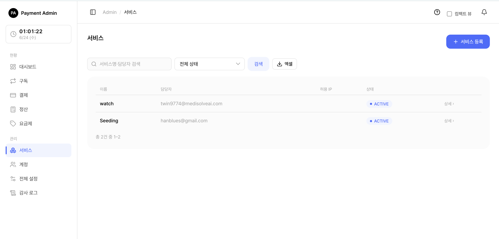
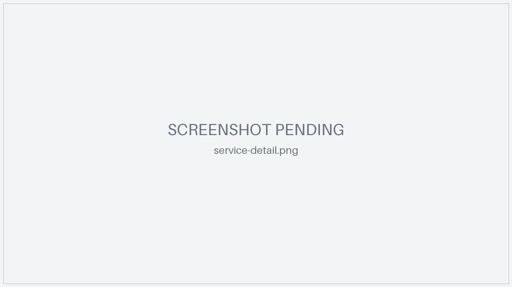
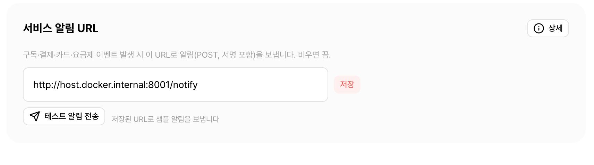
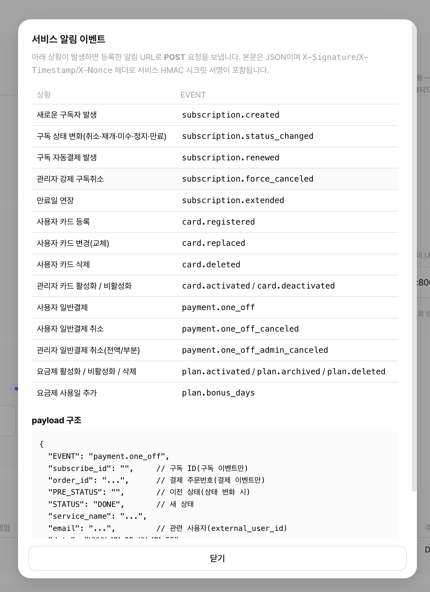

# 2. 서비스 관리

> 쉽게 말하면, **"어떤 사내 앱이 이 결제 서버를 쓸지" 를 등록·관리**하는 화면입니다. 서비스를 등록해야 그 서비스용 API 키·토스 시크릿 키·요금제·구독이 생깁니다. 전체 흐름에서 **가장 먼저** 하는 일입니다([0. 개요](00-overview.md)의 1~5 준비 단계).

> 대상: SYSTEM_ADMIN 전용 화면입니다. 서비스 담당자 SERVICE_MANAGER에게는 이 메뉴가 보이지 않습니다.

> 함께 보기: [관리자 콘솔 사용하기](01-admin-console.md) · [계정 관리](07-admin-accounts.md) · [요금제 관리](05-admin-plan.md) · [서비스 알림 기능](17-feature-notifications.md) · 화면별 기술 레퍼런스는 [어드민 화면별 설명](18-admin-screens.md).

---

## 2.1 시작 전에 — 담당자 계정을 먼저

서비스 등록 화면은 담당자를 **목록에서 선택**하는 방식입니다. 그래서 **담당자 계정(SERVICE_MANAGER)을 먼저 만들어야** 서비스에 담당자를 지정할 수 있습니다. 계정 생성은 [계정 관리](07-admin-accounts.md)를 참고하세요.

> 참고: 담당자 후보 목록에는 **삭제되지 않은 SERVICE_MANAGER 계정 전체**가 이메일 순으로 나옵니다. SYSTEM_ADMIN 계정은 담당자로 지정할 수 없습니다.

---

## 2.2 서비스 목록

왼쪽 메뉴에서 **서비스**를 누르면 등록된 서비스 목록이 열립니다.

- **검색**: 서비스명 또는 담당자(이메일) 일부로 검색
- **상태 필터**: 활성(ACTIVE) / 비활성(INACTIVE) / 전체
- **정렬**: 서비스명·등록일 등 컬럼 머리글로 정렬(기본은 등록일 순)
- **컬럼**: 서비스명, 담당자, 허용 IP, 상태
- 서비스명을 누르면 **서비스 상세**로 이동합니다.
- 오른쪽 위 **[서비스 등록]** 버튼으로 새 서비스를 만듭니다.
- **엑셀 내보내기**: 현재 검색·필터가 적용된 목록을 엑셀(.xlsx)로 내려받습니다. 한 번에 내보낼 수 있는 최대 행 수에 제한이 있어, 그보다 많으면 검색·필터로 범위를 좁혀 받으세요.

> 참고: 비활성(INACTIVE) 서비스는 API 키 인증이 막혀 외부 호출이 모두 거부됩니다(상세에서 활성/비활성을 토글, 2.8 참고).

---

## 2.3 서비스 등록

**서비스 → 서비스 등록**(`/admin/services/new`)에서 입력합니다.

| 항목 | 필수 | 설명 |
|------|------|------|
| **서비스명** | 필수 | 콘솔에 표시될 이름(중복 불가). 같은 이름이 이미 있으면 등록이 거부됩니다 |
| **담당자 계정** | 필수 | 미리 만든 SERVICE_MANAGER 계정을 **복수 선택**(체크박스) |
| **대표 계정** | 필수 | 결제 실패·갱신 등 **알림 메일 수신처**. 체크 목록에서 빠져 있어도 **자동으로 담당자에 포함**되며 목록 맨 앞에 배치됩니다 |
| **허용 IP** | 선택 | API를 호출할 서버의 공인 IP(IPv4, 한 줄에 하나, 콤마 구분도 허용). 비우면 **IP 제한 없음**(이 경우 호출은 HMAC 서명으로만 보호) |
| **일반결제 취소 정책** | — | 단건(일반) 결제 취소 허용 여부 + 취소 수수료율(0~100%) |
| **토스 시크릿 키** | 선택 | 그 서비스의 토스 시크릿 키. **AES 암호화 저장**, 저장 후 다시 표시되지 않음(쓰기 전용). 지금 비워두고 나중에 상세에서 설정/교체 가능(2.7 참고) |

> 참고: 허용 IP는 **IPv4만** 받습니다(IPv6·CIDR 불가). 같은 서버를 가리키는 로컬 주소(127.0.0.1)는 항상 허용되므로 입력해도 목록에 저장되지 않습니다.

> 중요: 결제가 동작하려면 **그 서비스의 토스 시크릿 키가 등록**돼 있어야 합니다(서비스마다 다름). 미등록 서비스는 결제·구독 첫 결제·자동연장이 `TOSS_KEY_NOT_CONFIGURED`(422)로 거부됩니다. 자세한 동작은 [어드민 화면별 설명](18-admin-screens.md) 참고. (전역 `TOSS_SECRET_KEY` 환경변수는 제거됨)

---

## 2.4 키 발급·전달 (등록 직후, 1회성 · 중요)

등록을 누르면 **키 발급 화면**으로 이동합니다.

- **API 키**와 **HMAC 시크릿**이 화면에 **단 한 번만** 표시됩니다(키는 암호화 저장되므로 평문을 볼 수 있는 유일한 기회).
- 두 값을 **복사**해 **안전한 채널**(사내 비밀 저장소 등)로 서비스 담당 개발자에게 전달하세요.
- 화면을 벗어나면 평문 키를 다시 볼 수 없습니다.

> 주의: 평문 키가 담긴 화면은 브라우저 캐시에 남지 않도록 처리되며, **키 조회는 감사 로그에 기록**됩니다.

> 함께 보기: API 키·HMAC 시크릿의 용도(요청 서명)는 [서비스 연동 API](13-service-api.md)를 참고하세요. 토스 시크릿 키는 **서버가 토스에 결제 요청**할 때 쓰는 별도 값이며, 외부 서비스의 client key와는 다릅니다(client key는 서비스 프론트가 자체 사용).

### 2.4.1 키 다시 복사하기 (키 복사 모달)

이미 발급된 서비스라도, 상세 화면에서 **키 복사 모달**을 열면 보관된 평문 API 키·HMAC 시크릿을 다시 확인·복사할 수 있습니다(키는 암호화 저장돼 있으므로 복호화해 표시). 이 조회 역시 **감사 로그에 남습니다**.

> 주의: 키 복사는 평문 노출 동작이므로 꼭 필요한 경우에만 사용하고, 유출이 의심되면 키 재발급(2.4.2)으로 즉시 무효화하세요.

### 2.4.2 키 재발급(회전)

분실·유출 시, 상세에서 **키 재발급(회전)**을 실행합니다.

- 새 API 키·HMAC 시크릿이 즉시 발급되고 **이전 키는 그 즉시 무효화**됩니다.
- 발급 직후 같은 1회성 키 화면이 다시 표시되므로, 새 값을 복사해 외부 서비스가 **새 키로 다시 설정**하도록 전달해야 합니다(재설정 전까지 해당 서비스의 API 호출은 인증 실패).

---

## 2.5 서비스 상세 — 개요

서비스명을 누르면 상세 화면이 열립니다. 상단에는 서비스 정보와 설정 영역이, 하단에는 데이터 탭이 있습니다.

- **설정 영역**(2.6~2.10): 허용 IP, 취소 정책, 알림 URL, 토스 시크릿 키, 상태 토글, 키 재발급, 담당자 관리, 삭제
- **데이터 탭**(2.11): 요금제 · 구독 · 단건 결제 · 등록 카드 · 이벤트

> 참고: 설정을 저장하면 "저장되었습니다" 같은 완료 안내가 표시됩니다. 입력값 오류(예: 잘못된 IP, 범위를 벗어난 수수료율)는 화면 상단에 오류 메시지로 안내됩니다.

---

## 2.6 허용 IP 수정

상세에서 허용 IP 목록을 **통째로 교체**합니다.

- 한 줄에 하나씩(콤마 구분도 가능) IPv4를 입력합니다.
- **비우면 IP 제한이 없어집니다**(모든 IP 허용 — 이 경우 호출은 HMAC 서명으로만 보호).
- 잘못된 IP 형식이면 저장이 거부되고 오류 메시지가 표시됩니다.

---

## 2.7 일반결제(단건) 취소 정책

단건(ONE_OFF) 결제의 **취소 허용 여부**와 **취소 수수료율**을 설정합니다.

| 항목 | 설명 |
|------|------|
| **취소 허용** | 체크하면 단건 결제 취소를 허용, 해제하면 취소 불가 |
| **취소 수수료율** | 0~100% 사이 정수. 취소 시 차감되는 수수료 비율(범위를 벗어나면 저장 거부) |

> 참고: 이 정책은 **단건(일반) 결제**에만 적용됩니다. 구독 결제의 취소·환불은 별도 규칙을 따릅니다([결제·환불 관리](06-admin-payment-refund.md)).

---

## 2.8 서비스별 토스 시크릿 키 설정

상세에서 그 서비스의 토스 시크릿 키를 **설정/교체/삭제**합니다. 이 키는 그 서비스가 **토스페이먼츠로 결제(빌링)를 호출**할 때 사용하는 인증 키로, **토스 개발자센터**에서 발급한 시크릿 키(`test_sk_…`(테스트) / `live_sk_…`(운영))를 넣습니다.

- 한 줄 UI입니다: **라벨 · 등록여부 배지 · 입력칸 · [저장] · (설정됨일 때) [삭제] · 상세설명**.
  - **이미 설정됨**이면 빨간 배지로 강조되고, 입력칸에 **마스킹 점(••••••)** 으로 실제 값이 저장된 것처럼 표시됩니다(보안상 실제 키·길이는 노출하지 않습니다). 미설정이면 입력칸에 "시크릿키 입력해주세요" 안내가 보입니다.
- **쓰기 전용**입니다 — 저장한 평문 키는 화면·로그·감사 어디에도 다시 표시되지 않고, 상세에는 **"이미 설정됨/미설정"** 상태만 보입니다.
- 입력란을 **빈 값으로 저장하면 변경 없이 기존 키가 유지**됩니다(실수로 키가 지워지지 않음). 키를 지우려면 **[삭제]** 버튼을 사용하세요.
- **[삭제]** 는 이미 설정된 경우에만 보이며(상세설명과 한 줄에 붙어 표시), 확인 후 키를 제거합니다. **삭제하면 그 서비스의 카드 등록·구독 첫 결제·자동연장·단건결제가 모두 거부됩니다**(미설정 상태로 되돌아감).
- 키는 **AES 암호화**되어 저장됩니다.
- 설정·교체·삭제는 각각 **감사 로그에 기록**되지만(설정/교체/삭제 구분), **시크릿 값 자체는 절대 기록되지 않습니다**.

> 중요: 토스 시크릿 키가 없으면 그 서비스의 결제·구독 첫 결제·자동연장이 모두 거부됩니다(2.3의 중요 안내 참고).

---

## 2.9 알림 수신 URL — 저장·테스트 전송

서비스 상세 화면의 **설정 영역**에서, 이 서비스가 받을 **아웃고잉 웹훅(알림) 수신 URL**을 등록합니다. 구독·결제·카드 상태가 바뀔 때(예: 결제 성공/실패, 구독 생성·갱신·취소, 카드 등록·변경) 결제 서버가 이 URL로 JSON 알림을 `POST`합니다. 외부 서비스는 이 알림을 받아 자기 DB를 갱신합니다.

<figure class="shot">
  
  <figcaption style="color:#6b7280;font-size:13px;margin-top:6px">서비스 상세의 '알림 수신 URL' 입력란과 [저장]·[테스트 전송] 버튼</figcaption>
</figure>

### 2.9.1 등록 방법

1. 서비스 상세 화면에서 **알림 수신 URL** 입력란에 서비스가 알림을 받을 주소를 입력합니다.
2. **[저장]** 을 누르면 적용됩니다.

| 항목 | 규칙 |
|------|------|
| URL 형식 | 반드시 **`http://` 또는 `https://`** 로 시작해야 합니다(그 외 형식은 저장 거부). |
| 비우고 저장 | **알림을 끕니다**(미발송 상태). |
| 변경 시점 | 저장 즉시 적용됩니다. 변경 내역은 [감사 로그](09-admin-audit.md)에 남습니다. |

### 2.9.2 테스트 전송

**[테스트 전송]** 버튼을 누르면 저장된 URL로 **테스트 알림**을 즉시 보내고, 수신 측 응답(성공/실패)을 화면에서 바로 확인할 수 있습니다. 연동 초기 점검에 사용하세요.

<figure class="shot">
  
  <figcaption style="color:#6b7280;font-size:13px;margin-top:6px">테스트 전송 결과 상세 — 성공/실패 여부와 수신 측 응답(상태 코드·사유)</figcaption>
</figure>

> 주의: URL이 미등록이거나 수신에 실패하면 실패 사유가 안내됩니다. 결제 서버와 수신 서버가 **서로 다른 도커/네트워크**에 있으면 `localhost`·컨테이너명으로는 닿지 않을 수 있으니, 결제 서버에서 실제로 도달 가능한 주소(예: `http://host.docker.internal:8001/notify`)를 등록하세요.

> 함께 보기: 어떤 이벤트가 어떤 payload로 가는지, 재시도·서명 검증 등 자세한 동작은 [서비스 알림 기능](17-feature-notifications.md)을 참고하세요.

---

## 2.10 상태 변경 · 담당자 관리 · 삭제

### 2.10.1 상태 변경 (활성/비활성)

서비스 상태를 ACTIVE ↔ INACTIVE로 토글합니다.

- **INACTIVE**가 되면 그 서비스의 **API 키 인증이 막혀 외부 호출이 모두 거부**됩니다.
- 구독 이력이 있어 삭제할 수 없는 서비스는, 삭제 대신 **비활성화**로 운영을 중단합니다.

### 2.10.2 담당자 관리

| 동작 | 설명 |
|------|------|
| **담당자 추가** | 드롭다운에서 아직 담당자가 아닌 SERVICE_MANAGER 계정을 골라 추가 |
| **대표 담당자 변경** | 담당자 중 한 명을 대표로 지정 → 그 계정 이메일이 **알림 메일 수신처**가 됨. 이 서비스의 담당자가 아닌 계정은 대표로 지정 불가 |
| **담당자 해제** | 담당자에서 제외. 단, **대표 담당자는 해제할 수 없습니다**(먼저 다른 사람으로 대표를 바꾼 뒤 해제) |

> 참고: 담당자 추가/해제, 대표 변경은 모두 이 서비스의 **이벤트(감사) 탭**에 기록됩니다(2.11 참고).

### 2.10.3 서비스 삭제

상세에서 서비스를 삭제합니다.

- **구독 이력이 1건이라도 있으면 삭제가 거부**됩니다(먼저 구독을 정리하거나, 운영 중단이 목적이면 비활성화 사용).
- 삭제 시 그 서비스의 **요금제도 함께 삭제**되고, 그 서비스에 연결된 **담당자 User 계정도 함께 삭제(CASCADE)**됩니다(서비스 없는 담당자 계정은 무의미하므로 의도된 동작).

> 주의: 삭제는 되돌릴 수 없습니다. 단순 운영 중단이 목적이면 **비활성화(2.10.1)**를 권장합니다.

---

## 2.11 서비스 상세 — 데이터 탭

상세 하단에는 이 서비스에 속한 데이터를 보여주는 탭이 있습니다. 각 탭은 검색·필터·페이지를 서로 독립적으로 유지합니다.

| 탭 | 내용 |
|----|------|
| **요금제** | 이 서비스의 요금제 목록(첫 결제 금액·정기 금액 등 표시). 관리는 [요금제 관리](05-admin-plan.md) |
| **구독** | 이 서비스의 구독 목록. 상태 필터·검색은 구독 목록과 동일. 상세는 [구독 관리](04-admin-subscription.md) |
| **단건 결제** | 이 서비스의 일반(ONE_OFF) 결제 내역. 자세한 내용은 [결제·환불 관리](06-admin-payment-refund.md) |
| **등록 카드** | 이 서비스에 결제수단(카드)을 등록한 사용자별 목록(사용자 ID로 검색). 카드번호 마스킹·발급사·customerKey·등록/변경 시각 표시. 자세한 내용은 [카드 관리](03-admin-card.md) |
| **이벤트** | 이 서비스 관련 **감사 로그**(등록·상태변경·키 재발급·키 복사·IP 갱신·취소 정책·대표 지정·담당자 추가/해제·토스 키 설정·카드 이벤트 등). 시각·동작·요약·행위자를 표시 |

> 참고: **이벤트 탭**에는 시크릿 값(토스 키·평문 API 키 등)은 절대 표시되지 않고, "설정함/교체함" 같은 동작 요약만 남습니다. 전체 감사 로그는 [감사 로그](09-admin-audit.md)에서 확인하세요.

> 중요: 토스 시크릿 키 설정/변경, 키 재발급, IP 갱신 등 이 화면의 주요 동작은 모두 **감사 로그**에 남습니다(시크릿 값 자체는 기록하지 않음). → [감사 로그](09-admin-audit.md)
