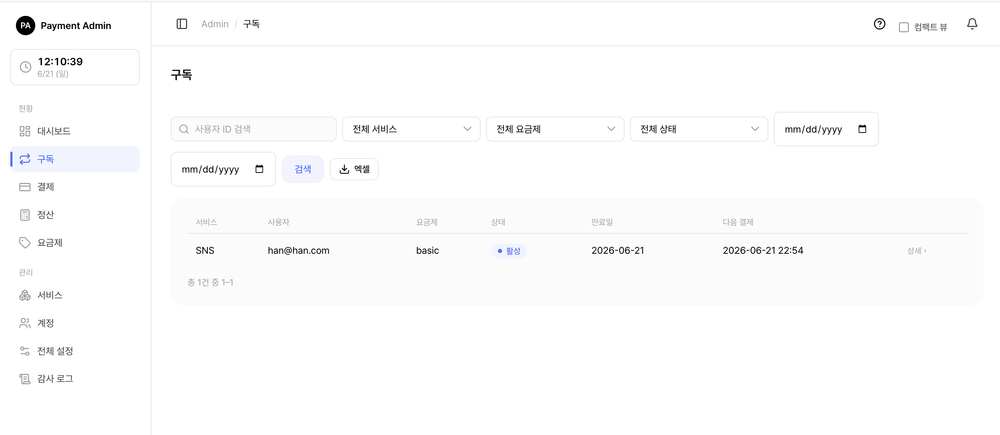
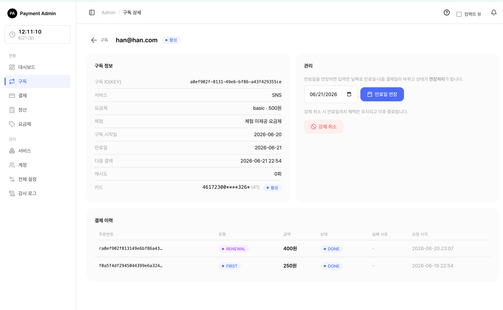

# 4. 구독 관리

이 문서는 관리자 콘솔의 **구독** 메뉴에서 구독을 찾아보고, 상태를 이해하고, 필요할 때 직접 손을 대는 방법(강제취소·만료일 연장·수동 재결제)을 안내합니다.

> 쉽게 말하면, 구독 화면은 "누가 어떤 요금제를 언제까지 쓰고 있고, 다음 결제는 언제인지"를 보고 조정하는 곳입니다.

> 함께 보기: [관리자 콘솔 개요](01-admin-console.md) · [카드 관리](03-admin-card.md)

---

## 4.1 구독 목록 보기

<figure class="shot">
  
  <figcaption style="color:#6b7280;font-size:13px;margin-top:6px">구독 목록 (상태 필터)</figcaption>
</figure>

<ol class="steps">
<li>왼쪽 메뉴에서 <b>구독</b>을 누릅니다.</li>
<li>위쪽 검색·필터로 원하는 구독을 좁힙니다. 사용자 ID 검색, 서비스·요금제·상태 드롭다운, 등록일 범위(시작·종료)로 필터링할 수 있습니다.</li>
<li>표의 <b>줄을 클릭</b>하면 그 구독의 상세 화면으로 이동합니다.</li>
</ol>

목록 표에는 서비스, 사용자, 요금제, **상태**(배지), 만료일, 다음 결제일이 보입니다.

### 4.1.1 검색·필터·정렬

표 위쪽 도구로 보고 싶은 구독만 추려낼 수 있습니다. 여러 조건을 함께 걸면 모두 만족하는 구독만 남습니다.

| 도구 | 설명 |
|------|------|
| 사용자 ID 검색 | 외부 서비스가 부여한 사용자 식별자(이메일 등)로 찾습니다. |
| 서비스 | 특정 서비스의 구독만 봅니다. 전체 관리자는 모든 서비스가, 서비스 담당자는 담당 서비스만 목록에 나옵니다. |
| 요금제 | 요금제 이름으로 거릅니다. 서비스를 먼저 고르면, 그 서비스의 요금제만 드롭다운에 나타납니다. |
| 상태 | TRIAL·ACTIVE·PAST_DUE·SUSPENDED·CANCELED·EXTENDED·EXPIRED 중 하나로 거릅니다. (상태 의미는 [4.2](#42-구독-상태의-의미) 참고) |
| 등록일 범위 | 구독이 만들어진 날짜의 시작·종료를 지정해 그 사이의 구독만 봅니다. |

정렬은 표 머리글을 눌러 바꿉니다. **사용자**, **상태**, **만료일**, **다음 결제일** 열을 기준으로 오름/내림차순 정렬할 수 있습니다. 기본 정렬은 최근 등록순입니다.

### 4.1.2 엑셀로 내보내기

현재 화면에 걸어 둔 **검색·필터를 그대로 담아** 엑셀(.xlsx)로 내려받을 수 있습니다. 페이지에 보이는 일부가 아니라 조건에 맞는 전체가 받아집니다. 내보내는 항목은 서비스, 사용자, 요금제, 상태, 만료일, 다음 결제입니다.

> 참고: 한 번에 내려받는 행 수에는 상한이 있습니다(시스템 보호 목적). 결과가 너무 많으면 상한까지만 받아지므로, 필터로 범위를 좁혀 나눠 내려받는 것을 권장합니다.

> 참고: 서비스 담당자(SERVICE_MANAGER)는 자신이 담당하는 서비스의 구독만 보입니다. 엑셀 내보내기도 같은 담당 범위로 제한됩니다. 전체 관리자(SYSTEM_ADMIN)는 모든 구독을 봅니다. → [역할별 차이](01-admin-console.md)

---

## 4.2 구독 상태의 의미

구독은 생애주기에 따라 여러 상태를 거칩니다. 각 상태가 무슨 뜻인지, 그리고 그 상태에서 **서비스를 이용할 수 있는지**를 정리했습니다.

| 상태 | 한글 의미 | 서비스 이용 | 설명 |
|------|----------|:----------:|------|
| TRIAL | 체험 중 | 가능 | 무료 체험 기간입니다. 체험이 끝나면 첫 정기 결제가 진행됩니다. |
| ACTIVE | 이용 중 | 가능 | 정상적으로 결제되고 이용 중인 상태입니다. |
| PAST_DUE | 미수(결제 실패) | 가능 | 자동결제가 실패했지만 유예 기간이라 아직 이용은 됩니다. 재시도가 진행됩니다. |
| SUSPENDED | 정지 | **불가** | 결제 재시도가 모두 실패해 정지된 상태입니다. 수동 재결제로 되살릴 수 있습니다. |
| CANCELED | 해지 예약 | 가능 | 해지를 예약한 상태입니다. **만료일까지는 그대로 이용**되고, 그 이후 종료됩니다. |
| EXTENDED | 연장처리 | 가능 | 운영자가 만료일을 수동으로 연장한 상태입니다. 이용이 허용되고, 새 만료일에 자동결제가 갱신됩니다. |
| EXPIRED | 완전 종료 | **불가** | 구독이 완전히 끝난 최종 상태입니다. 더 이상 되돌릴 수 없습니다. |

> 쉽게 말하면, **SUSPENDED(정지)**와 **EXPIRED(완전 종료)**일 때만 서비스 이용이 막힙니다. 나머지 상태(체험·이용 중·미수·해지 예약·연장처리)에서는 만료일 전까지 이용이 유지됩니다.

### 4.2.1 상태가 바뀌는 흐름

상태는 자동결제 결과와 운영자 조치에 따라 다음처럼 이어집니다.

- **체험 → 이용 중**: 체험(TRIAL)이 끝나면 첫 자동결제가 일어나고, 성공하면 이용 중(ACTIVE)이 됩니다.
- **이용 중 → 미수 → 정지**: 자동결제가 실패하면 미수(PAST_DUE)로 바뀌어 재시도가 이어집니다. 재시도가 모두 실패하면 정지(SUSPENDED)가 됩니다.
- **정지/미수 → 이용 중**: 수동 재결제가 성공하면 다시 이용 중(ACTIVE)으로 복귀합니다(만료일·다음 결제일이 결제 시점 기준으로 다시 계산됨).
- **이용 중·미수·연장처리 → 해지 예약**: 사용자가 해지하거나 운영자가 강제 취소하면 해지 예약(CANCELED)이 됩니다. 만료일까지는 이용되고, 이후 완전 종료(EXPIRED)로 넘어갑니다.
- **→ 연장처리**: 운영자가 만료일을 연장하면 연장처리(EXTENDED)가 되고, 새 만료일에 자동결제로 갱신됩니다.
- **→ 완전 종료**: 만료일이 지난 해지 예약 구독, 정지 상태가 오래 지속된 구독 등은 배치 처리로 완전 종료(EXPIRED)됩니다. 완전 종료는 되돌릴 수 없으며, 같은 사용자가 다시 쓰려면 새로 구독해야 합니다.

> 참고: **CANCELED(해지 예약)**는 "지금 당장 끊김"이 아닙니다. 이미 결제한 기간(만료일)까지는 계속 쓸 수 있고, 만료일이 지나면 자동으로 EXPIRED가 됩니다.

> 참고: 서비스+사용자 한 쌍당 **완전 종료(EXPIRED)를 제외하고 살아 있는 구독은 1개**만 존재할 수 있습니다. 그래서 완전 종료된 구독을 되살리는 대신 새 구독을 만드는 방식으로 운영됩니다.

---

## 4.3 구독 상세 화면 둘러보기

<figure class="shot">
  
  <figcaption style="color:#6b7280;font-size:13px;margin-top:6px">구독 상세 화면</figcaption>
</figure>

목록에서 구독 한 줄을 클릭하면 상세 화면이 열립니다. 화면은 크게 세 부분입니다.

- **구독 정보** (왼쪽): 구독 ID, 서비스, 요금제·금액, 체험 사용 여부, 구독 시작일, **만료일**, **다음 결제일**, 재시도 횟수, 그리고 등록된 **카드**(마스킹 번호 + 발급사 + 활성/비활성 배지)가 보입니다. 카드를 클릭하면 카드 상세로 이동합니다. → [카드 관리](03-admin-card.md)
- **관리** (오른쪽): 상황에 맞는 운영 버튼(수동 재결제·만료일 연장·강제 취소)이 모입니다. 어떤 버튼이 보이는지는 현재 구독 상태에 따라 달라집니다.
- **결제 이력** (아래): 이 구독에서 일어난 결제들이 표로 정리됩니다(최근 건 우선, 최대 200건). 만료일 연장을 한 적이 있으면 그 위에 **만료일 연장 이력**도 함께 표시됩니다(처리 시각·변경 전/후 만료일·처리자).

> 참고: 체험 사용 여부는 가입 당시 기록을 기준으로 표시되므로, 체험 후 이용 중(ACTIVE)으로 바뀌어도 "체험을 거친 구독"임이 그대로 남습니다.

> 참고: 담당 범위 밖의 구독 상세를 직접 열려고 하면 "구독을 찾을 수 없습니다"로 표시됩니다. (존재 여부 자체를 숨기기 위한 처리입니다.)

---

## 4.4 운영 작업

### 4.4.1 강제 취소

운영자가 구독을 직접 해지 예약하는 동작입니다.

<ol class="steps">
<li>구독 상세의 <b>관리</b> 영역에서 <b>강제 취소</b> 버튼을 찾습니다. (이용 중·미수·연장처리 상태일 때 나타납니다.)</li>
<li>버튼을 누르면 "구독을 강제 취소할까요?" 확인창이 뜹니다.</li>
<li>확인하면 구독이 해지 예약(CANCELED) 상태가 됩니다.</li>
</ol>

> 주의: 강제 취소는 **즉시 끊는 것이 아닙니다.** 만료일까지는 혜택(이용)이 그대로 유지되고, 만료일이 지나면 자동으로 종료됩니다. 또 강제 취소를 하면 다음 자동결제 예약이 해제되어 더 이상 청구되지 않습니다.

> 참고: 강제 취소 버튼은 이용 중(ACTIVE)·미수(PAST_DUE)·연장처리(EXTENDED) 상태에서만 보입니다. 이미 체험·정지·해지 예약·완전 종료된 구독에는 나타나지 않습니다.

### 4.4.2 만료일 연장

만료일과 다음 결제일을 운영자가 원하는 날짜로 미루는 동작입니다.

<ol class="steps">
<li>구독 상세의 <b>관리</b> 영역에서 <b>만료일 연장</b> 부분을 찾습니다. (완전 종료(EXPIRED)가 아닌 구독에서 보입니다.)</li>
<li>날짜 입력칸에 새 만료일을 고릅니다(기본값은 현재 만료일).</li>
<li><b>만료일 연장</b> 버튼을 누르고 확인창에서 확인합니다.</li>
<li>입력한 날짜로 <b>만료일</b>과 <b>다음 결제일</b>이 바뀌고, 구독 상태가 연장처리(EXTENDED)가 됩니다.</li>
</ol>

> 주의: 새 만료일은 **미래 날짜**여야 합니다. 과거·오늘 날짜를 넣거나 날짜 형식이 잘못되면 "연장 만료일은 미래 날짜여야 합니다(또는 올바르게 입력하세요)" 안내가 상세 화면 위에 표시되고 연장은 적용되지 않습니다.

> 팁: 연장처리(EXTENDED) 상태에서는 이용이 계속 허용되고, 새로 정한 만료일에 자동결제로 갱신이 이어집니다. 또 연장 시 그동안의 결제 재시도 흔적(재시도 횟수·정지 시각)이 정리되어 깨끗한 상태로 다시 시작합니다. 연장한 이력은 상세 화면의 "만료일 연장 이력"에 처리 시각·변경 전/후 만료일·처리자와 함께 남습니다.

### 4.4.3 수동 재결제 (지금 결제 처리)

자동결제가 실패해 **미수(PAST_DUE)** 이거나 **정지(SUSPENDED)** 된 구독을, 등록된 카드로 **지금 바로** 다시 청구하는 동작입니다.

<ol class="steps">
<li>구독 상세를 엽니다. 미수·정지 상태이면 <b>관리</b> 영역 위쪽에 안내 문구와 <b>결제 처리</b> 버튼이 보입니다. 청구될 금액(상시 할인가)도 함께 표시됩니다.</li>
<li><b>결제 처리</b> 버튼을 누르고 확인창에서 확인합니다.</li>
<li>결제에 성공하면 구독이 이용 중(ACTIVE)으로 되살아나고, 만료일·다음 결제일이 결제 시점 기준으로 다시 계산됩니다.</li>
</ol>

> 중요: 등록된 카드가 **없거나** 카드가 **비활성** 상태이면 결제 처리가 막힙니다. 또 그 서비스의 토스 결제 키가 설정되어 있지 않아도 결제할 수 없습니다. 이때는 먼저 [카드 관리](03-admin-card.md)에서 카드를 활성화·등록하거나, 서비스의 결제 키 설정을 확인해야 합니다.

> 참고: 결제가 거절되면(카드 한도·정지 등) 그 사유가 상세 화면 위에 메시지로 표시되고, 구독은 기존 상태(미수/정지)에 그대로 머뭅니다.

> 참고: 수동 재결제는 미수(PAST_DUE)·정지(SUSPENDED) 상태에서만 가능합니다. 이용 중·체험·해지 예약·완전 종료 구독에는 결제 처리 버튼이 나타나지 않습니다.

---

## 4.5 어떤 버튼이 언제 보이나 (상태별 요약)

| 구독 상태 | 결제 처리(재결제) | 만료일 연장 | 강제 취소 |
|-----------|:---:|:---:|:---:|
| TRIAL (체험 중) | — | 가능 | — |
| ACTIVE (이용 중) | — | 가능 | 가능 |
| PAST_DUE (미수) | 가능 | 가능 | 가능 |
| SUSPENDED (정지) | 가능 | 가능 | — |
| CANCELED (해지 예약) | — | 가능 | — |
| EXTENDED (연장처리) | — | 가능 | 가능 |
| EXPIRED (완전 종료) | — | — | — |

> 팁: 화면에 버튼이 보이지 않는다면, 그 동작이 현재 구독 상태에서 허용되지 않는다는 뜻입니다. 위 표에서 현재 상태를 확인하세요.

---

> 함께 보기: 결제가 막히는 원인이 카드 비활성 때문일 수 있습니다. [카드 관리](03-admin-card.md)에서 카드 상태를 먼저 확인하세요. 콘솔 로그인·메뉴 구조는 [관리자 콘솔 개요](01-admin-console.md)를 참고하세요.
