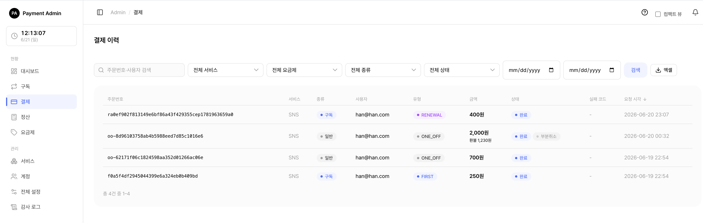
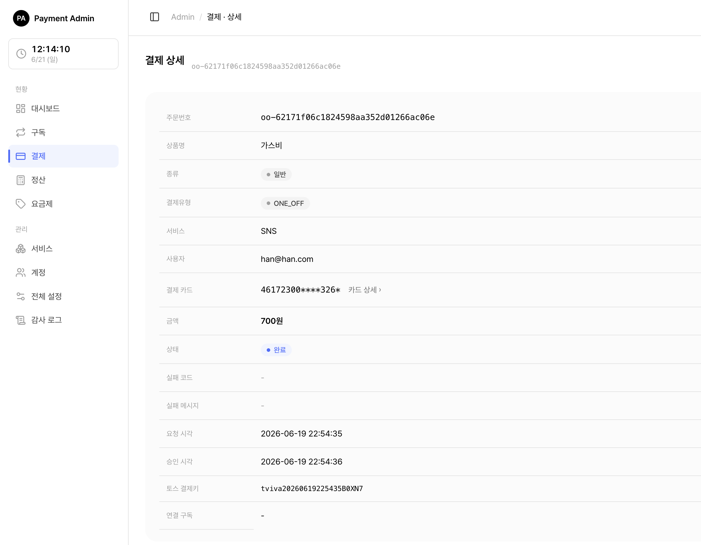

# 5. 일반결제와 환불(취소)

서비스에서 일어난 **결제 내역**을 확인하고, 일반결제(단건 결제)를 **취소(환불)** 하는 화면입니다. 구독 정기결제와 일반결제를 한 목록에서 함께 볼 수 있습니다.

> 쉽게 말하면 "어떤 사용자가 얼마를 언제 결제했는지" 확인하고, 필요하면 "그 돈을 돌려주는(환불)" 곳입니다.

> 함께 보기: [요금제 관리](04-admin-plan.md) · [구독 관리](03-admin-subscription.md)

---

## 5.1 결제 내역 보기

<figure class="shot">
  
  <figcaption style="color:#6b7280;font-size:13px;margin-top:6px">결제 목록 (구독·단건)</figcaption>
</figure>

왼쪽 메뉴에서 **결제**를 누르면 결제 목록이 열립니다.

각 줄에는 주문번호, 서비스, **종류**(구독 / 일반), 사용자, 금액, **상태**(완료 / 실패 / 대기 / 취소), 요청 시각, **매출전표**가 보입니다.

각 줄 오른쪽 **매출전표** 칸의 링크를 누르면 그 결제의 토스 매출전표(카드 영수증)가 새 탭으로 열립니다(인쇄 가능). 카드 결제(완료) 건에 표시되며, 매출전표가 없는 건(실패·대기 등)은 `-`로 보입니다. (참고: 토스 테스트 환경에서는 링크만 생성되고 실제 매출전표는 발행되지 않습니다.)

> 참고: "종류"가 **구독**이면 정기결제, **일반**이면 단건(1회성) 결제입니다. 환불(취소)은 **일반결제만** 이 화면에서 할 수 있습니다. 구독 결제의 취소는 [구독 관리](03-admin-subscription.md)에서 다룹니다.

검색·필터로 원하는 결제를 빠르게 찾을 수 있습니다.

| 필터 | 설명 |
|------|------|
| 검색어 | 주문번호 또는 사용자 ID의 일부 |
| 서비스 | 특정 서비스의 결제만 |
| 종류 | 구독 / 일반 / 전체 |
| 상태 | 완료 / 실패 / 대기 / 취소 / 전체 |
| 날짜 범위 | 요청 시각 기준 시작일~종료일 |

> 팁: 결제가 **실패**한 경우, 실패 코드에 마우스를 올리면 "한도 초과", "정지된 카드"처럼 한글 설명이 풍선으로 떠서 원인을 바로 알 수 있습니다.

목록 위쪽 **[엑셀]** 버튼으로 현재 필터가 적용된 전체 내역을 내려받을 수 있습니다.

---

## 5.2 결제 상세 화면

<figure class="shot">
  
  <figcaption style="color:#6b7280;font-size:13px;margin-top:6px">결제 상세·환불 화면</figcaption>
</figure>

목록에서 주문번호를 누르면 결제 1건의 상세가 열립니다. 주문번호, 상품명, 종류, 서비스, 사용자, **결제 카드**, 금액, 상태, 실패 코드/메시지, 요청·승인 시각, 연결된 구독 등을 한눈에 볼 수 있습니다.

일반결제이고 환불 가능한 금액이 남아 있으면, 이 화면 아래에 **결제 취소 카드**와 (이미 환불한 적이 있으면) **취소·환불 내역 카드**가 함께 나타납니다.

---

## 5.3 결제 취소(환불)하기 — 관리자

일반결제의 상세 화면에서 **전액 취소**와 **부분 취소**를 모두 할 수 있습니다. 관리자 취소는 **수수료가 붙지 않아**, 입력한 금액이 그대로 고객에게 환불됩니다.

> 중요: 관리자 취소는 **여러 번 나눠서(누적)** 할 수 있습니다. 예를 들어 10,000원 결제에서 3,000원을 먼저 환불하고, 나중에 2,000원을 더 환불하는 식입니다. 남은 환불 가능 금액이 0이 될 때까지 계속 취소할 수 있습니다.

### 전액 취소

<ol class="steps">
<li>결제 상세에서 <b>결제 취소</b> 카드를 찾습니다.</li>
<li>금액·비율 칸을 <b>모두 비워둔 채</b> <b>[취소 실행]</b>을 누릅니다. "전액 N원 환불"이라고 미리 보입니다.</li>
<li>확인 창에서 승인하면 남은 금액 전부가 환불됩니다.</li>
</ol>

### 부분 취소 (금액으로)

<ol class="steps">
<li><b>취소 금액(원)</b> 칸에 환불할 금액을 적습니다(예: 3000).</li>
<li>아래 미리보기에 "3,000원 환불"이라고 표시됩니다.</li>
<li><b>[취소 실행]</b> → 확인하면 그 금액만 환불됩니다.</li>
</ol>

### 부분 취소 (비율로)

<ol class="steps">
<li><b>비율(%)</b> 칸에 숫자를 적습니다(예: 30).</li>
<li>남은 금액의 30%가 자동으로 계산되어 취소 금액에 채워지고 미리보기에 표시됩니다.</li>
<li><b>[취소 실행]</b> → 확인하면 그 금액이 환불됩니다.</li>
</ol>

> 참고: 입력 금액이나 비율로 계산된 금액이 **남은 환불 가능 금액을 넘을 수는 없습니다.** 넘는 값을 넣으면 오류로 막힙니다.

취소가 끝나면 상태와 내역이 이렇게 바뀝니다.

| 상황 | 결제 상태 표시 | 의미 |
|------|--------------|------|
| 일부만 환불 | 완료 + 부분취소 | 아직 환불 가능 잔액이 남아 있어 추가 취소 가능 |
| 남김없이 전부 환불 | 취소 | 더 이상 환불할 금액 없음 |

**취소·환불 내역 카드**에는 총 결제금액, 누적 환불액(빨간색), 남은 환불 가능액, 최근 취소 시각이 표시됩니다.

---

## 5.4 외부(고객) 취소와의 차이

같은 일반결제라도, **누가 취소하느냐**에 따라 동작이 다릅니다.

| 구분 | 관리자 취소(이 화면) | 외부 서비스/고객 취소(API) |
|------|--------------------|--------------------------|
| 수수료 | **없음** — 입력 금액 그대로 환불 | **수수료율 적용** — 서비스가 정한 비율만큼 떼고 환불 |
| 부분·누적 | 전액/부분, **여러 번 누적 가능** | 한 번에 전액(수수료 차감) |
| 취소 차단 설정 | **무시**(관리자는 항상 가능) | 서비스가 "취소 불가"로 설정하면 막힘 |

> 쉽게 말하면 관리자 취소는 "운영자가 직접 손으로, 수수료 없이, 원하는 만큼" 돌려주는 것이고, 외부(고객) 취소는 "서비스가 정한 규칙(수수료·허용 여부)대로" 진행되는 것입니다.

예) 고객이 직접 취소 — 결제 10,000원, 서비스 취소 수수료 10%
- 수수료 1,000원을 떼고 9,000원이 환불됩니다.
- 이때 떼인 1,000원은 **취소 수수료(서비스 보유)** 항목으로 내역에 표시됩니다.

> 주의: 관리자가 이미 **부분취소**한 결제는, 고객(외부 API)이 다시 전액취소할 수 없습니다. 같은 돈을 두 번 환불하는 일을 막기 위한 안전장치입니다.

---

## 5.5 매출·환불에 반영되는 방식

취소(환불)는 **대시보드의 매출과 환불 집계에 자동으로 반영**됩니다.

- 부분취소를 하면 그만큼 매출에서 빠집니다(예: 10,000원 결제 중 3,000원 환불 → 매출 7,000원으로 인식).
- 전액취소든 부분취소든 환불한 금액은 **환불 합계**에 더해집니다.
- 외부 API로 결제 내역을 조회하는 고객사 화면에도 실제 환불액과 남은 실수령액이 그대로 전달됩니다.

> 참고: 별도의 정산이나 집계를 손으로 맞출 필요가 없습니다. 취소 실행 즉시 반영됩니다.

---

## 5.6 취소가 안 될 때 점검할 것

| 증상 | 원인·해결 |
|------|----------|
| "결제 취소" 카드가 안 보임 | 일반결제가 아니거나(구독 결제), 이미 전액 환불되어 남은 금액이 없음 |
| 구독 결제를 취소하고 싶음 | 이 화면에서는 불가. [구독 관리](03-admin-subscription.md)에서 처리 |
| 입력 금액이 거부됨 | 남은 환불 가능 금액보다 큰 값을 넣었는지 확인 |

> 함께 보기: 결제가 어떻게 만들어지고 자동 갱신되는지는 [구독 관리](03-admin-subscription.md)와 [요금제 관리](04-admin-plan.md)를 참고하세요.
