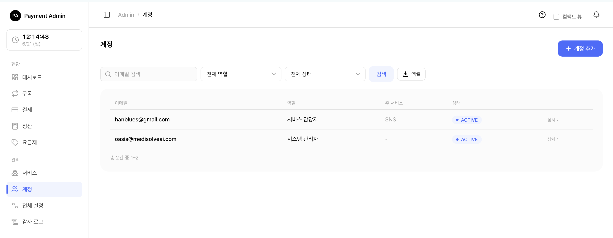
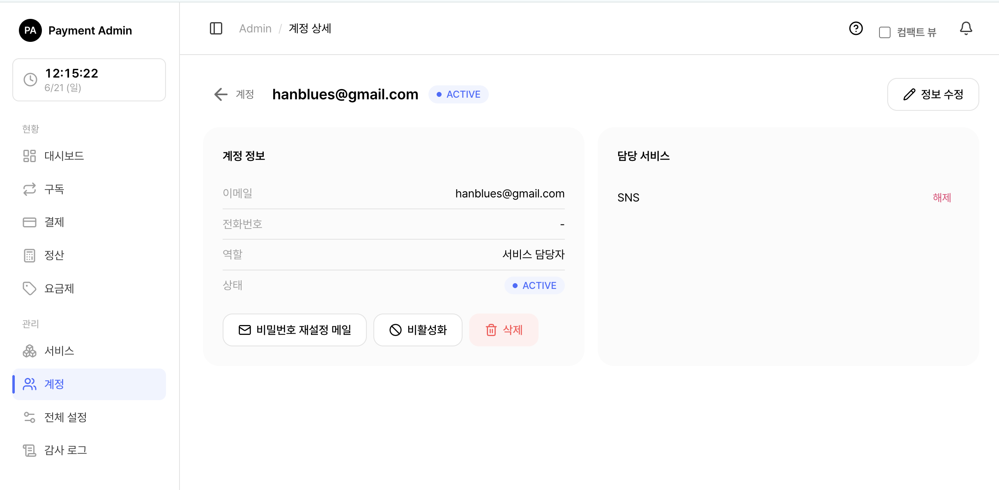

# 6. 계정 관리

관리자 콘솔에 로그인하는 **계정**을 만들고 관리하는 화면입니다. 어드민 콘솔을 사용할 수 있는 사람은 모두 여기서 만든 계정으로 로그인합니다.

> 쉽게 말하면 "이 시스템을 쓸 수 있는 사람" 목록을 만들고, 각자에게 어떤 권한을 줄지(전체 관리자인지, 특정 서비스 담당자인지) 정하는 곳입니다.

> 참고: 계정 관리는 SYSTEM_ADMIN 역할만 사용할 수 있습니다. 서비스 담당자(SERVICE_MANAGER)에게는 이 메뉴가 보이지 않습니다.

> 함께 보기: [전체 설정](07-admin-settings.md) · [감사 로그](08-admin-audit.md)

---

## 6.1 들어가기 전에 — 두 가지 역할

이 시스템의 계정에는 두 가지 역할이 있습니다.

| 역할 | 무엇을 할 수 있나 | 담당 서비스 |
|---|---|---|
| SYSTEM_ADMIN (시스템 관리자) | 모든 서비스·요금제·구독·결제·계정·전체 설정·감사 로그를 관리 | 모든 서비스 (배정 불필요) |
| SERVICE_MANAGER (서비스 담당자) | 자신에게 **배정된 서비스**의 요금제·구독만 관리 | 배정된 서비스만 |

> 쉽게 말하면 SYSTEM_ADMIN은 회사 전체를 보는 관리자, SERVICE_MANAGER는 자기가 맡은 서비스만 보는 담당자입니다.

> 주의: 시스템 관리자(SYSTEM_ADMIN)에게는 담당 서비스를 배정할 수 없습니다. 이미 모든 서비스에 접근할 수 있기 때문입니다.

---

## 6.2 계정 목록 보기 · 검색

<figure class="shot">
  
  <figcaption style="color:#6b7280;font-size:13px;margin-top:6px">계정 목록</figcaption>
</figure>

좌측 메뉴에서 **계정**을 누르면 등록된 계정 목록이 나옵니다.

목록에는 **이메일 · 역할 · 주 서비스 · 상태**가 표시됩니다.

### 검색과 필터

| 도구 | 설명 |
|---|---|
| 검색창 | 이메일 일부를 입력하면 해당 계정만 추려집니다. |
| 역할 필터 | 시스템 관리자 / 서비스 담당자로 좁혀 봅니다. |
| 상태 필터 | 활성(ACTIVE) / 설정 대기(PENDING) / 잠김(LOCKED)으로 좁혀 봅니다. |
| 엑셀 다운로드 | 현재 검색·필터 조건 그대로 목록을 엑셀(.xlsx) 파일로 내려받습니다. |

> 참고: **삭제한 계정은 목록에 나타나지 않습니다.** 어떤 필터를 걸어도 보이지 않습니다(완전히 지우지 않고 숨기는 방식이라 기록은 남습니다).

### 계정 상태가 뜻하는 것

| 상태 | 의미 |
|---|---|
| 활성 (ACTIVE) | 비밀번호가 설정되어 정상 로그인 가능 |
| 설정 대기 (PENDING) | 계정은 만들어졌지만 아직 비밀번호 미설정 → 로그인 불가 |
| 잠김 (LOCKED) | 로그인 비밀번호를 여러 번 틀려 일시 잠김 (15분 후 자동 해제) |
| 비활성 (DISABLED) | 관리자가 일부러 막아 둔 상태 → 로그인 불가 |

---

## 6.3 새 계정 만들기

<figure class="shot">
  
  <figcaption style="color:#6b7280;font-size:13px;margin-top:6px">계정 생성 폼</figcaption>
</figure>

<ol class="steps">
<li>계정 목록 화면 오른쪽 위 <b>계정 추가</b> 버튼을 누릅니다.</li>
<li><b>이메일</b>을 입력합니다. (로그인 아이디 겸 연락처로 쓰입니다. 시스템 전체에서 중복될 수 없습니다.)</li>
<li>필요하면 <b>전화번호</b>를 입력합니다. (선택)</li>
<li><b>역할</b>을 고릅니다 — 기본값은 서비스 담당자(SERVICE_MANAGER)입니다.</li>
<li>서비스 담당자를 골랐다면, 아래에 나타나는 <b>담당 서비스</b> 체크박스에서 맡을 서비스를 선택합니다. (지금 비워 두고 나중에 배정해도 됩니다.)</li>
<li><b>계정 생성 + 설정 메일 발송</b> 버튼을 누릅니다.</li>
</ol>

계정이 만들어지면 **설정 대기(PENDING)** 상태가 되고, 입력한 이메일로 **비밀번호 설정 메일**이 자동 발송됩니다. 받는 사람이 메일 속 링크에서 비밀번호를 직접 정하면 활성(ACTIVE) 상태가 되어 로그인할 수 있습니다.

> 중요: 비밀번호 설정 링크는 **발송 후 48시간** 동안만 유효합니다. 만료되면 계정 상세에서 다시 발송하면 됩니다.

> 주의: 메일 발송에 실패해도 계정 자체는 정상적으로 만들어집니다. "메일 발송에 실패했습니다" 안내가 뜨면, 메일(SMTP) 설정을 확인한 뒤 계정 상세에서 **비밀번호 재설정 메일**로 다시 보낼 수 있습니다.

> 팁: 시스템 관리자(SYSTEM_ADMIN)로 만들면 담당 서비스 선택란이 사라집니다. 모든 서비스에 접근하기 때문입니다.

---

## 6.4 계정 정보 수정

계정을 눌러 상세 화면으로 들어간 뒤 오른쪽 위 **정보 수정** 버튼을 누르면 **이메일**과 **전화번호**를 바꿀 수 있습니다.

> 참고: 수정 화면에서는 역할을 바꿀 수 없습니다. 역할이 잘못 지정되었다면 계정을 새로 만드는 방식으로 처리하세요.

> 팁: 어떤 서비스의 대표 담당자로 지정된 계정의 이메일을 바꾸면, 그 서비스의 담당자 이메일도 자동으로 함께 바뀝니다. 따로 손볼 필요가 없습니다.

---

## 6.5 담당 서비스 배정 · 해제

서비스 담당자(SERVICE_MANAGER) 계정 상세 화면 오른쪽에는 **담당 서비스** 카드가 있습니다.

### 서비스 배정하기

<ol class="steps">
<li>담당 서비스 카드의 드롭다운에서 맡길 서비스를 고릅니다.</li>
<li><b>서비스 추가</b> 버튼을 누릅니다.</li>
<li>해당 서비스가 담당 목록에 추가됩니다.</li>
</ol>

### 서비스 해제하기

<ol class="steps">
<li>담당 서비스 목록에서 해제할 서비스 옆 <b>해제</b> 버튼을 누릅니다.</li>
<li>즉시 담당에서 빠집니다.</li>
</ol>

> 참고: 해제 버튼은 확인 절차 없이 바로 처리됩니다. 신중히 누르세요.

> 주의: 시스템 관리자(SYSTEM_ADMIN)에게는 서비스를 배정할 수 없습니다. 배정을 시도하면 오류가 표시됩니다.

---

## 6.6 비활성화 · 활성화

잠시 로그인을 막고 싶을 때 계정을 **비활성화**할 수 있습니다(나중에 다시 활성화 가능).

### 비활성화

<ol class="steps">
<li>계정 상세에서 <b>비활성화</b> 버튼을 누릅니다.</li>
<li>"로그인이 차단되고 기존 세션이 모두 종료됩니다" 확인 창에서 한 번 더 확인합니다.</li>
<li>계정이 비활성(DISABLED) 상태가 되고, 그 사람이 현재 로그인 중이었다면 즉시 로그아웃됩니다.</li>
</ol>

### 활성화

비활성 상태인 계정 상세에는 **활성화** 버튼이 나타납니다. 누르면 다시 로그인할 수 있게 됩니다. (비밀번호가 이미 설정돼 있으면 활성, 아직이면 설정 대기 상태로 복구됩니다.)

> 주의: **본인 계정은 비활성화할 수 없습니다.** 실수로 스스로 잠기는 사고를 막기 위한 안전장치입니다.

---

## 6.7 계정 삭제

더 이상 쓰지 않는 계정은 삭제할 수 있습니다.

<ol class="steps">
<li>계정 상세에서 빨간색 <b>삭제</b> 버튼을 누릅니다.</li>
<li>"로그인이 영구 차단되고 담당 서비스 연결이 모두 해제됩니다. 되돌릴 수 없습니다" 확인 창에서 확인합니다.</li>
<li>계정이 목록에서 사라지고 로그인이 막힙니다.</li>
</ol>

> 주의: **본인 계정은 삭제할 수 없습니다.**

> 중요: 어떤 서비스의 **대표 담당자**로 지정된 계정은 바로 삭제되지 않습니다. "'OO 서비스의 대표 담당자입니다. 먼저 다른 계정을 대표로 지정하세요" 안내가 뜨면, 먼저 서비스 화면에서 다른 계정을 대표로 바꾼 뒤 다시 삭제하세요.

> 참고: 삭제는 기록을 완전히 지우지 않고 숨기는 방식입니다. 누가 무엇을 했는지 감사 로그에는 그대로 남습니다.

---

## 6.8 비밀번호 설정 메일 다시 보내기

비밀번호를 잊었거나, 설정 링크가 만료됐거나, 처음 메일이 도착하지 않았을 때 사용합니다.

<ol class="steps">
<li>계정 상세에서 <b>비밀번호 재설정 메일</b> 버튼을 누릅니다.</li>
<li>입력된 이메일로 새 비밀번호 설정 링크가 발송됩니다.</li>
<li>받는 사람이 링크에서 새 비밀번호를 정하면 다시 로그인할 수 있습니다.</li>
</ol>

> 참고: 보안을 위해 재설정 메일을 보내면 해당 계정의 기존 로그인 세션은 즉시 모두 종료됩니다. 새 링크 유효기간은 역시 **48시간**입니다.

> 팁: 비밀번호를 5번 틀려 **잠김(LOCKED)** 상태가 된 계정도, 이 재설정 메일로 새 비밀번호를 설정하면 잠금이 바로 풀립니다. (또는 15분 기다리면 자동 해제됩니다.)

---

## 6.9 자주 묻는 상황

| 상황 | 해결 |
|---|---|
| 새로 만든 사람이 로그인을 못 함 | 아직 비밀번호 미설정(PENDING)입니다. 설정 메일의 링크로 비밀번호를 정해야 합니다. |
| 설정 메일 링크가 만료됨 | 계정 상세 → **비밀번호 재설정 메일**로 새 링크 발송. |
| 비밀번호를 여러 번 틀려 잠김 | 15분 후 자동 해제, 또는 재설정 메일로 즉시 해제. |
| 담당자를 다른 서비스로 옮기고 싶음 | 계정 상세에서 기존 서비스 **해제** 후 새 서비스 **추가**. |
| 대표 담당자라 삭제가 안 됨 | 서비스 화면에서 다른 계정을 대표로 지정한 뒤 삭제. |

---

## 관련 문서

- [전체 설정 (재시도·보안 정책·IP·킬스위치)](07-admin-settings.md)
- [감사 로그 (누가 무엇을 했나)](08-admin-audit.md)
