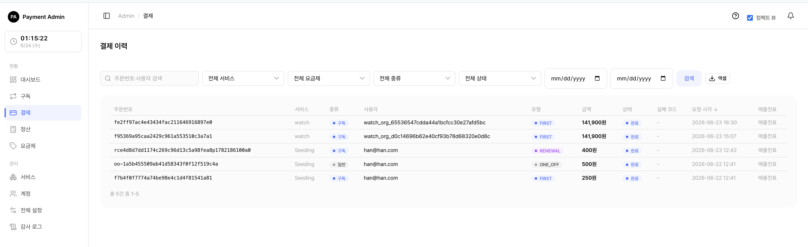
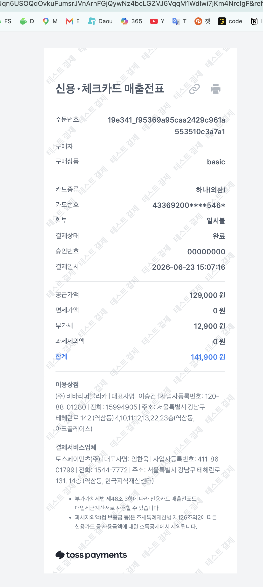

# 6. 일반결제와 환불(취소)

서비스에서 일어난 **결제 내역**을 확인하고, 일반결제(단건 결제)를 **취소(환불)** 하는 화면입니다. 구독 정기결제와 일반결제를 한 목록에서 함께 볼 수 있습니다.

> 쉽게 말하면 "어떤 사용자가 얼마를 언제 결제했는지" 확인하고, 필요하면 "그 돈을 돌려주는(환불)" 곳입니다.

> 함께 보기: [요금제 관리](05-admin-plan.md) · [구독 관리](04-admin-subscription.md)

---

## 6.1 결제 내역 보기

<figure class="shot">
  
  <figcaption style="color:#6b7280;font-size:13px;margin-top:6px">결제 목록 (구독·단건)</figcaption>
</figure>

왼쪽 메뉴에서 **결제**를 누르면 결제 목록이 열립니다.

각 줄에는 주문번호, 서비스, **종류**(구독 / 일반), **유형**(회차), 사용자, 금액, **상태**(완료 / 실패 / 대기 / 취소), 실패 코드, 요청 시각, **매출전표**가 보입니다.

> 참고: 시스템 관리자는 모든 서비스의 결제를 보고, 서비스 담당자는 **자신이 담당하는 서비스의 결제만** 보입니다. 목록의 서비스·요금제 드롭다운에도 담당 서비스만 나타납니다.

목록 맨 오른쪽 **매출전표** 칸은 그 결제의 카드 영수증으로 가는 링크입니다. → 자세한 사용법은 아래 **6.1.2 매출전표(영수증) 보기**를 참고하세요.

> 참고: "종류"가 **구독**이면 정기결제, **일반**이면 단건(1회성) 결제입니다. 환불(취소)은 **일반결제만** 이 화면에서 할 수 있습니다. 구독 결제의 취소는 [구독 관리](04-admin-subscription.md)에서 다룹니다.

검색·필터로 원하는 결제를 빠르게 찾을 수 있습니다.

| 필터 | 설명 |
|------|------|
| 검색어 | **주문번호** 또는 **사용자 ID**(external_user_id)의 일부 |
| 서비스 | 특정 서비스의 결제만 |
| 요금제 | 특정 요금제의 결제만 (구독 결제에만 적용 — 단건 결제는 요금제가 없어 자동 제외됨) |
| 종류 | 구독 / 일반 / 전체 |
| 상태 | 완료 / 실패 / 대기 / 취소 / 전체 |
| 날짜 범위 | 요청 시각 기준 시작일~종료일 |

주문번호·금액·상태·요청 시각 머리글을 누르면 정렬됩니다. 기본 정렬은 **요청 시각 최신순**입니다.

> 팁: 결제가 **실패**한 경우, 실패 코드에 마우스를 올리면 "한도 초과", "정지된 카드"처럼 한글 설명이 풍선으로 떠서 원인을 바로 알 수 있습니다.

목록 위쪽 **[엑셀]** 버튼으로 현재 필터가 적용된 전체 내역을 내려받을 수 있습니다(주문번호·서비스·종류·사용자·유형·금액·상태·실패코드·요청시각). 한 번에 내려받는 행 수에는 상한이 있어, 매우 많은 내역은 날짜 범위 등으로 나눠서 받는 것이 좋습니다.

### 6.1.1 결제 상태와 종류·유형 한눈에 보기

목록·상세에서 쓰이는 배지의 의미는 다음과 같습니다.

**상태**

| 배지 | 값 | 의미 |
|------|----|------|
| 대기 | PENDING | 결제 요청은 만들어졌지만 토스 승인 응답을 아직 못 받은 상태(통신 지연 등). 시간이 지나면 완료/실패로 바뀝니다. |
| 완료 | DONE | 토스 승인 완료(정상 결제). |
| 실패 | FAILED | 토스가 거절했거나 통신 오류. 실패 코드·메시지가 함께 기록됩니다. |
| 취소 | CANCELED | 승인 후 **전액** 환불 처리되어 종료된 상태. |

> 참고: 일반결제를 **일부만** 환불하면 상태는 완료를 유지한 채 **부분취소** 배지가 함께 표시됩니다. 남은 금액을 모두 환불해야 취소로 바뀝니다.

**종류**

| 값 | 의미 |
|----|------|
| 구독(SUBSCRIPTION) | 구독에 묶인 정기(자동) 결제 |
| 일반(ONE_OFF) | 구독과 무관한 단건 즉시 결제 |

**유형(회차)** — 구독 결제의 회차를 구분합니다(일반결제는 항상 ONE_OFF).

| 값 | 의미 |
|----|------|
| FIRST | 최초 결제(첫 구독 시 할인 적용 대상) |
| RENEWAL | 정기 자동 갱신 결제 |
| RETRY | 결제 실패(미납) 상태에서 재시도한 결제 |
| ONE_OFF | 단건(구독 무관) 결제 |

### 6.1.2 매출전표(영수증) 보기

결제 목록의 **맨 오른쪽 열**에는 각 결제의 **매출전표**(카드 영수증) 링크가 있습니다.

<figure class="shot">
  
  <figcaption style="color:#6b7280;font-size:13px;margin-top:6px">결제 목록 맨 오른쪽의 '매출전표' 열 — 카드 결제(완료) 건에 링크가 보입니다</figcaption>
</figure>

**매출전표**(파란 글씨) 링크를 누르면, 그 결제의 매출전표(카드 영수증)가 **새 탭으로** 열립니다. 토스페이먼츠가 호스팅하는 페이지이며, 결제 일시·카드사·승인번호·금액 등이 담겨 있어 **인쇄하거나 PDF로 저장**할 수 있습니다.

<figure class="shot">
  
  <figcaption style="color:#6b7280;font-size:13px;margin-top:6px">'매출전표'를 누르면 새 탭에 열리는 토스 매출전표(카드 영수증) 화면</figcaption>
</figure>

언제 보이고 안 보이는지는 다음과 같습니다.

| 상태 | 매출전표 칸 | 이유 |
|------|------------|------|
| 카드결제 **완료**(DONE) | **매출전표** 링크 | 승인 시 토스 응답에 영수증 URL이 담겨 저장됨 |
| 실패(FAILED)·대기(PENDING) | `-` | 승인이 안 됐으므로 영수증이 없음 |
| 과거 일부 완료 건 | `-` | 영수증 URL이 저장되지 않았던 예전 결제 |

> 참고: 매출전표 링크는 **승인 시점에 토스가 내려준 영수증 주소**를 그대로 저장해 띄우는 것입니다(서버가 새로 만들지 않음). 따라서 카드 결제 완료 건에만 나타나고, 가상계좌 등 영수증이 없는 수단이나 미승인 건에는 `-`로 표시됩니다.

> 주의: 토스 **테스트 환경**에서는 매출전표가 실제로 발행되지 않아 링크가 `-`로 보이거나 빈 페이지가 열릴 수 있습니다. 실제 매출전표는 운영(라이브) 결제에서 확인됩니다.

---

## 6.2 결제 상세 화면

<figure class="shot">
  
  <figcaption style="color:#6b7280;font-size:13px;margin-top:6px">결제 상세·환불 화면</figcaption>
</figure>

목록에서 주문번호를 누르면 결제 1건의 상세가 열립니다. 다음 정보를 한눈에 볼 수 있습니다.

- 주문번호, 상품명, 종류·유형
- 서비스, 사용자(external_user_id)
- **결제 카드** — 실제 결제에 쓰인 카드 번호를 우선 표시하고, 없으면 현재 보관함 카드로 대체합니다. 옆의 **[카드 상세]** 링크로 카드 화면으로 이동할 수 있습니다.
- 금액, 상태(부분취소 시 배지 함께 표시)
- 실패 코드·메시지(실패한 경우)
- 요청 시각, 승인 시각, 토스 결제키(paymentKey)
- 연결된 구독(구독 결제인 경우)

화면 아래에는 **토스 응답 원문** 카드가 있어, 토스페이먼츠가 돌려준 응답(JSON)을 그대로 펼쳐 볼 수 있습니다. 카드 정보·영수증 URL 등 사후 확인·문의 대응에 쓰입니다.

일반결제이고 환불 가능한 금액이 남아 있으면, 이 화면 아래에 **결제 취소 카드**와 (이미 환불한 적이 있으면) **취소·환불 내역 카드**가 함께 나타납니다.

> 참고: 결제 취소(환불) 버튼은 **일반결제(단건)에만** 나타납니다. 구독 결제 상세에는 취소 버튼이 없습니다.

---

## 6.3 결제 취소(환불)하기 — 관리자

일반결제의 상세 화면에서 **전액 취소**와 **부분 취소**를 모두 할 수 있습니다. 관리자 취소는 **수수료가 붙지 않아**, 입력한 금액이 그대로 고객에게 환불됩니다.

> 중요: 관리자 취소는 **여러 번 나눠서(누적)** 할 수 있습니다. 예를 들어 10,000원 결제에서 3,000원을 먼저 환불하고, 나중에 2,000원을 더 환불하는 식입니다. 남은 환불 가능 금액이 0이 될 때까지 계속 취소할 수 있습니다.

### 6.3.1 전액 취소

<ol class="steps">
<li>결제 상세에서 <b>결제 취소</b> 카드를 찾습니다.</li>
<li>금액·비율 칸을 <b>모두 비워둔 채</b> <b>[취소 실행]</b>을 누릅니다. "전액 N원 환불"이라고 미리 보입니다.</li>
<li>확인 창에서 승인하면 남은 금액 전부가 환불됩니다.</li>
</ol>

### 6.3.2 부분 취소 (금액으로)

<ol class="steps">
<li><b>취소 금액(원)</b> 칸에 환불할 금액을 적습니다(예: 3000).</li>
<li>아래 미리보기에 "3,000원 환불"이라고 표시됩니다.</li>
<li><b>[취소 실행]</b> → 확인하면 그 금액만 환불됩니다.</li>
</ol>

### 6.3.3 부분 취소 (비율로)

<ol class="steps">
<li><b>비율(%)</b> 칸에 숫자를 적습니다(예: 30).</li>
<li>남은 금액의 30%가 자동으로 계산되어 취소 금액에 채워지고 미리보기에 표시됩니다.</li>
<li><b>[취소 실행]</b> → 확인하면 그 금액이 환불됩니다.</li>
</ol>

> 참고: 입력 금액이나 비율로 계산된 금액이 **남은 환불 가능 금액을 넘을 수는 없습니다.** 넘는 값을 넣으면 오류로 막힙니다. 금액 칸에도 잔여 금액이 상한으로 걸려 있습니다.

취소가 끝나면 상태와 내역이 이렇게 바뀝니다.

| 상황 | 결제 상태 표시 | 의미 |
|------|--------------|------|
| 일부만 환불 | 완료 + 부분취소 | 아직 환불 가능 잔액이 남아 있어 추가 취소 가능 |
| 남김없이 전부 환불 | 취소 | 더 이상 환불할 금액 없음 |

**취소·환불 내역 카드**에는 총 결제금액, 누적 환불액(빨간색), 남은 환불 가능액, (외부 취소로 떼인) 취소 수수료, 최근 취소 시각이 표시됩니다. 관리자 취소는 수수료가 0이므로 수수료 줄은 외부(고객) 취소 건에서만 보입니다.

> 참고: 관리자 취소 내역은 **누가 취소했는지(관리자 계정)** 가 감사 로그에 함께 남습니다.

---

## 6.4 외부(고객) 취소와의 차이

같은 일반결제라도, **누가 취소하느냐**에 따라 동작이 다릅니다.

| 구분 | 관리자 취소(이 화면) | 외부 서비스/고객 취소(API) |
|------|--------------------|--------------------------|
| 수수료 | **없음** — 입력 금액 그대로 환불 | **수수료율 적용** — 서비스가 정한 비율만큼 떼고 환불 |
| 부분·누적 | 전액/부분, **여러 번 누적 가능** | 한 번에 전액(수수료 차감) |
| 취소 차단 설정 | **무시**(관리자는 항상 가능) | 서비스가 "취소 불가"로 설정하면 막힘 |

> 쉽게 말하면 관리자 취소는 "운영자가 직접 손으로, 수수료 없이, 원하는 만큼" 돌려주는 것이고, 외부(고객) 취소는 "서비스가 정한 규칙(수수료·허용 여부)대로" 진행되는 것입니다.

예) 고객이 직접 취소 — 결제 10,000원, 서비스 취소 수수료 10%
- 수수료 1,000원(= 금액 × 10% 내림)을 떼고 9,000원이 환불됩니다.
- 이때 떼인 1,000원은 **취소 수수료(서비스 보유)** 항목으로 내역에 표시됩니다.

> 주의: 관리자가 이미 **부분취소**한 결제는, 고객(외부 API)이 다시 전액취소할 수 없습니다. 같은 돈을 두 번 환불하는 일을 막기 위한 안전장치입니다. 이런 건은 남은 환불도 **관리자가 이 화면에서** 이어서 처리하세요.

---

## 6.5 매출·환불에 반영되는 방식

취소(환불)는 **대시보드의 매출과 환불 집계에 자동으로 반영**됩니다.

- 부분취소를 하면 그만큼 매출에서 빠집니다(예: 10,000원 결제 중 3,000원 환불 → 매출 7,000원으로 인식).
- 전액취소든 부분취소든 환불한 금액은 **환불 합계**에 더해집니다.
- 외부 API로 결제 내역을 조회하는 고객사 화면에도 실제 환불액과 남은 실수령액이 그대로 전달됩니다.

> 참고: 별도의 정산이나 집계를 손으로 맞출 필요가 없습니다. 취소 실행 즉시 반영됩니다.

---

## 6.6 취소가 안 될 때 점검할 것

| 증상 | 원인·해결 |
|------|----------|
| "결제 취소" 카드가 안 보임 | 일반결제가 아니거나(구독 결제), 결제가 **완료(DONE)** 상태가 아니거나, 이미 전액 환불되어 남은 금액이 없음 |
| 구독 결제를 취소하고 싶음 | 이 화면에서는 불가. [구독 관리](04-admin-subscription.md)에서 처리 |
| 입력 금액이 거부됨 | 남은 환불 가능 금액보다 큰 값을 넣었는지, 또는 0·음수·숫자가 아닌 값을 넣었는지 확인 |
| "취소 실행" 후 토스 키 관련 오류 안내로 돌아옴 | 해당 서비스의 **토스 결제 키가 설정되지 않음**. 서비스 관리에서 토스 키를 등록한 뒤 다시 시도하세요. |
| "취소 실패: …" 메시지 | 토스 측 거절(이미 취소됨 등). 상태·환불액은 **그대로 보존**되며 안전하게 다시 시도할 수 있습니다. |

> 함께 보기: 결제가 어떻게 만들어지고 자동 갱신되는지는 [구독 관리](04-admin-subscription.md)와 [요금제 관리](05-admin-plan.md)를 참고하세요.
