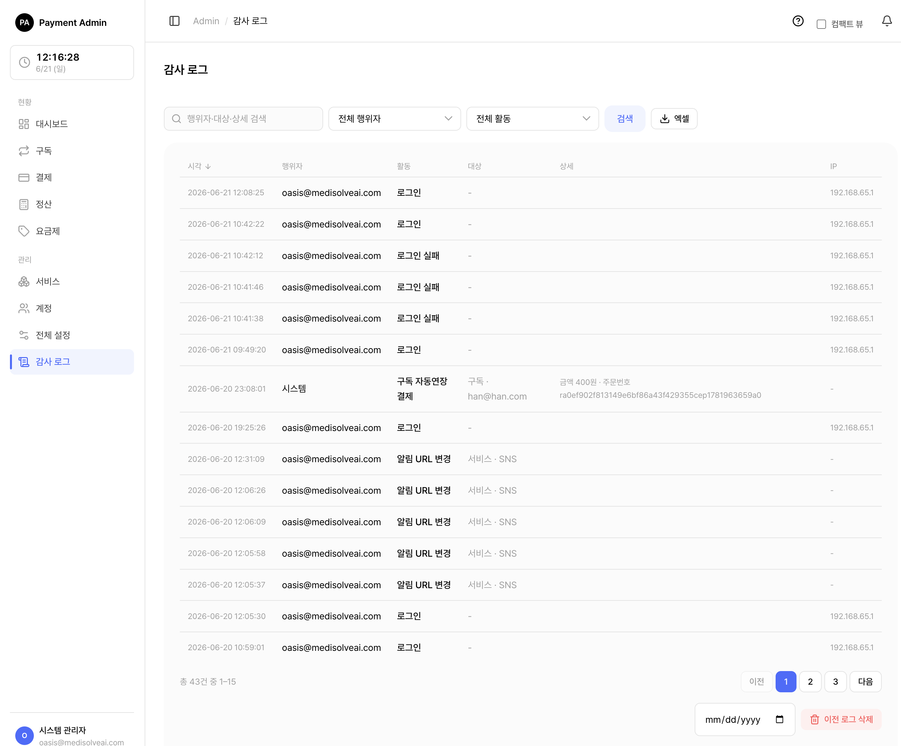

# 9. 감사 로그

시스템에서 일어난 **중요한 일들을 시간순으로 기록한 이력**입니다. 좌측 메뉴 **감사 로그**에서 들어갑니다.

> 쉽게 말하면 "누가 · 언제 · 무엇을 · 어떻게 바꿨는지"를 빠짐없이 남기는 기록장입니다. 문제가 생겼을 때 원인을 추적하거나, 변경 내역을 되짚어 볼 때 사용합니다.

> 참고: 감사 로그는 SYSTEM_ADMIN 역할만 볼 수 있습니다. 기록은 **추가만 되고 수정·삭제되지 않는** 불변 이력입니다(아래 "이전 로그 삭제" 제외).

> 함께 보기: [계정 관리](07-admin-accounts.md) · [전체 설정](08-admin-settings.md)

---

## 9.1 무엇이 기록되나

거의 모든 중요한 동작이 자동으로 기록됩니다. 행위자는 **세 종류**로 구분됩니다.

| 행위자 유형 | 의미 |
|---|---|
| 관리자 (USER) | 어드민 화면에 로그인한 사람이 한 일 (이메일로 표시) |
| 외부 서비스 (SERVICE) | 서비스 키로 인증한 외부 서비스가 API로 한 일 (서비스명으로 표시) |
| 시스템 (SYSTEM) | 스케줄러 등 자동 처리가 한 일 (자동연장·만료 등, 행위자 이름 없음) |

기록되는 활동은 분류별로 다음과 같습니다.

| 분류 | 기록되는 일 (예) |
|---|---|
| 로그인 | 로그인 성공, 로그인 실패, 비밀번호 설정 |
| 계정 | 계정 생성·수정·비활성화·활성화·삭제, 관리자 계정 생성, 서비스 담당 추가·해제, 비밀번호 재설정 메일 발송 |
| 서비스 | 서비스 등록·삭제, 키 재발급·키 조회, 허용 IP 변경, 상태 변경, 대표 담당자 지정, 취소 정책 변경, 알림 URL 변경, **토스 시크릿 키 설정·변경** |
| 요금제 | 요금제 생성·수정·비활성화·활성화·삭제, 사용일 추가(보너스) |
| 구독 | 구독 생성·취소·재개·강제 취소, 카드 변경, 만료일 연장, 사용일 추가, 자동연장 결제, 정지(재시도 소진), 만료, 갱신 결제 실패, 갱신 결제 결과 불명, 첫 결제 실패·결과 불명, 수동 결제(정지 복구)·실패·결과 불명 |
| 결제 | 단건 결제(성공·실패·결과 불명), 결제 취소·취소 실패, 결제 정산 확정(성공·실패) |
| 카드 | 카드 등록·교체·삭제·활성화·비활성화 |
| 설정 | 재시도 설정 변경, 보안/결제 정책 변경, 어드민 IP 변경, 결제서버 비활성화·활성화 |
| 감사 로그 | 이전 로그 삭제(누가 몇 건을 지웠는지도 기록) |

> 쉽게 말하면 화면에서 버튼을 눌러 무언가를 바꾸는 거의 모든 행동이 기록된다고 보면 됩니다.

> 중요: **토스 시크릿 키 같은 비밀값의 평문은 감사 로그에 절대 기록되지 않습니다.** "설정했다 / 변경했다"는 사실만 남고, 키 값 자체는 상세에 포함되지 않습니다.

> 참고: "결과 불명"은 결제 요청을 보냈으나 응답을 받지 못해 성공/실패를 단정할 수 없는 상태입니다. 이런 경우도 빠짐없이 기록되어 나중에 정산으로 결과가 확정되면 "결제 정산 확정"으로 다시 남습니다.

---

## 9.2 화면 구성 — 무엇이 보이나

<figure class="shot">
  
  <figcaption style="color:#6b7280;font-size:13px;margin-top:6px">감사 로그 화면</figcaption>
</figure>

목록은 **최신순**으로 표시되며, 각 줄에 아래 정보가 있습니다.

| 컬럼 | 설명 |
|---|---|
| 시각 | 일이 일어난 시각 (한국 시간 `YYYY-MM-DD HH:MM:SS`) |
| 행위자 | 누가 했는지 — 관리자(이메일) / 외부 서비스(서비스명) / 시스템(자동 처리) |
| 활동 | 무슨 일인지 (예: "계정 생성", "요금제 수정", "구독 취소") |
| 대상 | 어떤 대상에 한 일인지 (서비스명·요금제명·이메일 등) |
| 상세 | 구체적인 내용. 값이 바뀐 일은 **변경 전 → 변경 후**로 표시 |
| IP | 요청이 들어온 IP 주소 |

### 9.2.1 "변경 전 → 변경 후" 표시

설정이나 요금제처럼 값이 바뀌는 동작은, **실제로 바뀐 항목만** 골라 한눈에 보여 줍니다.

| 활동 | 상세에 이렇게 보입니다 |
|---|---|
| 재시도 설정 변경 | `재시도 횟수 4 → 6 · 재시도 간격(시간) 12 → 6` |
| 어드민 IP 변경 | `허용 IP 10.0.0.1 → 10.0.0.1, 10.0.0.2` |
| 요금제 수정 | `정가 9,900원 → 19,900원 · 첫결제 할인 없음 → 정률 10%` |
| 서비스 상태 변경 | `상태 ACTIVE → INACTIVE` |
| 계정 수정 | `이메일 old@x → new@x` |
| 만료일 연장 | `상태 ACTIVE → EXTENDED · 만료일 2026-06-30 → 2026-09-30` |

> 쉽게 말하면 "9,900원이던 가격을 19,900원으로 바꿨다"처럼, 무엇이 어떻게 달라졌는지를 그대로 보여 줍니다.

> 참고: 키 재발급·키 조회·비밀번호 재설정처럼 "전후 값"이 없는 동작은 무슨 일이 있었는지 설명 문구로 남습니다.

---

## 9.3 검색 · 필터

원하는 기록을 빠르게 찾을 수 있습니다.

| 도구 | 설명 |
|---|---|
| 검색창 | 행위자(이메일)·외부 서비스명·대상·상세 내용에 들어간 단어로 한꺼번에 검색합니다. |
| 행위자 유형 필터 | 전체 / 관리자 / 외부 서비스 / 시스템으로 좁힙니다. |
| 활동 유형 필터 | "계정 생성", "구독 취소" 등 특정 활동만 골라 봅니다. 드롭다운에 활동 목록이 모두 들어 있습니다. |

<ol class="steps">
<li>검색창에 찾고 싶은 단어(이메일·서비스명 등)를 입력합니다.</li>
<li>필요하면 <b>행위자 유형</b>·<b>활동 유형</b> 필터를 함께 적용합니다.</li>
<li>목록이 즉시 추려집니다.</li>
</ol>

> 참고: 컬럼 제목으로 정렬할 수 있는 항목은 **시각 · 활동 · 행위자 유형** 세 가지입니다. (대상·상세·IP는 정렬용이 아닙니다.) 기본 정렬은 시각 최신순입니다.

> 팁: 특정 사람의 활동만 보고 싶으면 검색창에 그 사람의 이메일을 입력하세요. 특정 종류의 활동만 보려면 활동 유형 필터를 쓰면 편합니다. 검색어는 상세 내용(예: 변경된 값)에도 적용되므로, 특정 서비스명·금액 등으로도 찾을 수 있습니다.

---

## 9.4 엑셀로 내려받기

현재 검색·필터 조건 그대로 전체 결과를 엑셀(.xlsx) 파일로 받을 수 있습니다.

<ol class="steps">
<li>원하는 검색어·필터를 먼저 적용합니다.</li>
<li><b>엑셀 내보내기</b> 버튼을 누릅니다.</li>
<li>시각 · 행위자 · 활동 · 대상 · 상세 · IP 컬럼이 담긴 파일이 내려받아집니다.</li>
</ol>

> 참고: 엑셀은 화면 페이지와 달리 **조건에 맞는 전체 데이터**를 한꺼번에 담습니다. 데이터가 많으면 내려받는 데 시간이 걸릴 수 있습니다.

> 주의: 감사 로그는 계속 쌓이는 표라서, 한 번에 내려받을 수 있는 행 수에 **상한(기본 100,000행)**이 있습니다. 상한을 넘는 경우 최신 기록부터 상한까지만 담깁니다. 더 받아야 한다면 검색·필터(예: 활동 유형, 검색어)로 범위를 좁혀 나눠 받으세요.

---

## 9.5 이전 로그 삭제 (purge)

오래된 기록을 정리하고 싶을 때, **기준일 이전의 로그를 한꺼번에 삭제**할 수 있습니다.

<ol class="steps">
<li>목록 아래쪽 <b>이전 로그 삭제</b> 영역에서 기준 <b>날짜</b>를 고릅니다.</li>
<li>빨간 <b>이전 로그 삭제</b> 버튼을 누릅니다.</li>
<li>"과거 로그를 삭제할까요?" 확인 창에서 <b>삭제</b>를 누릅니다.</li>
<li>기준일 이전의 감사 로그가 영구 삭제됩니다.</li>
</ol>

> ⚠️ 주의: **삭제한 로그는 복구할 수 없습니다.** 반드시 먼저 [엑셀로 내려받아](#94-엑셀로-내려받기) 백업한 뒤 진행하세요. 확인 창에도 "필요하면 먼저 엑셀로 내려받으세요"라는 안내가 표시됩니다.

> 참고: 기준일은 **오늘이나 미래로 지정할 수 없습니다.** 당일 로그는 삭제할 수 없으며, 미래 날짜를 넣으면 거부됩니다.

> 중요: 로그를 삭제한 행동 자체도 "감사로그 삭제"로 기록에 남습니다. **누가 · 언제 · 어떤 기준일로 · 몇 건을 지웠는지**가 상세에 함께 기록되어 추적할 수 있습니다. (이 기록은 기준일 이후이므로 삭제 대상에 포함되지 않습니다.)

---

## 9.6 알아두면 좋은 점

- **시각은 한국 시간으로 표시**되지만 내부 저장 기준은 세계 표준시(UTC)입니다. 이전 로그 삭제의 기준일도 UTC 자정 기준으로 처리되므로, 한국 시간 오전에는 전날 로그가 일부 남아 있을 수 있습니다.
- **민감한 정보 보호**를 위해 감사 로그는 SYSTEM_ADMIN만 볼 수 있습니다. (로그인 실패 시 입력된 이메일 등이 기록에 포함될 수 있기 때문입니다.)
- 기록은 자동으로 쌓입니다. 운영자가 따로 기록을 남길 필요는 없습니다.

---

## 관련 문서

- [계정 관리 (계정·역할·담당 서비스)](07-admin-accounts.md)
- [전체 설정 (재시도·보안 정책·IP·킬스위치)](08-admin-settings.md)
