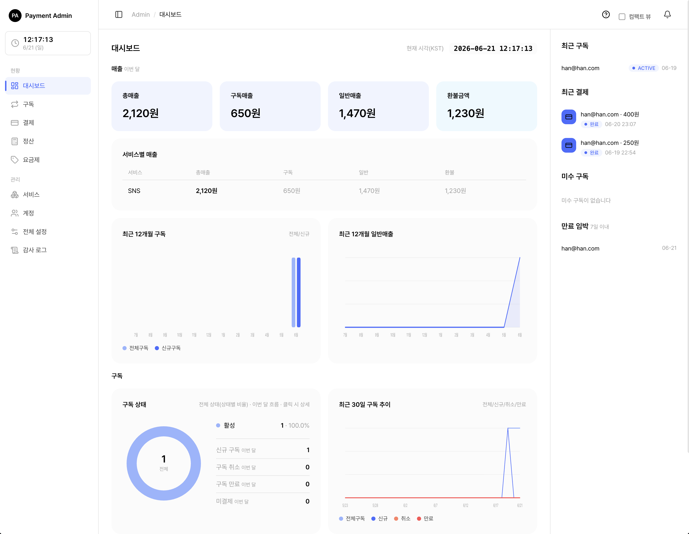
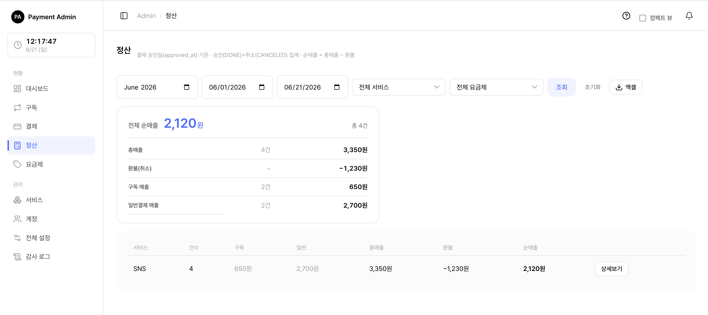

# 10. 대시보드

관리자 콘솔에 로그인하면 가장 먼저 보이는 화면이 **대시보드**입니다. 이번 달 매출 요약, 구독 상태 현황, 12개월·30일 추이 그래프, 그리고 우측 패널(최근 결제·미수 구독·만료 임박)을 한 화면에서 보여줍니다. 이 문서는 화면에 나오는 숫자와 그래프를 **어떻게 읽는지**, 각 숫자가 **어떻게 계산되는지**를 안내합니다.

> 쉽게 말하면, 대시보드는 "구독·결제·매출이 지금 어떤 상태인지 한눈에 보는 계기판"입니다.

> 참고: 대시보드는 **조회 전용** 화면입니다. 여기서는 데이터를 만들거나 고치지 않고, 보기만 합니다. 카드·숫자를 클릭하면 더 자세한 목록 화면으로 이동할 뿐입니다.

> 함께 보기: [구독 관리](04-admin-subscription.md) · [일반결제·환불](06-admin-payment-refund.md) · [관리자 콘솔 사용하기](01-admin-console.md)

---

## 10.1 대시보드 개요 — 역할에 따라 보이는 범위

<figure class="shot">
  
  <figcaption style="color:#6b7280;font-size:13px;margin-top:6px">대시보드 전체 화면</figcaption>
</figure>

대시보드는 두 역할 모두 볼 수 있지만, **데이터 범위**가 다릅니다.

| 역할 | 대시보드가 보여주는 범위 | 서비스별 표 |
|------|----------------------|-----------|
| SYSTEM_ADMIN 전체 관리자 | **모든 서비스를 합친** 전체 기준 | 보임 (서비스별 매출·구독 표) |
| SERVICE_MANAGER 서비스 담당자 | **자신이 담당하는 서비스만** 모은 기준 | 보이지 않음 |

즉 같은 "총매출 카드"라도, 전체 관리자에게는 모든 서비스를 합친 금액이, 서비스 담당자에게는 담당 서비스만 합친 금액이 표시됩니다. 모든 그래프와 카드가 이 범위 규칙을 똑같이 따릅니다.

> 참고: 서비스 담당자에게는 "서비스별 매출 표"와 "서비스별 구독 표"가 아예 표시되지 않습니다. 이 두 표는 전체 관리자 전용입니다.

> 팁: 화면 우측 상단에는 **현재 시각(한국 시간, KST)** 이 표시되며 1초마다 갱신됩니다. 대시보드 숫자가 "언제 기준"인지 헷갈릴 때 참고하세요.

---

## 10.2 구독 지표 — 지금 구독이 어떤 상태인가

### 10.2.1 구독 상태 도넛 (전체 비율)

화면 가운데의 **도넛 그래프**는 현재 모든 구독을 상태별로 나눠 비율로 보여줍니다. 도넛 중앙에는 전체 구독 수가 표시됩니다. 각 색깔 조각을 클릭하면 그 상태로 필터된 구독 목록으로 이동합니다.

| 상태 | 한글 표시 | 뜻 |
|------|----------|----|
| TRIAL | 체험 | 무료 체험 기간 중인 구독 |
| ACTIVE | 활성 | 정상적으로 결제되며 이용 중 |
| PAST_DUE | 미수 | 결제일이 지났는데 결제가 안 된 상태 |
| SUSPENDED | 정지 | 결제 실패가 이어져 정지된 상태 |
| CANCELED | 취소 | 취소 요청됨(기간이 남아 있으면 만료일까지는 이용 가능) |
| EXTENDED | 연장처리 | 만료일 연장이 적용된 상태 |
| EXPIRED | 만료 | 기간이 끝나 종료된 구독 |

> 참고: 도넛에는 **만료(EXPIRED)된 구독까지 포함**됩니다. 스코프 안에 구독이 하나도 없으면 회색 "데이터 없음" 도넛이 표시되는데, 이는 오류가 아니라 정상입니다.

### 10.2.2 이번 달 구독 흐름 지표 (도넛 옆)

도넛 옆에는 이번 달(매월 1일 0시부터 현재까지) 구독이 어떻게 움직였는지 보여주는 4개 숫자가 있습니다. 각 항목을 클릭하면 관련 목록으로 이동합니다.

| 지표 | 무엇을 세나 |
|------|-----------|
| 신규 구독 | 이번 달에 **새로 생긴** 구독 수 |
| 구독 취소 | 이번 달에 **취소된** 구독 수. 사용자가 직접 취소한 것과, 결제 실패로 강제 정지된 것을 **합산**합니다 |
| 구독 만료 | 이번 달에 **만료(종료)된** 구독 수 |
| 미결제 | 이번 달에 **결제가 실패한** 건수 |

> 쉽게 말하면, "신규 - 취소 - 만료"를 보면 이번 달에 구독이 늘었는지 줄었는지 흐름을 가늠할 수 있습니다.

> 주의: "구독 취소" 숫자는 단순히 취소 상태인 구독 수가 아니라, **이번 달에 일어난 취소 사건(사용자 취소 + 강제 정지)의 건수**입니다. 그래서 도넛의 "취소" 조각 수와 다를 수 있습니다.

---

## 10.3 결제 지표 — 이번 달 매출 카드 4개

화면 상단에는 **이번 달**(매월 1일 0시부터 현재까지) 매출을 요약한 카드 4개가 있습니다. 각 카드를 클릭하면 그 조건으로 필터된 결제 목록으로 이동합니다.

| 카드 | 의미 | 클릭하면 |
|------|------|---------|
| 총매출 | 이번 달 모든 결제로 들어온 **순매출** 합계 (구독 + 일반) | 이번 달 완료 결제 목록 |
| 구독매출 | 그중 **구독 정기결제**로 들어온 금액 | 이번 달 구독 결제 목록 |
| 일반매출 | 그중 **단건(일반) 결제**로 들어온 금액 | 이번 달 일반 결제 목록 |
| 환불금액 | 이번 달에 **돌려준 금액** 합계 | 이번 달 취소(환불) 결제 목록 |

### 10.3.1 매출 카드 숫자는 어떻게 계산되나

매출은 단순히 "결제된 원금"이 아니라, **환불을 반영한 순매출**입니다.

- **완료된 결제**는 결제 금액에서 그동안 **부분환불한 금액을 뺀** 값으로 잡힙니다. (관리자가 일부만 환불한 경우, 그만큼 매출에서 빠집니다.)
- **취소된 일반결제**는 전액 취소면 0원으로, 일부 수수료만 보유한 취소면 그 **남긴 수수료만** 매출로 잡힙니다.

즉, **순매출 = 결제 원금 − 환불 금액** 으로 계산됩니다. 정산 화면의 "순매출"과 같은 금액입니다.

> 참고: 매출 카드는 **승인 시각(결제가 승인된 날)** 을 기준으로 그 달에 집계됩니다. 반면 **환불금액 카드는 환불을 요청한 날** 을 기준으로 집계됩니다. 그래서 "지난달 결제를 이번 달에 환불"하면, 매출은 지난달에, 환불은 이번 달에 잡힐 수 있습니다.

> 팁: 환불금액 카드는 환불이 **0원이면 긍정 색상**으로 표시됩니다. 환불이 없을수록 좋은 상태라는 뜻입니다.

---

## 10.4 정산 보기 — 서비스별 총매출·환불·순매출

<figure class="shot">
  
  <figcaption style="color:#6b7280;font-size:13px;margin-top:6px">정산 보기 — 서비스별 총매출·환불·순매출</figcaption>
</figure>

정산은 **두 군데**에서 볼 수 있습니다. 하나는 대시보드의 **서비스별 매출 요약 표**(빠른 요약), 다른 하나는 **정산 화면**(기간·필터·엑셀까지 갖춘 전체 정산)입니다. 둘 다 같은 계산 규칙(순매출 = 총매출 − 환불, 부분취소 포함)을 씁니다.

### 10.4.1 대시보드의 서비스별 매출 표 (요약)

전체 관리자에게는 대시보드에 **서비스별 매출 표**가 함께 표시됩니다(서비스 담당자에게는 보이지 않습니다). 이번 달 기준으로 서비스마다 매출을 나눠 보여주며, 총매출이 많은 서비스가 위에 옵니다.

| 컬럼 | 의미 |
|------|------|
| 서비스 | 서비스 이름 (클릭하면 서비스 상세로 이동) |
| 총매출 | 이번 달 그 서비스의 순매출 합계 |
| 구독 | 그중 구독 정기결제 매출 |
| 일반 | 그중 단건(일반) 결제 매출 |
| 환불 | 이번 달 그 서비스가 돌려준 환불 합계 |

### 10.4.2 환불과 순매출 — 부분취소도 환불에 포함

이 표의 환불 금액에는 **두 종류의 환불이 모두 합산**됩니다.

- **전액 취소**: 결제 전체를 취소한 경우, 돌려준 금액 전부.
- **부분취소(부분환불)**: 결제는 완료 상태로 두고 **일부만 환불**한 경우, 그 환불한 금액.

> 쉽게 말하면, 관리자가 1만 원 결제 중 3천 원만 환불했다면, 그 3천 원도 "환불"에 포함됩니다. 이 결제의 순매출은 7천 원(1만 − 3천)으로 잡힙니다.

### 10.4.3 정산 화면 — 두 가지 모드

대시보드의 서비스별 표는 빠른 요약용입니다. **기간을 직접 정하고, 서비스·요금제로 거르고, 엑셀로 내려받으려면 정산 화면**을 이용하세요. 정산 화면은 보는 방식에 따라 두 가지 모드로 동작합니다.

| 모드 | 언제 보이나 | 무엇을 보여주나 |
|------|-----------|----------------|
| **전체 모드** | 서비스를 고르지 않았을 때 | 스코프 안 **모든 서비스의 정산 요약 표**(서비스별 한 줄). 하단에 구독·일반 소계와 합계가 표시됨 |
| **서비스별 모드** | 특정 서비스를 골랐을 때 | 그 서비스의 **결제 건별 목록**(페이지 단위). 승인시각·금액으로 정렬 가능 |

전체 모드의 요약 표는 다음 컬럼을 가집니다.

| 컬럼 | 의미 |
|------|------|
| 서비스 | 서비스 이름 |
| 건수 | 정산 대상 결제 건수(승인 + 취소) |
| 구독매출 | 구독 정기결제 총매출 |
| 일반매출 | 단건(일반) 결제 총매출 |
| 총매출 | 청구된 원금 합(승인 + 취소) |
| 환불 | 돌려준 환불 합 |
| 순매출 | 총매출 − 환불 |

서비스별 모드의 건별 목록은 승인시각·사용자·주문번호·유형·종류(구독/일반)·**상태(승인/부분취소/취소)**·총매출·환불·순매출을 한 줄씩 보여줍니다.

> 참고: 정산은 **승인 완료(DONE)와 취소(CANCELED) 결제만** 집계합니다. 실패·대기 결제는 정산에서 제외됩니다. 집계 기준일은 **승인 시각(approved_at)** 입니다.

### 10.4.4 기간 기본값 · 필터

- **기간 기본값**: 정산 화면을 처음 열면(기간을 따로 지정하지 않으면) **당월 1일 ~ 오늘**로 자동 설정됩니다. 이번 달 현황을 바로 보는 것이 자연스럽기 때문입니다. 시작일·종료일을 직접 바꿀 수 있습니다.
- **서비스 필터**: 서비스를 고르면 그 서비스의 건별 모드로 전환됩니다. (서비스 담당자는 자신이 담당하지 않는 서비스를 지정하면 "찾을 수 없습니다"로 처리됩니다.)
- **요금제 필터**: 요금제 이름으로 거를 수 있습니다. 요금제를 고르면 그 요금제로 만들어진 **구독 결제만** 남습니다(단건 결제는 요금제가 없으므로 제외).

### 10.4.5 엑셀 다운로드

정산 화면에서는 현재 조건 그대로 **엑셀로 내려받을 수 있습니다**. 모드에 따라 두 가지 형식으로 나옵니다.

| 모드 | 엑셀 형식 | 컬럼 |
|------|----------|------|
| 전체 모드 | 서비스별 합계 | 서비스 · 건수 · 구독매출 · 일반매출 · 총매출 · 환불 · 순매출 |
| 서비스별 모드 | 결제 건별 상세 | 승인시각 · 사용자 · 주문번호 · 유형 · 종류 · 상태 · 총매출 · 환불 · 순매출 |

> 참고: 엑셀은 화면에 적용한 기간·요금제·서비스 필터를 **그대로 반영**합니다. 서비스별 모드 엑셀은 파일명에 서비스 이름이 포함됩니다.

> 함께 보기: 결제·환불의 상세 흐름은 [일반결제·환불](06-admin-payment-refund.md)을 참고하세요.

---

## 10.5 요금제·서비스별 구독 지표

전체 관리자 화면에는 **서비스별 구독 표** 도 함께 표시됩니다. 서비스마다 구독이 얼마나 있고 이번 달에 어떻게 변했는지 한눈에 비교할 수 있습니다. 현재 구독 수가 많은 서비스가 위에 옵니다.

| 컬럼 | 의미 |
|------|------|
| 서비스 | 서비스 이름 (클릭하면 서비스 상세로 이동) |
| 현재구독 | 지금 시점에 **열려 있는(이용 중인)** 구독 수 |
| 신규 | 이번 달 새로 생긴 구독 수 |
| 취소 | 이번 달 취소된 구독 사건 수 |
| 만료 | 이번 달 만료된 구독 수 |
| 구독매출 | 이번 달 그 서비스의 구독 정기결제 매출 |

> 참고: "현재구독(열린 구독)"에는 체험·활성·미수·정지·연장처리 상태가 포함되며, **취소된 구독은 만료일이 아직 남아 있을 때만** 열린 것으로 셉니다. 만료된 구독은 제외됩니다.

요금제별 가격·결제주기·할인 설정 자체는 대시보드가 아니라 요금제 화면에서 관리합니다. 대시보드는 그 요금제로 만들어진 구독·매출이 **서비스 단위로 얼마나 모였는지**를 요약해 보여 줍니다.

> 함께 보기: 요금제를 만들고 가격·주기·할인을 설정하려면 [요금제 관리](05-admin-plan.md)를 참고하세요.

---

## 10.6 12개월·30일 추이 그래프 읽는 법

### 10.6.1 최근 12개월 구독 (막대 그래프)

현재 달을 포함한 과거 12개월 동안, 달마다 **두 가지 막대**를 보여줍니다.

- **전체구독**: 그 달 말 시점에 **열려 있던 구독 수** (그 시점의 누적 스냅샷).
- **신규구독**: 그 달에 **새로 생긴 구독 수**.

> 쉽게 말하면, "전체구독" 막대가 달마다 올라가면 누적 구독이 늘고 있는 것이고, "신규구독" 막대는 그달의 유입 속도를 보여줍니다.

### 10.6.2 최근 12개월 일반매출 (영역 그래프)

달마다 **단건(일반) 결제 매출** 을 곡선(영역)으로 보여줍니다. 여기에도 매출 계산 규칙이 똑같이 적용되어, 완료 결제는 부분환불을 뺀 금액으로, 취소 결제는 남긴 수수료만 더해집니다.

### 10.6.3 최근 30일 구독 추이 (선 그래프)

최근 30일 동안 날마다 **전체구독·신규·취소·만료** 네 개의 선을 함께 보여줍니다. 짧은 기간 동안 구독이 어떻게 늘고 줄었는지 세밀하게 볼 때 유용합니다. (가로축 날짜 라벨은 보기 편하도록 일부 날짜만 표시됩니다.)

> 팁: 12개월 그래프는 "큰 흐름(추세)"을, 30일 그래프는 "최근 변화(최신 움직임)"를 보는 데 적합합니다. 둘을 함께 보면 추세와 최근 변화를 모두 파악할 수 있습니다.

---

## 10.7 우측 패널 — 바로 챙겨야 할 항목

화면 오른쪽에는 항상 보이는 패널이 있어, 자주 확인해야 할 항목을 모아 줍니다. 각 항목을 클릭하면 해당 구독 상세로 이동합니다.

| 패널 | 보여주는 것 |
|------|-----------|
| 최근 구독 | 가장 최근에 생긴 구독 (최대 8건) |
| 최근 결제 | 가장 최근 결제 (최대 8건). 무료 체험·0원 첫결제도 0원으로 함께 표시 |
| 미수 구독 | 미수·정지 상태로 결제가 밀린 구독 (최대 5건) |
| 만료 임박 | 7일 안에 만료 예정인 구독 (최대 5건) |

> 팁: "미수 구독"과 "만료 임박"은 방치하면 이탈로 이어질 수 있는 항목입니다. 대시보드에 들어왔을 때 이 두 패널을 먼저 챙기면 좋습니다.

---

> 함께 보기: 구독 상태별 운영(강제취소·연장·재결제)은 [구독 관리](04-admin-subscription.md), 결제·환불 상세는 [일반결제·환불](06-admin-payment-refund.md)에서 이어집니다.
