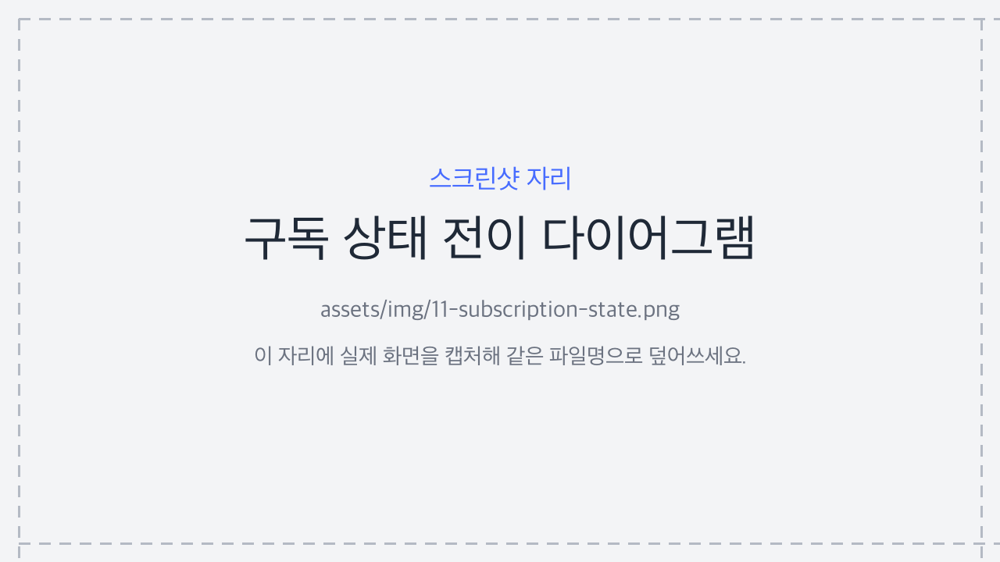

# 11. 상태값 사전 — 모든 상태의 의미

콘솔 곳곳에 **배지**로 뜨는 상태값(구독·결제·계정·요금제·서비스·카드)의 의미를 한곳에 모았습니다. 각 상태가 **무슨 뜻이고**, 그 상태에서 **무엇이 가능한지**를 정리합니다.

> 쉽게 말하면, 화면에서 본 배지(예: <span class="pill pri">미수</span>, <span class="pill no">정지</span>)가 무슨 뜻인지 헷갈릴 때 찾아보는 사전입니다.

> 함께 보기: [구독 관리](04-admin-subscription.md) · [결제·환불](06-admin-payment-refund.md) · [대시보드](10-dashboard.md)

---

## 11.1 구독 상태 (가장 중요)

구독은 생애주기에 따라 7가지 상태를 거칩니다. **서비스 이용 가능 여부**가 상태마다 다릅니다.

| 영문 | 화면 표시 | 서비스 이용 | 의미 | 이 상태에서 가능한 동작 |
|------|----------|:----------:|------|------------------------|
| `TRIAL` | <span class="pill pri">체험</span> | **가능** | 무료 체험 기간. 만료 시 첫 정기 결제가 진행됨(체험도 사전 카드 등록 필요) | 강제취소 |
| `ACTIVE` | <span class="pill ok">활성</span> | **가능** | 정상적으로 결제되고 이용 중 | 강제취소·만료일 연장 |
| `PAST_DUE` | <span class="pill pri">미수</span> | **가능**(유예) | 자동결제가 실패했지만 유예 기간이라 아직 이용됨. 재시도가 진행됨 | 수동 재결제·강제취소 |
| `SUSPENDED` | <span class="pill no">정지</span> | **불가** | 재시도가 모두 실패해 정지됨. 이용이 막힘 | 수동 재결제(성공 시 복구) |
| `CANCELED` | <span class="pill">취소</span> | **가능**(만료일까지) | 해지를 **예약**한 상태. 이미 결제한 기간(만료일)까지는 이용되고 그 후 종료 | 재개(취소 철회) |
| `EXTENDED` | <span class="pill pri">연장처리</span> | **가능** | 운영자가 만료일을 수동 연장한 상태. 새 만료일에 자동결제로 갱신 | 강제취소 |
| `EXPIRED` | <span class="pill no">만료</span> | **불가** | 구독이 완전히 끝난 **최종 상태**. 되돌릴 수 없음 | (없음 — 재구독은 새 구독) |

> 핵심: **서비스 이용이 막히는 건 `SUSPENDED`(정지)와 `EXPIRED`(만료) 두 상태뿐**입니다. 나머지(체험·활성·미수·취소·연장처리)에서는 만료일 전까지 이용이 유지됩니다. 외부 서비스는 구독 조회 응답의 `access_allowed` 하나로 이 판단을 그대로 받습니다.

> 참고: **`CANCELED`(취소)는 "지금 끊김"이 아닙니다.** 만료일까지 이용되고, 만료일이 지나면 자동으로 `EXPIRED`가 됩니다.

### 상태 전이 한눈에

```
 TRIAL ──(체험 만료·결제)──▶ ACTIVE
 ACTIVE ──(자동결제 실패)──▶ PAST_DUE ──(재시도 실패)──▶ SUSPENDED ──(기간 만료)──▶ EXPIRED
   │                            └──(수동/재시도 성공)──▶ ACTIVE
   ├──(사용자 취소)──▶ CANCELED ──(만료일 경과)──▶ EXPIRED
   │                     └──(재개)──▶ ACTIVE
   └──(운영자 연장)──▶ EXTENDED ──(새 만료일 자동결제)──▶ ACTIVE
```

> 참고: **"열린(open) 구독"** = `EXPIRED`를 제외한 모든 상태. **서비스+사용자당 구독 1개** 규칙은 이 "열린 구독" 기준이라, 만료(EXPIRED)된 뒤에는 같은 사용자가 다시 구독할 수 있습니다.

<figure class="shot">
  
  <figcaption style="color:#6b7280;font-size:13px;margin-top:6px">구독 상태 전이 한눈에 보기</figcaption>
</figure>

---

## 11.2 결제 상태 (PaymentStatus)

개별 결제 한 건의 처리 상태입니다(결제 목록의 "상태" 열).

| 영문 | 화면 표시 | 의미 |
|------|----------|------|
| `PENDING` | <span class="pill">대기</span> | 결제 요청은 만들어졌고 토스 승인 응답을 기다리는 중 |
| `DONE` | <span class="pill ok">완료</span> | 토스 승인 완료(정상 결제) |
| `FAILED` | <span class="pill no">실패</span> | 토스 거절 또는 네트워크 오류 |
| `CANCELED` | <span class="pill no">취소</span> | 승인된 결제를 **전액 취소**(환불)함 |

> 중요: 결과를 알 수 없는 **타임아웃은 실패가 아니라 `PENDING`으로 유지**됩니다. 정산 스윕이 토스에 재조회해 최종 확정하므로, 운영자가 임의로 실패 처리하면 안 됩니다.

> 참고: **부분 취소**(일부 금액만 환불)는 상태가 `DONE`으로 **그대로 유지**되고, 취소된 금액(`canceled_amount`)으로 구분합니다. 그래서 "취소" 배지는 보통 **전액 취소**를 뜻합니다.

---

## 11.3 결제의 종류·회차

| 구분 | 값 | 의미 |
|------|----|------|
| **종류** (PaymentKind) | `SUBSCRIPTION` | 구독에 묶인 정기(자동) 결제 — 화면 표시 <span class="pill pri">구독</span> |
| | `ONE_OFF` | 구독과 무관한 단건(1회성) 결제 — 화면 표시 <span class="pill">일반</span> |
| **회차** (PaymentType) | `FIRST` | 구독 최초 결제(첫 구독 할인 적용 대상) |
| | `RENEWAL` | 정기 자동 갱신 결제 |
| | `RETRY` | `PAST_DUE`에서 재시도한 결제 |
| | `ONE_OFF` | 단건 결제 |

> 참고: 환불(취소)을 이 화면에서 직접 할 수 있는 건 **종류가 `일반`(ONE_OFF)** 인 결제입니다. 구독 정기결제의 취소는 [구독 관리](04-admin-subscription.md)에서 다룹니다.

---

## 11.4 계정 상태와 역할

### 계정 상태 (UserStatus)

| 영문 | 화면 표시 | 의미 |
|------|----------|------|
| `PENDING` | 설정 대기 | 계정은 생성됐지만 아직 비밀번호 미설정 → 로그인 불가 |
| `ACTIVE` | 활성 | 비밀번호가 설정되어 정상 로그인 가능 |
| `LOCKED` | 잠김 | 로그인 비밀번호를 여러 번 틀려 일시 잠김(15분 후 자동 해제) |
| `DISABLED` | 비활성 | 관리자가 일부러 막아 둔 상태 → 로그인 불가(복구 가능) |
| `DELETED` | (숨김) | 관리자가 삭제(소프트). 목록에 보이지 않지만 기록은 남음 |

### 역할 (UserRole)

| 영문 | 표시 | 권한 |
|------|------|------|
| `SYSTEM_ADMIN` | 시스템 관리자 | 모든 서비스·요금제·구독·결제·계정·전체 설정·감사 로그 |
| `SERVICE_MANAGER` | 서비스 담당자 | **배정된 서비스**의 요금제·구독만 |

→ 자세한 내용은 [계정 관리](07-admin-accounts.md).

---

## 11.5 요금제 상태와 설정값

### 요금제 상태 (PlanStatus)

| 영문 | 화면 표시 | 의미 |
|------|----------|------|
| `ACTIVE` | <span class="pill pri">ACTIVE</span> | 신규 구독을 받을 수 있는 정상 요금제 |
| `ARCHIVED` | <span class="pill no">ARCHIVED</span> | 보관됨 — **신규 구독 불가**(기존 구독은 유지). 구독이 남아 있으면 삭제 불가 |

### 결제 주기 (BillingCycle)

| 값 | 의미 |
|----|------|
| `YEAR` / `MONTH` / `WEEK` | 연 / 월 / 주 단위 결제 |
| `DAY` | 일 단위 — 원하는 일수(`cycle_days`)를 함께 지정 |
| `MINUTE` | 분 단위(`cycle_minutes`, 최소 5분) — **자동연장 테스트용**이라 비운영 환경에서만 생성됩니다 |

> 참고: `MINUTE` 주기는 자동결제 동작을 짧은 주기로 확인하기 위한 **테스트 전용**입니다. 운영(prod) 환경에서는 생성되지 않으므로 운영 화면에서는 보통 보이지 않습니다.

### 체험·자동연장 (Plan 설정값)

| 설정 | 의미 |
|------|------|
| `trial_enabled` / `trial_days` | 체험 사용 여부와 체험 기간(일수). 켜져 있으면 구독이 <span class="pill pri">체험</span>(TRIAL)으로 시작하고, 체험 종료 시 첫 정기 결제가 진행됩니다 |
| `auto_renew` | **꺼짐(False)**이면 첫 주기 종료 후 자동연장하지 않습니다 — 다음 결제 예정이 없고(`next_billing_at` 없음) 기간이 끝나면 바로 <span class="pill no">만료</span>(EXPIRED) 처리됩니다 |

### 첫 구독 혜택 (FirstPaymentType) · 상시 할인 (DiscountType)

| 값 | 첫 구독 | 상시 할인 | 의미 |
|----|:------:|:--------:|------|
| `NONE` | ○ | ○ | 혜택 없음(정상 금액) |
| `FREE` | ○ | — | 첫 결제 **무료(0원)** (상시 할인엔 없음) |
| `DISCOUNT_AMOUNT` | ○ | ○ | **정액**(원) 할인 |
| `DISCOUNT_PERCENT` | ○ | ○ | **정률**(%) 할인 |

→ 자세한 내용은 [요금제 관리](05-admin-plan.md).

---

## 11.6 서비스 상태 · 카드 상태

| 대상 | 값 | 의미 |
|------|----|------|
| **서비스** (ServiceStatus) | `ACTIVE` | 정상 운영(API 키 인증 가능) |
| | `INACTIVE` | 비활성 — 이 서비스의 API 키 인증이 막힘 |
| **카드** | <span class="pill ok">활성</span> | 결제에 사용 가능 |
| | <span class="pill no">비활성</span> | 결제 차단 — 자동연장·수동결제가 실패(미수→정지로 이어질 수 있음). [카드 관리](03-admin-card.md) |

---

## 11.7 (참고) 내부 처리 상태 — 운영자 화면 밖

아래는 시스템 내부에서만 쓰여 보통 화면에 직접 보이지 않습니다.

| 대상 | 값 | 의미 |
|------|----|------|
| **토스 웹훅 처리** (WebhookStatus) | `RECEIVED` / `PROCESSED` / `IGNORED` / `FAILED` | 토스가 보낸 웹훅을 수신·처리한 결과(중복은 IGNORED) |

> 참고: 서비스로 **나가는** 알림(아웃고잉 웹훅)의 이벤트 종류는 [서비스 알림](17-feature-notifications.md)을 보세요. 여기 WebhookStatus는 토스 → 결제서버로 **들어오는** 웹훅 처리 상태입니다.
