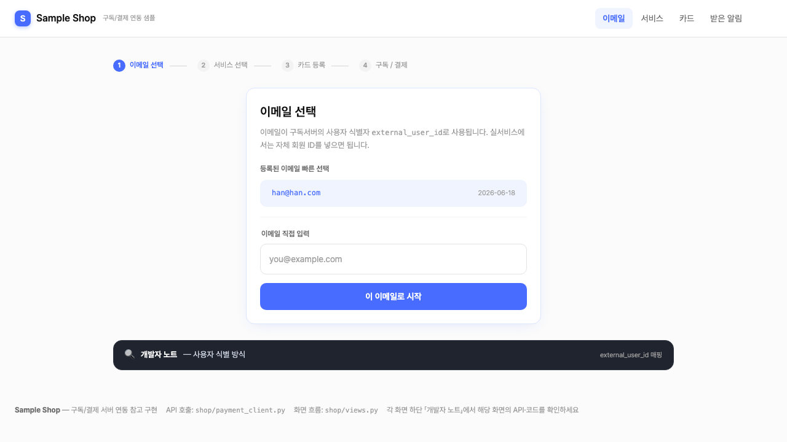
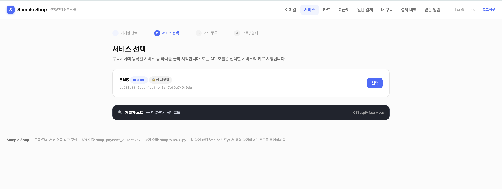
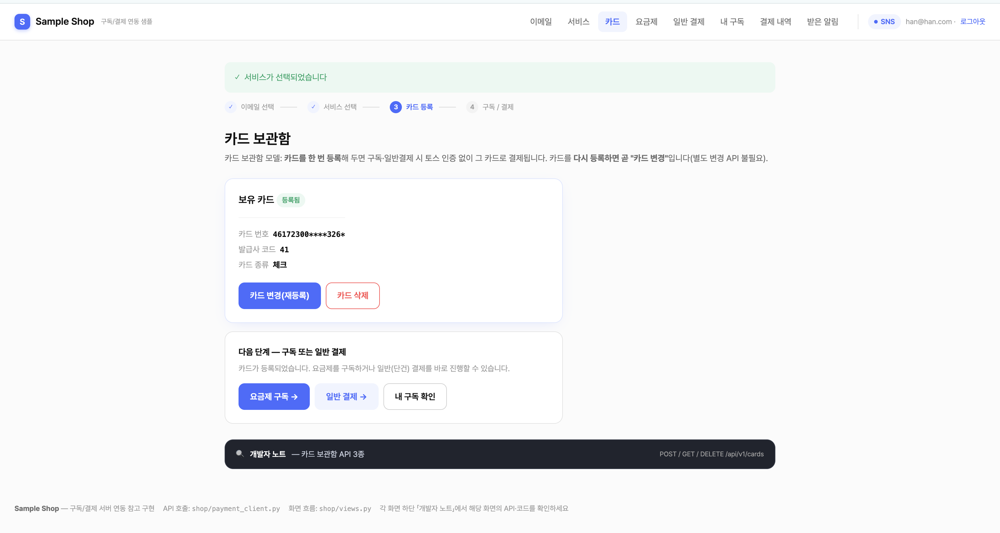
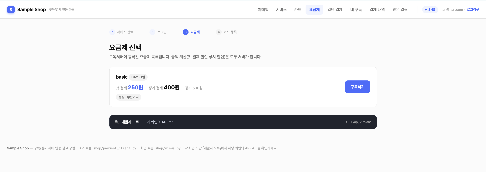
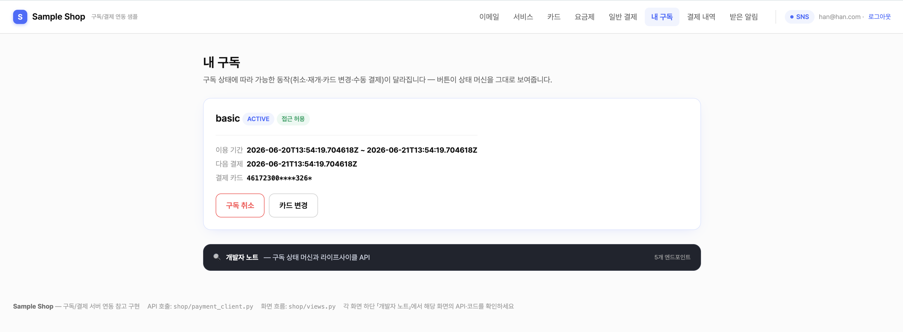
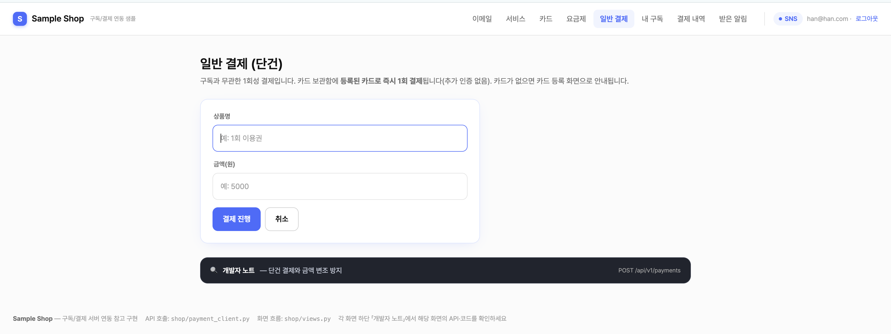
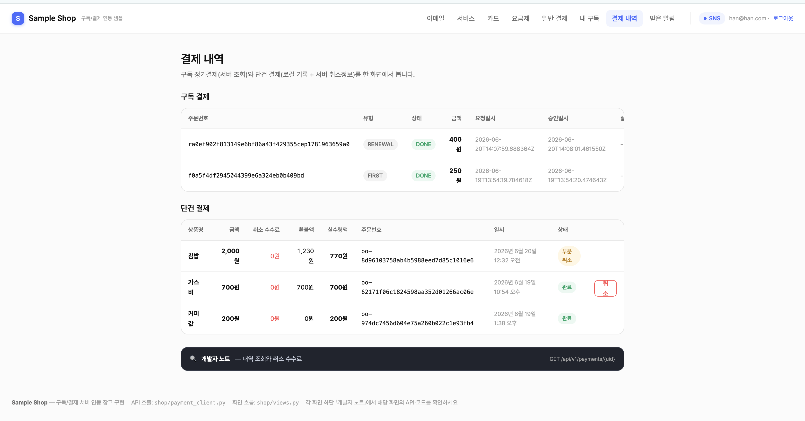
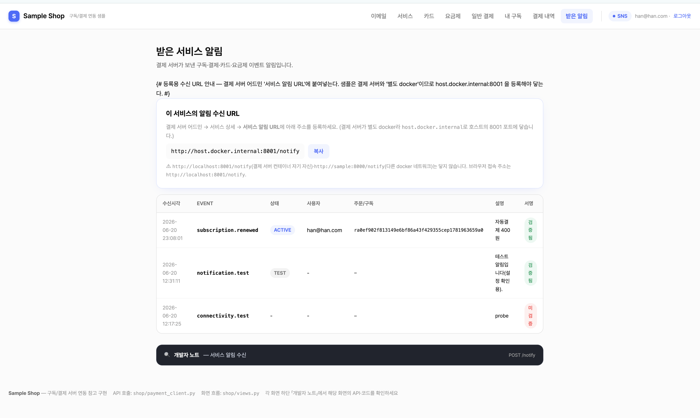

# 17. 샘플 서비스(sample_service) 사용법

> 쉽게 말하면 `sample_service`는 **"외부 서비스가 결제 서버에 어떻게 연동하는지"를 직접 눌러 보며 배우는 동작하는 예제**입니다. 진료 앱·쇼핑몰이 할 일을 그대로 Django로 구현해 둔 것이라, 화면을 따라가면 연동 전 과정을 이해하고 코드를 그대로 가져다 쓸 수 있습니다.

> 함께 보기: [서비스 API](11-service-api.md) · [카드 보관함](12-feature-card.md) · [서비스 알림](15-feature-notifications.md)

---

## 전체 프로세스 한눈에 — 화면으로 따라가기

서비스 개발자가 연동을 시연하는 **전체 흐름을 화면 순서대로** 보여줍니다. 각 화면 하단의 「개발자 노트」에 그 단계가 호출하는 API가 정리돼 있습니다.

<div class="flow">
  <div class="flow-step"><span class="fn">1</span><b>로그인</b><span>이메일 = <code>external_user_id</code> 선택</span></div>
  <div class="flow-step"><span class="fn">2</span><b>서비스 선택</b><span>서비스·API 키 설정</span></div>
  <div class="flow-step"><span class="fn">3</span><b>카드 등록</b><span>토스 인증 → <code>POST /cards</code> · 구독·결제 전제</span></div>
  <div class="flow-step"><span class="fn">4</span><b>요금제·구독</b><span><code>POST /subscriptions</code> · 등록 카드로</span></div>
  <div class="flow-step"><span class="fn">5</span><b>내 구독</b><span>취소·재개·카드변경·수동결제</span></div>
  <div class="flow-step"><span class="fn">6</span><b>일반결제</b><span><code>POST /payments</code> · 단건</span></div>
  <div class="flow-step"><span class="fn">7</span><b>결제 내역</b><span><code>GET /payments</code> · 단건 취소</span></div>
  <div class="flow-step"><span class="fn">8</span><b>알림 수신</b><span><code>POST /notify</code> · 웹훅 수신</span></div>
</div>

> 흐름 요지: **③ 카드 등록**이 **④ 구독·⑥ 일반결제**의 전제다(카드 보관함 모델). 카드가 없으면 결제서버가 `404`를 반환한다.

**① 이메일 선택 (`/login`)** — 고른 이메일이 결제서버의 사용자 식별자 `external_user_id`가 된다.



**② 서비스 선택 (`/services`)** — 결제서버의 서비스 목록에서 고르고 API 키를 저장한다.



**③ 카드 등록 (`/card`)** — 토스 빌링 인증창으로 카드를 등록한다(구독·결제의 전제).



**④ 요금제·구독 (`/plans`)** — 요금제와 실제 청구 금액을 보고 등록 카드로 구독한다.



**⑤ 내 구독 (`/my`)** — 상태·다음 결제일·등록 카드와 함께 취소·재개·카드 변경·수동 결제 버튼이 상태에 따라 보인다.



**⑥ 일반결제 (`/pay`)** — 구독과 무관한 단건 결제(등록 카드로 즉시).



**⑦ 결제 내역 (`/history`)** — 구독 결제(서버 API)와 단건 결제(로컬 DB)를 한 화면에서 통합 조회하고, 단건은 취소(환불)할 수 있다.



**⑧ 받은 알림 (`/notifications`)** — 결제서버가 보낸 웹훅(상태 변화 알림)을 서명 검증해 받은 내역.



> 참고: 아래 17.1~17.8은 위 흐름을 **개념 → 코드 → 실행 → 규칙**으로 풀어 설명합니다. 처음이라면 이 화면 흐름을 먼저 훑고 내려가세요.

---

## 17.1 이게 무엇이고, 왜 있나

`sample_service`(Sample Shop)는 결제 서버(`payment_system`)의 **외부 서비스 역할을 하는 참조 구현**입니다. 실제 토스페이먼츠 테스트 키로 **카드 등록 → 빌링키 발급 → 결제 승인**까지 진짜 API로 동작합니다.

목적은 둘입니다.

- **배우기**: 서비스 개발자가 화면을 눌러 보며 "구독·결제를 붙이려면 무엇을 어떤 순서로 호출하는가"를 체득.
- **가져다 쓰기**: 핵심 연동 코드(`shop/payment_client.py`)를 **그대로 복사**해 자기 서비스에 이식.

> 참고: 이건 "결제 서버"가 아니라 **결제 서버를 호출하는 쪽**(고객을 가진 우리 앱)입니다. 둘은 별개 프로세스로 함께 띄워 연동을 시연합니다.

---

## 17.2 큰 그림 — 세 주체

연동에는 세 주체가 등장합니다. 샘플 서비스는 가운데 **"외부 서비스(앱)"** 자리를 연기합니다.

<div class="seqwrap" role="img" aria-label="샘플 서비스 연동 구조 — 사용자·sample_service·결제서버·토스 사이 호출 관계">
<svg viewBox="0 0 760 300" xmlns="http://www.w3.org/2000/svg" style="max-width:100%;height:auto;font-family:inherit">
  <defs>
    <marker id="ahb" markerWidth="9" markerHeight="9" refX="7" refY="4" orient="auto"><path d="M0,0 L8,4 L0,8 z" fill="#476CFF"/></marker>
    <marker id="ahg" markerWidth="9" markerHeight="9" refX="7" refY="4" orient="auto"><path d="M0,0 L8,4 L0,8 z" fill="#9AA1AD"/></marker>
  </defs>
  <!-- 박스 -->
  <rect x="40" y="34" width="170" height="56" rx="10" fill="#EEF2FF" stroke="#C7D2FE"/>
  <text x="125" y="58" text-anchor="middle" font-size="13" font-weight="700" fill="#1e293b">사용자(브라우저)</text>
  <text x="125" y="76" text-anchor="middle" font-size="11" fill="#64748b">카드번호는 토스만 다룸</text>

  <rect x="40" y="196" width="190" height="56" rx="10" fill="#EEF2FF" stroke="#C7D2FE"/>
  <text x="135" y="220" text-anchor="middle" font-size="13" font-weight="700" fill="#1e293b">sample_service</text>
  <text x="135" y="238" text-anchor="middle" font-size="11" fill="#64748b">외부 서비스 역할(Django)</text>

  <rect x="430" y="196" width="160" height="56" rx="10" fill="#E0F2FE" stroke="#7DD3FC"/>
  <text x="510" y="220" text-anchor="middle" font-size="13" font-weight="700" fill="#1e293b">결제 서버</text>
  <text x="510" y="238" text-anchor="middle" font-size="11" fill="#64748b">payment_system</text>

  <rect x="600" y="34" width="120" height="56" rx="10" fill="#F1F5F9" stroke="#CBD5E1"/>
  <text x="660" y="66" text-anchor="middle" font-size="13" font-weight="700" fill="#1e293b">토스페이먼츠</text>

  <!-- 화살표 -->
  <line x1="125" y1="90" x2="135" y2="196" stroke="#9AA1AD" stroke-width="1.5" marker-end="url(#ahg)"/>
  <text x="150" y="148" font-size="11" fill="#64748b">화면 조작</text>

  <line x1="210" y1="58" x2="600" y2="58" stroke="#9AA1AD" stroke-width="1.5" marker-end="url(#ahg)"/>
  <text x="405" y="48" text-anchor="middle" font-size="11" fill="#64748b">① 카드 인증창(빌링) — 토스 SDK, 사용자↔토스 직접</text>

  <line x1="230" y1="216" x2="430" y2="216" stroke="#476CFF" stroke-width="2" marker-end="url(#ahb)"/>
  <text x="330" y="209" text-anchor="middle" font-size="11" font-weight="700" fill="#2A45C0">② HMAC API (카드·구독·결제·조회)</text>

  <line x1="578" y1="196" x2="660" y2="92" stroke="#9AA1AD" stroke-width="1.5" marker-end="url(#ahg)"/>
  <text x="648" y="150" text-anchor="middle" font-size="11" fill="#64748b">빌링키·승인</text>

  <line x1="430" y1="242" x2="230" y2="242" stroke="#476CFF" stroke-width="1.5" stroke-dasharray="5 3" marker-end="url(#ahb)"/>
  <text x="330" y="266" text-anchor="middle" font-size="11" fill="#2A45C0">③ 알림(웹훅) POST /notify</text>
</svg>
</div>

> 참고: **파란 화살표**(②③)가 *내 서비스가 작성하는 코드*입니다 — 결제서버로의 HMAC API 호출(`payment_client.py`)과 웹훅 수신(`/notify`). 회색은 토스·브라우저가 알아서 하는 부분입니다.

- **사용자 ↔ 토스**: 카드번호는 **토스 결제창에서만** 다룬다(서비스·결제서버는 카드번호를 보지 않음).
- **샘플 ↔ 결제서버**: 모든 호출은 **API 키 + HMAC 서명**으로 인증(`shop/payment_client.py`).
- **결제서버 → 샘플**: 구독·결제·카드 상태가 바뀌면 **알림(웹훅)**을 `POST /notify`로 받는다.

---

## 17.3 화면이 곧 문서 — 「개발자 노트」

모든 화면 **하단에 다크 패널 「🔍 개발자 노트」**가 있습니다. 펼치면 그 화면이 **어떤 API를 호출하고**(메서드·경로·대응 `payment_client.py` 함수), **어느 뷰가 구현하며**, **무슨 규칙을 지켜야 하는지**를 그 자리에서 보여줍니다. 즉 화면을 따라가는 것만으로 API 레퍼런스를 함께 읽게 됩니다.

화면 ↔ 호출 API ↔ 클라이언트 함수 매핑:

| 화면(경로) | 시연하는 일 | 호출 API | `payment_client.py` |
|---|---|---|---|
| 로그인 `/login` | 사용자 식별자(`external_user_id`) 선택 | — | — |
| 서비스 선택 `/services` | 결제서버의 서비스 목록·키 입력 | `GET /api/v1/services`(무인증) | `list_services` |
| 카드 `/card` | **카드 등록/변경/조회/삭제**(연동의 전제) | `POST·GET·DELETE /api/v1/cards` | `register_card`/`get_card`/`delete_card` |
| 요금제 `/plans` | 구독 가능한 요금제·금액 | `GET /api/v1/plans` | `get_plans` |
| 구독 `/subscribe/{plan_id}` | 등록 카드로 구독 생성 | `POST /api/v1/subscriptions` | `create_subscription` |
| 내 구독 `/my` | 조회·취소·재개·수동결제·카드변경 | `GET·.../cancel·/resume·/pay` | `get_subscription`/`cancel`/`resume`/`manual_pay` |
| 일반결제 `/pay` | 구독과 무관한 단건 결제 | `POST /api/v1/payments` | `create_one_off_payment` |
| 결제 내역 `/history` | 구독+단건 내역, 단건 취소 | `GET /api/v1/payments/{uid}` · `.../cancel` | — |
| 받은 알림 `/notifications` | 웹훅 수신·서명검증 데모 | `POST /notify`(수신측) | — (수신 뷰 `views.notify_receive_view`) |

---

## 17.4 코드 구조 — 어디를 보면 되나

| 파일 | 역할 |
|---|---|
| **`shop/payment_client.py`** | **연동의 핵심.** HMAC 서명(`sign_request`) + 모든 API 호출(`_request`)이 한 파일에. Django 의존이 거의 없어 **이 파일만 복사하면 연동 끝**(`settings` 폴백 2줄만 교체). |
| `shop/views.py` | 화면 흐름·토스 successUrl 콜백 처리(`billing_success_view` → `POST /api/v1/cards`), 카드 미등록 시 `/card` 유도, 401 키 재입력, 웹훅 수신(`notify_receive_view`). |
| `shop/templates/shop/*.html` | 각 화면 + 하단 「개발자 노트」. `card.html`에 토스 SDK `requestBillingAuth()` 호출부. |
| `shop/urls.py` | 경로 → 뷰 매핑. |

> 쉽게 말하면 **"무엇을 호출하나"는 `payment_client.py`, "언제 호출하나(화면 흐름)"는 `views.py`** 를 보면 됩니다.

---

## 17.5 실행 방법

샘플과 결제 서버 **두 프로세스**를 함께 띄웁니다. 먼저 결제 서버에 서비스를 등록해 **키를 발급**받아야 합니다.

### (1) 사전 — 결제 서버에서 서비스 등록

1. 결제 서버 어드민(`/admin`) → **서비스 등록**(허용 IP에 `127.0.0.1` 포함).
2. 등록 직후 표시되는 **API 키 / HMAC 시크릿**을 복사(서비스 상세의 *키 복사* 버튼). 이 값은 `.env`가 아니라 **실행 후 `/services` 화면에 입력**한다.
3. 요금제 1개 이상 생성(체험 요금제 포함 권장).

### (2) 샘플 설정 — `.env`

`cp .env.example .env` 후 채운다. **서비스 API 키·HMAC 시크릿은 `.env`에 넣지 않는다** — 실행 후 `/services` 화면에서 직접 입력한다.

```env
PAYMENT_API_BASE=http://127.0.0.1:8000     # 결제 서버 주소(포트 포함)
# 토스 빌링 client key — 비우면 /card 화면의 '수동 authKey' 폴백으로 테스트 가능
TOSS_CLIENT_KEY=test_ck_xxx
```

> 참고: 서비스 **API 키·HMAC 시크릿**은 앱 실행 후 `/services` 화면에서 서비스를 고르고 입력하면 **세션에 저장**되어 이후 모든 API 호출에 쓰인다(화면에서 여러 서비스 전환 가능). 그래서 `.env`에는 두지 않는다. 보호 화면은 키 입력 전까지 자동으로 `/services`로 유도한다.

### (3) 구동 — 로컬

```bash
# 터미널 1 — 결제 서버
cd payment_system && uv run uvicorn app.main:app --port 8000
# 터미널 2 — 샘플
cd sample_service
python3 -m venv .venv && .venv/bin/pip install -r requirements.txt
.venv/bin/python manage.py migrate
.venv/bin/python manage.py runserver 8001
```

→ 브라우저에서 `http://127.0.0.1:8001` 접속.

### (3') 구동 — docker

```bash
cd sample_service && docker compose up -d --build   # http://localhost:8001 (호스트 8001 → 컨테이너 8000)
```

---

## 17.6 데모 시나리오 — 권장 순서

> 중요: **카드 등록이 구독·결제보다 먼저**입니다(카드 보관함 모델). 구독/결제 화면에서 카드가 없으면 자동으로 `/card`로 유도하고, 등록을 마치면 원래 흐름으로 복귀합니다.

> 참고: 각 화면 캡처는 맨 앞 **"전체 프로세스 한눈에"** 섹션에 순서대로 있습니다. 아래는 따라 할 때의 단계와 확인 지점입니다.

1. **이메일 선택**(`/login`) → **서비스 선택**(`/services`).
2. **카드 등록**(`/card`) — "카드 등록창 열기" → 토스 테스트 카드 입력(테스트 모드는 청구 없음). 완료 시 `POST /api/v1/cards`로 빌링키 발급·보관, 마스킹 카드만 표시. (토스 키가 없으면 **수동 authKey 폴백**으로 흐름 테스트)
3. **구독**(`/plans` → 구독하기) — 등록 카드로 **즉시 구독**(토스 재인증 없음). 또는 **일반결제**(`/pay`).
4. **확인** — 샘플 `/my`(ACTIVE·다음 결제일), 결제서버 어드민(구독·결제 내역), 토스 개발자센터(테스트 결제).
5. **라이프사이클** — `/my`에서 취소(만료일까지 유지)·재개, PAST_DUE/SUSPENDED 시 수동 결제, **카드 변경**(재등록=교체, 기존 구독이 새 카드 자동 참조).
6. **알림**(`/notifications`) — 상태 변화 시 결제서버가 보낸 웹훅 수신 내역 확인.

---

## 17.7 내 서비스에 가져다 쓰기 — 지켜야 할 규칙

`shop/payment_client.py`를 복사하는 게 출발점입니다. 그리고 「개발자 노트」에도 반복되는 **연동 4규칙**을 지킵니다.

1. **타임아웃(`503 PAYMENT_UNRESOLVED`)은 실패가 아니다** — 서버가 결제를 PENDING으로 유지했다가 정산 스윕으로 확정한다. 실패로 처리하지 말 것.
2. **금액은 서버 세션/DB에 보관**했다가 서명된 본문으로 전달 — 토스 successUrl 쿼리스트링을 신뢰하지 말 것(변조 방지).
3. **`order_id`는 서비스 내 고유 + 멱등** — 같은 `order_id` 재요청은 기존 결제를 반환한다(이중결제 방지).
4. **접근 제어는 `access_allowed` 하나로** — 구독 조회 응답의 이 불리언으로 판단하고, 상태별 분기를 직접 구현하지 말 것.

> 주의(알림 수신 등록): 샘플은 결제 서버와 **별도 docker**다. 결제 서버 컨테이너에서 샘플의 `/notify`에 닿으려면 알림 URL을 **`http://host.docker.internal:8001/notify`**로 등록한다(`localhost:8001`·컨테이너명은 닿지 않음). `/notifications` 화면 상단에 이 주소가 복사 버튼과 함께 표시되고, 어드민의 **'테스트 알림 전송'**으로 연결을 즉시 확인할 수 있다. 수신 측 서명검증·전달 규약은 [서비스 알림](15-feature-notifications.md) 참고.

---

## 17.8 핵심 호출 예시 (요청/응답)

샘플이 실제로 주고받는 두 호출. 모든 요청에는 `payment_client.py`가 HMAC 서명 4개 헤더(`x-service-key`/`x-timestamp`/`x-nonce`/`x-signature`)를 붙인다.

**① 카드 등록 — `POST /api/v1/cards`** (토스 successUrl 콜백에서 호출)

```json
// 요청 — customer_key·auth_key는 토스 빌링 인증창에서 받은 값
{ "external_user_id": "han@han.com", "customer_key": "cust-123", "auth_key": "toss_auth_key_xxx" }
// 응답 201 — billingKey는 절대 내려오지 않고 마스킹 카드만
{ "external_user_id": "han@han.com", "card": { "issuerCode": "61", "number": "123456******1234" } }
```

**② 구독 생성 — `POST /api/v1/subscriptions`** (등록 카드로 즉시, 토스 재인증 없음)

```json
// 요청 — 금액·카드 정보 없음(서버가 요금제·등록 카드에서 처리)
{ "external_user_id": "han@han.com", "plan_id": "3fa85f64-5717-4562-b3fc-2c963f66afa6", "trial": false }
// 응답 201
{ "id": "…", "plan_name": "프리미엄 월간", "status": "ACTIVE", "access_allowed": true }
```

> 쉽게 말하면 서비스가 직접 챙기는 호출은 **①카드 등록 → ②구독 요청** 둘뿐이고, 자동결제·연장은 서버가, 상태 변화 통지는 알림(`/notify`)이 처리한다. 더 많은 엔드포인트·필드·오류코드는 [서비스 API 연동](11-service-api.md) 참고.

> 함께 보기: API 전체 레퍼런스는 [서비스 API 연동](11-service-api.md), 11.8의 최소 연동 예제와 함께 보면 코드가 더 빨리 잡힙니다.
